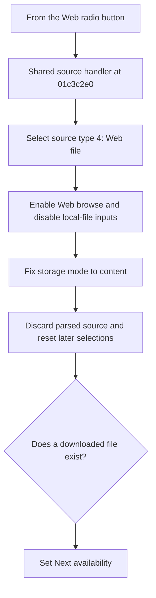

# From the Web

> Analysis status: Reviewed from recovered source and UI evidence.

## Control

| Property | Recovered value |
| --- | --- |
| Component path | `fMacroWiz.pcMWiz.tsSource.pSourceEmpty.rbFromWeb` |
| Control class | `TRadioButton` |
| Caption | `From the Web` |
| Handler | `rbSourceClick` at `01c3c2e0` |

## What happens when clicked

Selecting this radio button sets source type 4. The shared handler enables the Web browse button and disables the local file editor and local browse button. It fixes the storage selection to the `content` row, discards any parsed source, and resets downstream model and shape selections. Next stays disabled until the Web browse path records a downloaded file that exists.

## Click flow

## Evidence

- [Recovered shared source handler](../../../DecompiledSources/Tina16/functions/0000000001C3C2E0__FUN_01c3c2e0.c)
- [Recovered source-type reader](../../../DecompiledSources/Tina16/functions/0000000001C3C010__FUN_01c3c010.c)
- [Recovered navigation-state refresh](../../../DecompiledSources/Tina16/functions/0000000001C38160__FUN_01c38160.c)
- The hidden `File downloaded press Next` label is consistent with this path. The handler and file-existence test provide the behavior evidence.

## Analysis limits

- The UI resource does not identify the remote service or catalog. The browse helper shows only a generic URL browser and an INI-backed history.
