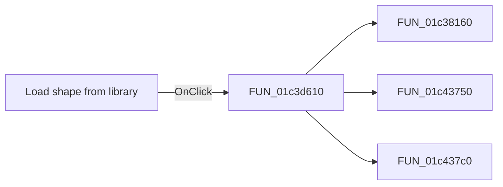

# Load shape from library

> Analysis status: Pending individual source review.

## Control

| Property | Recovered value |
| --- | --- |
| Form | fMacroWiz |
| Component path | fMacroWiz.pcMWiz.tsShape.rbLoadFromLib |
| Control class | TRadioButton |
| Caption | Load shape from library |
| Hint | Not present in the recovered resource. |
| Text | Not present in the recovered resource. |
| Handler name | rbAutoGenClick |
| Handler address | 01c3d610 |
| Graph node | `resource:dfm:fMacroWiz/fMacroWiz.pcMWiz.tsShape.rbLoadFromLib` |
| Handler node | `function:01c3d610` |
| Graph layer | UI |

## What happens when clicked

Pending individual analysis. An agent must read the recovered handler source and its relevant callees before it replaces this text.

## Click flow

## Handler evidence

- Source: [DecompiledSources/Tina16/functions/0000000001C3D610__FUN_01c3d610.c](../../../DecompiledSources/Tina16/functions/0000000001C3D610__FUN_01c3d610.c)
- Recovered role: Not present in the recovered resource.
- Current graph summary: Handles 2 Delphi UI events: fMacroWiz.pcMWiz.tsShape.rbAutoGen.OnClick, fMacroWiz.pcMWiz.tsShape.rbLoadFromLib.OnClick.
- Current graph behavior: Not present in the recovered resource.
- Current graph evidence: Not present in the recovered resource.
- Complexity: complex
- Distinct outgoing calls: 3

## Direct calls

- `function:01c38160` — FUN_01c38160
- `function:01c43750` — Handles 1 Delphi UI event: fMacroWiz.pcMWiz.tsShape.gbFilter.cbShapeSS.OnClick.
- `function:01c437c0` — FUN_01c437c0

## Resource evidence

- Kind: Not present in the recovered resource.
- Modal result: Not present in the recovered resource.
- Checked state: true
- List items: Not present in the recovered resource.
- Image reference: Not present in the recovered resource.
- Extracted glyph: None.

## Nearby label candidates

Nearby labels are layout candidates only. They are not proof of behavior.

- Rank 1: Select the shape you want to assign: at distance 45.

## Analysis limits

- Do not infer behavior from the control class, caption, hint, glyph, or nearby label alone.
- Do not replace the pending status until the handler source and relevant call path provide enough evidence.
