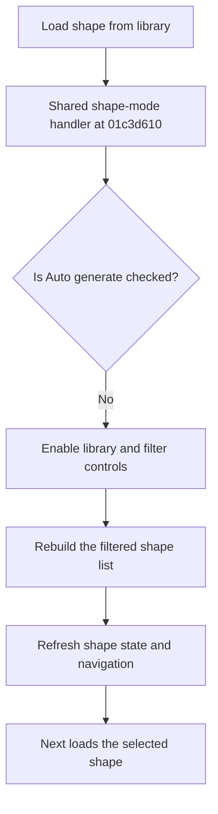

# Load shape from library

> Analysis status: Reviewed from recovered source and UI evidence.

## Control

| Property | Recovered value |
| --- | --- |
| Component path | `fMacroWiz.pcMWiz.tsShape.rbLoadFromLib` |
| Control class | `TRadioButton` |
| Caption | `Load shape from library` |
| Initial checked state | `true` |
| Handler | `rbAutoGenClick` at `01c3d610` |

## What happens when clicked

Selecting this radio button clears the `rbAutoGen` state. The shared handler detects that library mode is active and enables the library selector, shape list, suggested-shape check box, search editor, pin filter, and shape-type filter. It rebuilds the shape list with the current filters and refreshes wizard navigation. A later Next action loads the selected library shape.

## Click flow

## Evidence

- [Recovered shared shape-mode handler](../../../DecompiledSources/Tina16/functions/0000000001C3D610__FUN_01c3d610.c)
- [Recovered shape-list rebuild](../../../DecompiledSources/Tina16/functions/0000000001C3DC60__FUN_01c3dc60.c)
- [Recovered Next handler](../../../DecompiledSources/Tina16/functions/0000000001C38D00__FUN_01c38d00.c)
- The handler branches on the `rbAutoGen` checked state. The false branch applies to this radio button.

## Analysis limits

- The shape library data object has no recovered Delphi class name.
