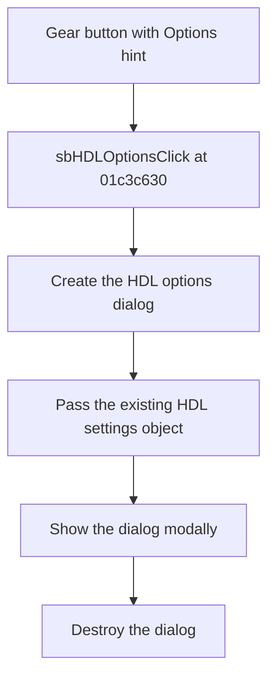

# HDL options

> Analysis status: Reviewed from recovered source, resource, and glyph evidence.

## Control

| Property | Recovered value |
| --- | --- |
| Component path | `fMacroWiz.pcMWiz.tsSource.pMacroName.gbSourceVHDL.sbHDLOptions` |
| Control class | `TSpeedButton` |
| Hint | `Options` |
| Handler | `sbHDLOptionsClick` at `01c3c630` |

## What happens when clicked

The handler creates the HDL options dialog and passes it the wizard's existing HDL settings object. It shows the dialog modally and then destroys the dialog. The caller does not inspect the modal result. Validation and settings changes, if any, are owned by the dialog.

## Click flow

## Evidence

- [Recovered sbHDLOptionsClick source](../../../DecompiledSources/Tina16/functions/0000000001C3C630__FUN_01c3c630.c)
- [Recovered dialog initializer](../../../DecompiledSources/Tina16/functions/0000000001C32280__FUN_01c32280.c)
- [Extracted gear glyph](../../../glyph/0171_fMacroWiz_fMacroWiz_pcMWiz_tsSource_pMacroName_gbSourceVHDL_sbHDLOptions_Glyph_Data.png)
- The resource gives the `Options` hint. The handler proves that the target is the HDL options dialog.

## Analysis limits

- The recovered initializer stores the settings-object pointer, but this control's call path does not expose the dialog's individual fields or its acceptance rules.
