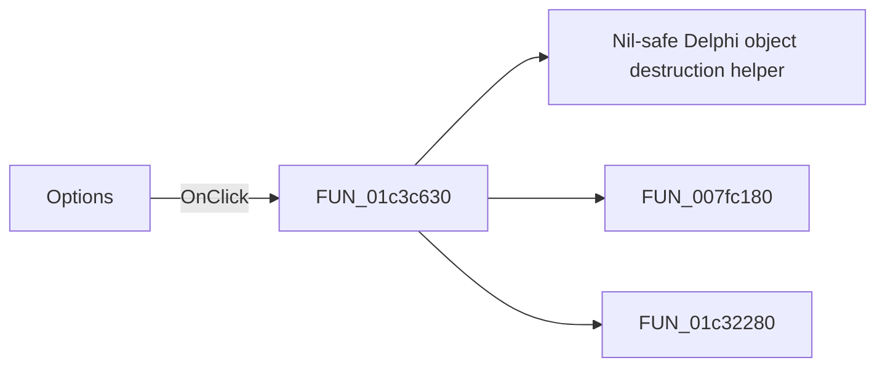

# Options

> Analysis status: Pending individual source review.

## Control

| Property | Recovered value |
| --- | --- |
| Form | fMacroWiz |
| Component path | fMacroWiz.pcMWiz.tsSource.pMacroName.gbSourceVHDL.sbHDLOptions |
| Control class | TSpeedButton |
| Caption | Not present in the recovered resource. |
| Hint | Options |
| Text | Not present in the recovered resource. |
| Handler name | sbHDLOptionsClick |
| Handler address | 01c3c630 |
| Graph node | `resource:dfm:fMacroWiz/fMacroWiz.pcMWiz.tsSource.pMacroName.gbSourceVHDL.sbHDLOptions` |
| Handler node | `function:01c3c630` |
| Graph layer | UI |

## What happens when clicked

Pending individual analysis. An agent must read the recovered handler source and its relevant callees before it replaces this text.

## Click flow

## Handler evidence

- Source: [DecompiledSources/Tina16/functions/0000000001C3C630__FUN_01c3c630.c](../../../DecompiledSources/Tina16/functions/0000000001C3C630__FUN_01c3c630.c)
- Recovered role: Not present in the recovered resource.
- Current graph summary: Handles 1 Delphi UI event: fMacroWiz.pcMWiz.tsSource.pMacroName.gbSourceVHDL.sbHDLOptions.OnClick.
- Current graph behavior: Not present in the recovered resource.
- Current graph evidence: Not present in the recovered resource.
- Complexity: complex
- Distinct outgoing calls: 3

## Direct calls

- `function:00410f20` — Nil-safe Delphi object destruction helper
- `function:007fc180` — FUN_007fc180
- `function:01c32280` — FUN_01c32280

## Resource evidence

- Kind: Not present in the recovered resource.
- Modal result: Not present in the recovered resource.
- Checked state: Not present in the recovered resource.
- List items: Not present in the recovered resource.
- Image reference: Not present in the recovered resource.
- Extracted glyph: [`0171_fMacroWiz_fMacroWiz_pcMWiz_tsSource_pMacroName_gbSourceVHDL_sbHDLOptions_Glyph_Data.png`](../../../glyph/0171_fMacroWiz_fMacroWiz_pcMWiz_tsSource_pMacroName_gbSourceVHDL_sbHDLOptions_Glyph_Data.png)

## Nearby label candidates

Nearby labels are layout candidates only. They are not proof of behavior.

- No same-parent label candidate is available.

## Analysis limits

- Do not infer behavior from the control class, caption, hint, glyph, or nearby label alone.
- Do not replace the pending status until the handler source and relevant call path provide enough evidence.
