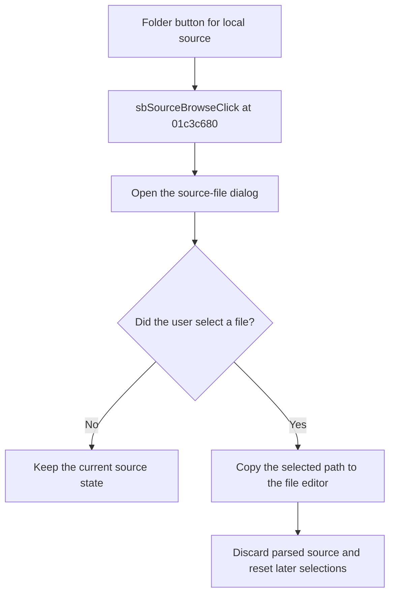

# Local source browse

> Analysis status: Reviewed from recovered source, resource, and glyph evidence.

## Control

| Property | Recovered value |
| --- | --- |
| Component path | `fMacroWiz.pcMWiz.tsSource.pSourceEmpty.sbSourceBrowse` |
| Control class | `TSpeedButton` |
| Caption and hint | Not present in the recovered resource. |
| Handler | `sbSourceBrowseClick` at `01c3c680` |

## What happens when clicked

The handler opens the wizard's local source-file dialog. The dialog filters include schematic, SPICE, VHDL, Verilog, Verilog-A, Verilog-AMS, SystemC, SystemVerilog, and VHDL-AMS files, with TensorFlow Lite when that feature is available. If the user accepts, the handler copies the selected path to the file-source editor, discards the prior parsed source, and resets later model and shape selections. If the user cancels, it changes nothing.

## Click flow

## Evidence

- [Recovered local browse handler](../../../DecompiledSources/Tina16/functions/0000000001C3C680__FUN_01c3c680.c)
- [Recovered form initialization and dialog filters](../../../DecompiledSources/Tina16/functions/0000000001C37190__FUN_01c37190.c)
- [Extracted folder glyph](../../../glyph/0172_fMacroWiz_fMacroWiz_pcMWiz_tsSource_pSourceEmpty_sbSourceBrowse_Glyph_Data.png)
- The folder glyph supports browse intent. The handler and initialized file dialog prove the local-file target.

## Analysis limits

- File content is not parsed by this click. Parsing and validation occur when the user selects Next.
