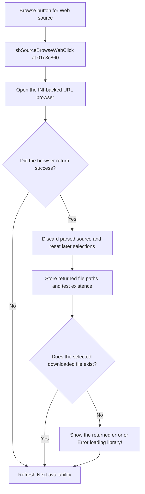

# Browse

> Analysis status: Reviewed from recovered source, resource, and glyph evidence.

## Control

| Property | Recovered value |
| --- | --- |
| Component path | `fMacroWiz.pcMWiz.tsSource.pSourceEmpty.sbSourceBrowseWeb` |
| Control class | `TSpeedButton` |
| Caption | `Browse` |
| Handler | `sbSourceBrowseWebClick` at `01c3c860` |

## What happens when clicked

The handler opens a modal URL browser that uses `openfromweb.ini` for history and the last URL. If the browser returns success, the handler discards the prior parsed source and resets later model and shape selections. It copies each returned file path to the wizard's Web-source field, so the last returned path remains selected, and tests whether that file exists. It updates the downloaded-file status from that test. If no valid file is available, it shows `Error loading library!` or the error text returned by the operation. It refreshes Next availability after both success and cancellation.

## Click flow

## Evidence

- [Recovered Web browse handler](../../../DecompiledSources/Tina16/functions/0000000001C3C860__FUN_01c3c860.c)
- [Recovered modal URL browser helper](../../../DecompiledSources/Tina16/functions/0000000001C1DE60__FUN_01c1de60.c)
- [Extracted folder glyph](../../../glyph/0173_fMacroWiz_fMacroWiz_pcMWiz_tsSource_pSourceEmpty_sbSourceBrowseWeb_Glyph_Data.png)
- The caption and glyph support browse intent. The handler proves the Web-source and downloaded-file behavior.

## Analysis limits

- The helper is a generic browser. The recovered code does not identify a fixed Web host.
