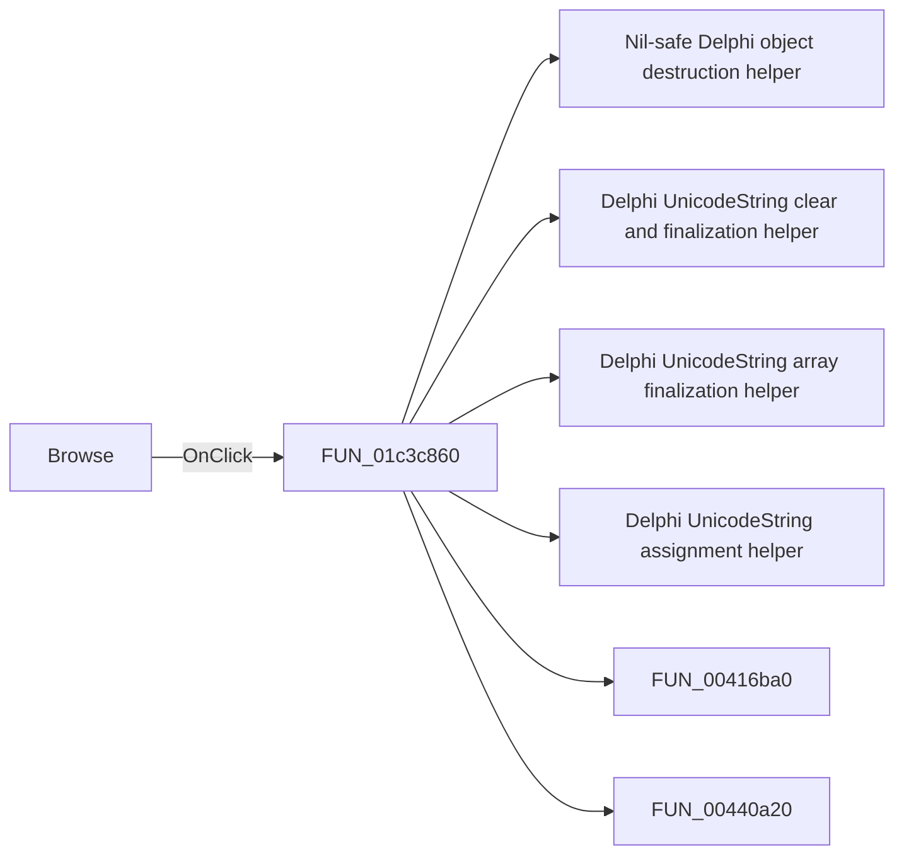

# Browse

> Analysis status: Pending individual source review.

## Control

| Property | Recovered value |
| --- | --- |
| Form | fMacroWiz |
| Component path | fMacroWiz.pcMWiz.tsSource.pSourceEmpty.sbSourceBrowseWeb |
| Control class | TSpeedButton |
| Caption | Browse |
| Hint | Not present in the recovered resource. |
| Text | Not present in the recovered resource. |
| Handler name | sbSourceBrowseWebClick |
| Handler address | 01c3c860 |
| Graph node | `resource:dfm:fMacroWiz/fMacroWiz.pcMWiz.tsSource.pSourceEmpty.sbSourceBrowseWeb` |
| Handler node | `function:01c3c860` |
| Graph layer | UI |

## What happens when clicked

Pending individual analysis. An agent must read the recovered handler source and its relevant callees before it replaces this text.

## Click flow

## Handler evidence

- Source: [DecompiledSources/Tina16/functions/0000000001C3C860__FUN_01c3c860.c](../../../DecompiledSources/Tina16/functions/0000000001C3C860__FUN_01c3c860.c)
- Recovered role: Not present in the recovered resource.
- Current graph summary: Handles 1 Delphi UI event: fMacroWiz.pcMWiz.tsSource.pSourceEmpty.sbSourceBrowseWeb.OnClick.
- Current graph behavior: Not present in the recovered resource.
- Current graph evidence: Not present in the recovered resource.
- Complexity: complex
- Distinct outgoing calls: 13

## Direct calls

- `function:00410f20` — Nil-safe Delphi object destruction helper
- `function:00414480` — Delphi UnicodeString clear and finalization helper
- `function:00414560` — Delphi UnicodeString array finalization helper
- `function:00414ad0` — Delphi UnicodeString assignment helper
- `function:00416ba0` — FUN_00416ba0
- `function:00440a20` — FUN_00440a20
- `function:004b6930` — FUN_004b6930
- `function:0064dbe0` — FUN_0064dbe0
- `function:0064de00` — VCL control text setter with change suppression
- `function:0072d730` — FUN_0072d730
- `function:01c1de60` — FUN_01c1de60
- `function:01c38160` — FUN_01c38160
- `function:01c38530` — FUN_01c38530

## Resource evidence

- Kind: Not present in the recovered resource.
- Modal result: Not present in the recovered resource.
- Checked state: Not present in the recovered resource.
- List items: Not present in the recovered resource.
- Image reference: Not present in the recovered resource.
- Extracted glyph: [`0173_fMacroWiz_fMacroWiz_pcMWiz_tsSource_pSourceEmpty_sbSourceBrowseWeb_Glyph_Data.png`](../../../glyph/0173_fMacroWiz_fMacroWiz_pcMWiz_tsSource_pSourceEmpty_sbSourceBrowseWeb_Glyph_Data.png)

## Nearby label candidates

Nearby labels are layout candidates only. They are not proof of behavior.

- Rank 1: File downloaded press Next at distance 104.

## Analysis limits

- Do not infer behavior from the control class, caption, hint, glyph, or nearby label alone.
- Do not replace the pending status until the handler source and relevant call path provide enough evidence.
