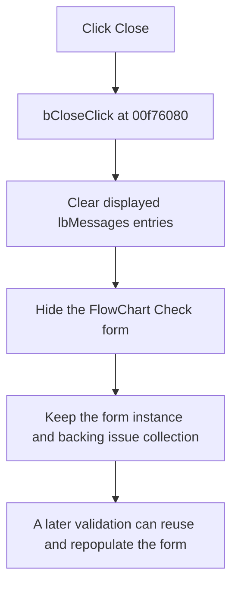

# Close

> Analysis status: Evidence-backed source review complete.

## Control

| Property | Recovered value |
| --- | --- |
| Form | formFlowChartCheck |
| Component path | formFlowChartCheck.bClose |
| Control class | TButton |
| Caption | Close |
| Hint | Not present in the recovered resource. |
| Text | Not present in the recovered resource. |
| Handler name | bCloseClick |
| Handler address | 00f76080 |
| Graph node | `resource:dfm:formFlowChartCheck/formFlowChartCheck.bClose` |
| Handler node | `function:00f76080` |
| Graph layer | UI |

## What happens when clicked

The handler first clears all displayed entries from `lbMessages`. It then hides the FlowChart Check form. It does not destroy the form or clear the separate backing collection of validation issue records.

The flowchart editor keeps the form instance in its field at `+0x998`. A later validation run reuses this instance, clears the visible list again, runs the validator, shows the form when the result path requires it, assigns the new backing issue collection, and repopulates `lbMessages`.

Clicking Close when the list is already empty and the form is already hidden has no additional visible effect. The handler has no condition, confirmation prompt, save operation, or local error branch. If the list-clear call does not return normally, the later hide call is not reached.

## Click flow

## Handler evidence

- Source: [DecompiledSources/Tina16/functions/0000000000F76080__FUN_00f76080.c](../../../DecompiledSources/Tina16/functions/0000000000F76080__FUN_00f76080.c)
- Recovered role: FlowChart Check close-button handler
- Current graph summary: Clears the validation result list and hides the FlowChart Check form. Handles 1 Delphi UI event: formFlowChartCheck.bClose.OnClick.
- Current graph behavior: Clears the visible validation-message list and hides the reusable FlowChart Check form.
- Current graph evidence: The DFM binds the Close button to this function. The handler calls the list-box clear wrapper and then the VCL form-hide wrapper. The editor retains the form and supplies a new issue collection on a later validation run.
- Complexity: moderate
- Distinct outgoing calls: 2

## Direct calls

- [`function:00805990`](../../../DecompiledSources/Tina16/functions/0000000000805990__FUN_00805990.c) — hides a VCL form by applying visible state `false`; a repeated hide leaves it hidden.
- [`function:00f760b0`](../../../DecompiledSources/Tina16/functions/0000000000F760B0__FUN_00f760b0.c) — invokes the recovered clear operation on `lbMessages`.

Relevant owner path:

- [`FUN_01050af0`](../../../DecompiledSources/Tina16/functions/0000000001050AF0__FUN_01050af0.c) creates the form only when the stored instance is null, clears its list before validation, shows and focuses it when required, assigns the new issue collection, and repopulates the visible messages.

## Resource evidence

- Kind: Not present in the recovered resource.
- Modal result: Not present in the recovered resource.
- Checked state: Not present in the recovered resource.
- List items: Not present in the recovered resource.
- Image reference: Not present in the recovered resource.
- Extracted glyph: None.

## Nearby label candidates

Nearby labels are layout candidates only. They are not proof of behavior.

- Rank 1: Click any of the errors/warnings above to highlight the questionable connection or component. at distance 270.

## Analysis limits

- The exact Delphi method name for the list-box clear virtual slot is not recovered. Its role is established by the form field, the empty-list preparation path, and the later population loop.
- The Close handler does not clear the backing issue collection at form field `+0x6d0`. Ownership and later disposal of that collection are outside this click path.
