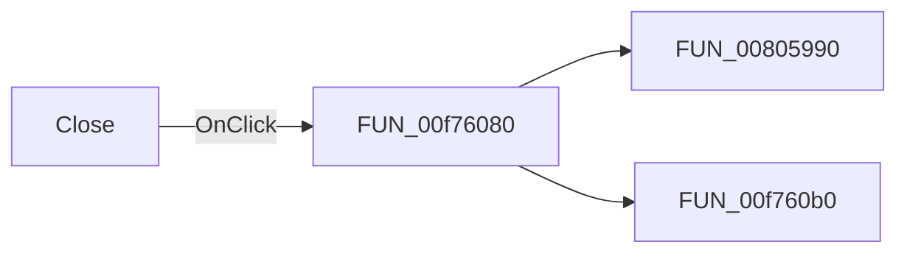

# Close

> Analysis status: Pending individual source review.

## Control

| Property | Recovered value |
| --- | --- |
| Form | formFlowChartCheck |
| Component path | formFlowChartCheck.bClose |
| Control class | TButton |
| Caption | Close |
| Hint | Not present in the recovered resource. |
| Text | Not present in the recovered resource. |
| Handler name | bCloseClick |
| Handler address | 00f76080 |
| Graph node | `resource:dfm:formFlowChartCheck/formFlowChartCheck.bClose` |
| Handler node | `function:00f76080` |
| Graph layer | UI |

## What happens when clicked

Pending individual analysis. An agent must read the recovered handler source and its relevant callees before it replaces this text.

## Click flow

## Handler evidence

- Source: [DecompiledSources/Tina16/functions/0000000000F76080__FUN_00f76080.c](../../../DecompiledSources/Tina16/functions/0000000000F76080__FUN_00f76080.c)
- Recovered role: FlowChart Check close-button handler
- Current graph summary: Clears the validation result list and hides the FlowChart Check form. Handles 1 Delphi UI event: formFlowChartCheck.bClose.OnClick.
- Current graph behavior: Clears the validation result list and hides the FlowChart Check form.
- Current graph evidence: The DFM binds the Close button to this function. It clears the list and calls the VCL visibility setter with false.
- Complexity: moderate
- Distinct outgoing calls: 2

## Direct calls

- `function:00805990` — FUN_00805990
- `function:00f760b0` — FUN_00f760b0

## Resource evidence

- Kind: Not present in the recovered resource.
- Modal result: Not present in the recovered resource.
- Checked state: Not present in the recovered resource.
- List items: Not present in the recovered resource.
- Image reference: Not present in the recovered resource.
- Extracted glyph: None.

## Nearby label candidates

Nearby labels are layout candidates only. They are not proof of behavior.

- Rank 1: Click any of the errors/warnings above to highlight the questionable connection or component. at distance 270.

## Analysis limits

- Do not infer behavior from the control class, caption, hint, glyph, or nearby label alone.
- Do not replace the pending status until the handler source and relevant call path provide enough evidence.
