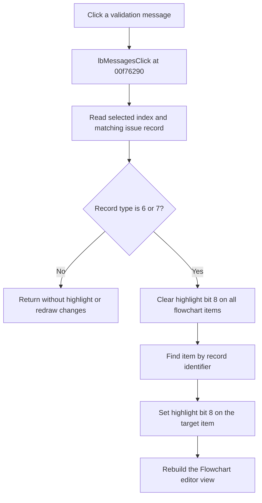

# lbMessages

> Analysis status: Evidence-backed source review complete.

## Control

| Property | Recovered value |
| --- | --- |
| Form | formFlowChartCheck |
| Component path | formFlowChartCheck.lbMessages |
| Control class | TListBox |
| Caption | Not present in the recovered resource. |
| Hint | Not present in the recovered resource. |
| Text | Not present in the recovered resource. |
| Handler name | lbMessagesClick |
| Handler address | 00f76290 |
| Graph node | `resource:dfm:formFlowChartCheck/formFlowChartCheck.lbMessages` |
| Handler node | `function:00f76290` |
| Graph layer | UI |

## What happens when clicked

The handler reads the selected `lbMessages` index and uses that index to get the matching record from the backing validation issue collection. The population routine builds the visible list in the same record order, so the selected row and issue record stay aligned.

If the selected record's type field at `+0x0c` is not `6` or `7`, the handler returns without changing highlights or redrawing the flowchart. For type `6` or `7`, it clears highlight bit `8` on every flowchart item. It then reads the referenced item identifier from record field `+0x10`, finds the item whose identifier field at `+0x3c` matches, sets highlight bit `8` on that item, and rebuilds the Flowchart editor view.

A repeated click on the same type `6` or `7` row clears all highlight bits, sets the same target again, and performs another rebuild. The handler has no local error message or recovery branch. It also has no explicit guard for an invalid list index or a missing referenced item; the recovered path assumes that a clickable type `6` or `7` record has a valid target.

## Click flow

## Handler evidence

- Source: [DecompiledSources/Tina16/functions/0000000000F76290__FUN_00f76290.c](../../../DecompiledSources/Tina16/functions/0000000000F76290__FUN_00f76290.c)
- Recovered role: Flowchart validation-message selection handler
- Current graph summary: For connection issue records, clears old highlights, finds the referenced flowchart object, sets its highlight flag, and redraws the flowchart. Handles 1 Delphi UI event: formFlowChartCheck.lbMessages.OnClick.
- Current graph behavior: For issue record types `6` and `7`, clears old item highlights, finds the referenced flowchart item, sets its highlight bit, and rebuilds the editor. Other record types do nothing in this handler.
- Current graph evidence: `formFlowChartCheck.lbMessages.OnClick` resolves here. The DFM instruction says that clicking an error or warning highlights its connection or component. The source implements a type-gated record-to-item lookup, bit update, and redraw path.
- Complexity: complex
- Distinct outgoing calls: 5

## Direct calls

- [`function:004aeac0`](../../../DecompiledSources/Tina16/functions/00000000004AEAC0__FUN_004aeac0.c) — returns a list entry by index and calls the range-error path when the index is outside the current count.
- [`function:00f65130`](../../../DecompiledSources/Tina16/functions/0000000000F65130__FUN_00f65130.c) — forwards the validation record's item identifier to the flowchart item lookup.
- [`function:00f6f900`](../../../DecompiledSources/Tina16/functions/0000000000F6F900__FUN_00f6f900.c) — adds highlight bit `8` to the selected item flags.
- [`function:00f750e0`](../../../DecompiledSources/Tina16/functions/0000000000F750E0__FUN_00f750e0.c) — iterates all flowchart items and clears highlight bit `8` through `FUN_00f6f910`.
- [`function:010508e0`](../../../DecompiledSources/Tina16/functions/00000000010508E0__FUN_010508e0.c) — forwards the current editor model to the layout and redraw rebuild.

Relevant population evidence:

- [`FUN_00f760d0`](../../../DecompiledSources/Tina16/functions/0000000000F760D0__FUN_00f760d0.c) iterates the backing issue collection in order and appends one formatted `lbMessages` row for each record.

## Resource evidence

- Kind: Not present in the recovered resource.
- Modal result: Not present in the recovered resource.
- Checked state: Not present in the recovered resource.
- List items: Not present in the recovered resource.
- Image reference: Not present in the recovered resource.
- Extracted glyph: None.

## Nearby label candidates

Nearby labels are layout candidates only. They are not proof of behavior.

- Rank 1: Click any of the errors/warnings above to highlight the questionable connection or component. at distance 127.

## Analysis limits

- The recovered string table does not expose names for issue types `6` and `7`. The article keeps the numeric type values.
- The exact Delphi names for record fields `+0x0c` and `+0x10`, item identifier `+0x3c`, and item flags `+0x10` are not recovered.
- No explicit missing-item check is recovered between the item lookup and the highlight-bit setter.
