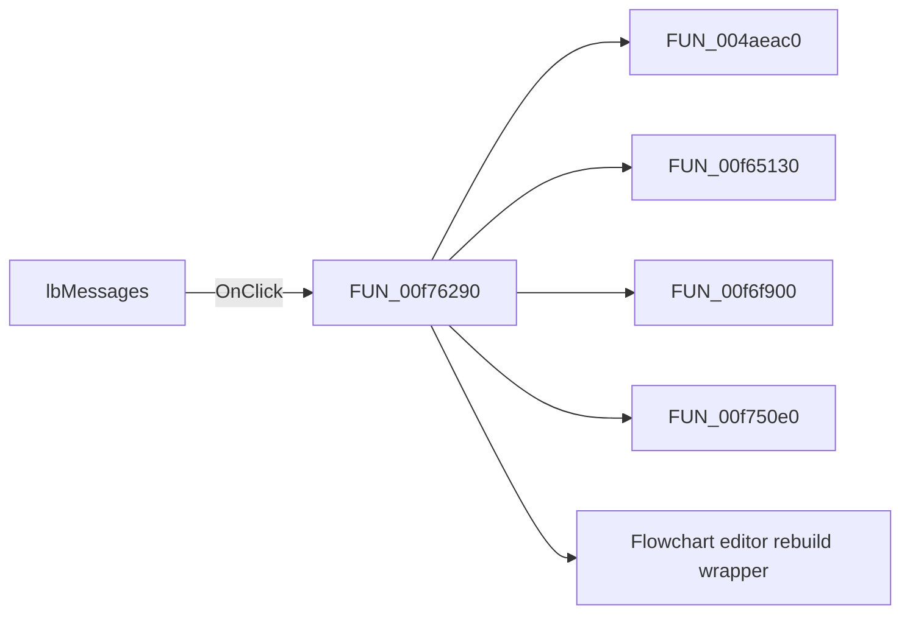

# lbMessages

> Analysis status: Pending individual source review.

## Control

| Property | Recovered value |
| --- | --- |
| Form | formFlowChartCheck |
| Component path | formFlowChartCheck.lbMessages |
| Control class | TListBox |
| Caption | Not present in the recovered resource. |
| Hint | Not present in the recovered resource. |
| Text | Not present in the recovered resource. |
| Handler name | lbMessagesClick |
| Handler address | 00f76290 |
| Graph node | `resource:dfm:formFlowChartCheck/formFlowChartCheck.lbMessages` |
| Handler node | `function:00f76290` |
| Graph layer | UI |

## What happens when clicked

Pending individual analysis. An agent must read the recovered handler source and its relevant callees before it replaces this text.

## Click flow

## Handler evidence

- Source: [DecompiledSources/Tina16/functions/0000000000F76290__FUN_00f76290.c](../../../DecompiledSources/Tina16/functions/0000000000F76290__FUN_00f76290.c)
- Recovered role: Flowchart validation-message selection handler
- Current graph summary: For connection issue records, clears old highlights, finds the referenced flowchart object, sets its highlight flag, and redraws the flowchart. Handles 1 Delphi UI event: formFlowChartCheck.lbMessages.OnClick.
- Current graph behavior: For connection issue records, clears old highlights, finds the referenced flowchart object, sets its highlight flag, and redraws the flowchart.
- Current graph evidence: formFlowChartCheck.lbMessages.OnClick resolves here. DFM text instructs the user to click an issue to highlight its connection or component, and the function implements that record-to-object path.
- Complexity: complex
- Distinct outgoing calls: 5

## Direct calls

- `function:004aeac0` — FUN_004aeac0
- `function:00f65130` — FUN_00f65130
- `function:00f6f900` — FUN_00f6f900
- `function:00f750e0` — FUN_00f750e0
- `function:010508e0` — Flowchart editor rebuild wrapper

## Resource evidence

- Kind: Not present in the recovered resource.
- Modal result: Not present in the recovered resource.
- Checked state: Not present in the recovered resource.
- List items: Not present in the recovered resource.
- Image reference: Not present in the recovered resource.
- Extracted glyph: None.

## Nearby label candidates

Nearby labels are layout candidates only. They are not proof of behavior.

- Rank 1: Click any of the errors/warnings above to highlight the questionable connection or component. at distance 127.

## Analysis limits

- Do not infer behavior from the control class, caption, hint, glyph, or nearby label alone.
- Do not replace the pending status until the handler source and relevant call path provide enough evidence.
