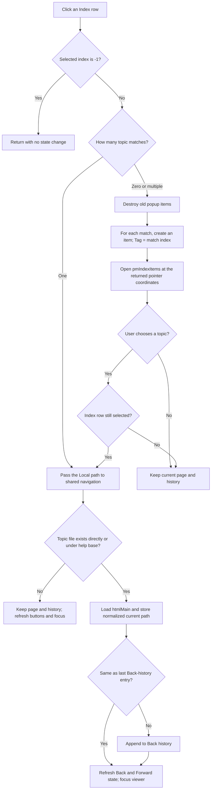

# Index list

## Control

| Property | Recovered value |
| --- | --- |
| Form | FormHelp |
| Component path | FormHelp.PCIndexSearch.tsIndex.lbIndex |
| Control class | TListBox |
| Parent tab | Index |
| Caption | Not present in the recovered resource. |
| Hint | Not present in the recovered resource. |
| Handler name | lbIndexClick |
| Handler address | 00b01390 |
| Graph node | `resource:dfm:FormHelp/FormHelp.PCIndexSearch.tsIndex.lbIndex` |
| Handler node | `function:00b01390` |
| Graph layer | UI |

The recovered form resource binds the list's `OnClick` event to `TFormHelp.lbIndexClick`. The list has no caption, hint, static items, or glyph. Its **Index** tab and the source-built index records identify its purpose.

## What happens when clicked

The list maps a selected help-index keyword to one or more help topics. A keyword with one topic opens it immediately. A keyword with multiple topics opens a popup menu that lets the user choose the topic.

The help-data loader builds the index before this click. It parses help sitemap objects and stores each usable entry as:

- one keyword from the outer `Name` parameter; and
- a dynamic array of matches, where each match contains a topic `Name` and a `Local` topic path.

It keeps an entry only when it has at least one complete `Name` and `Local` match. When the help form is shown, it adds the stored keywords to `lbIndex` in the same order. The selected list index therefore selects the corresponding index record.

## Selection branches

The handler first reads the list's selected index.

- If the index is `-1`, it returns without changing the current topic, history, popup menu, or button state.
- If the selected keyword has exactly one match, it passes that match's `Local` path to the shared FormHelp navigator with history insertion enabled.
- For any other match count, it clears and destroys all previous dynamic items in `pmIndexItems`. It creates one menu item for each match, uses the match `Name` as the item caption, stores the zero-based match index in the item `Tag`, and assigns `FUN_00b01320` as the click callback. It then opens the popup menu at the two coordinates returned by the common pointer-position thunk.

Normal parsed entries always have at least one match. Thus, the popup branch normally means two or more matches. If damaged or inconsistent in-memory data supplies a zero-length match array, the code still invokes an empty popup and performs no navigation.

The popup callback reads the current `lbIndex` selection again. If there is still a selection, it uses the clicked menu item's `Tag` to select the corresponding match and sends that match's `Local` path to the shared navigator with history insertion enabled. Dismissing the popup, or reaching the callback with no current selection, leaves the page and history unchanged. The popup creation itself does not load a topic.

## Topic path resolution and display

The shared navigator first tests the supplied `Local` path as received. If it is not an existing file, it prefixes the help package's extracted base directory and tests the combined path. When a file exists, it:

1. normalizes forward slashes to backslashes for the form's current-path field;
2. loads the topic into `FormHelp.htmlMain`;
3. conditionally adds the resolved topic path to history;
4. refreshes the navigation-button state; and
5. gives focus to the main HTML viewer.

If neither path exists, it does not load a topic, change the current-path field, or add history. It still refreshes the navigation controls and tries to focus `htmlMain`. This missing-topic branch does not show an application error message.

The click does not resolve a keyword by searching its displayed text. It uses the selected row number to index the parsed record. The popup captions are the per-match topic names, while the hidden `Local` values are the navigation targets.

## History and button state

Successful index navigation asks the shared navigator to add history. It appends the resolved topic path to the Back-history list only when that path differs from the current last entry. Repeated selection of the current topic therefore reloads it without adding a duplicate adjacent history entry.

The shared state updater enables Back only when the Back-history list contains more than one entry. It enables Forward when the Forward-history list contains at least one entry. An index click does not clear the Forward-history list. If Forward entries already exist after a Back operation, they remain available after a later index navigation.

The index click does not directly set button properties. The `.546`-owned navigator calls the common FormHelp state updater after both successful and missing-topic attempts.

## Errors, no-op behavior, and persistence

The normal no-op paths are:

- no selected list row;
- dismissal of a multiple-match popup;
- a popup callback after the list selection became `-1`; and
- a topic path that does not exist either directly or under the extracted help directory.

The handler assumes that the list row index, index-record array, popup `Tag`, and match array remain consistent. It checks only for selected index `-1`; it does not perform an explicit upper-bound check. Corrupt or changed in-memory structures can therefore cause an out-of-range access. The handler, callback, and shared navigator have no local exception handler or rollback.

The action changes only FormHelp's in-memory current path, HTML-viewer content, history lists, dynamic popup items, focus, and button state. It does not edit the help files, save history, write settings, or persist the selected keyword. Form closure destroys the help form's history collections, and the recovered click path contains no persistence call.

## Click flow

## Evidence

- [Index click handler](../../../DecompiledSources/Tina16/functions/0000000000B01390__FUN_00b01390.c): reads the selected row, distinguishes one from multiple matches, creates the popup items, and opens the popup.
- [Multiple-match callback](../../../DecompiledSources/Tina16/functions/0000000000B01320__FUN_00b01320.c): combines the current list selection with the clicked menu item's stored match index and invokes shared navigation.
- [Help-data loader](../../../DecompiledSources/Tina16/functions/0000000000B02F00__FUN_00b02f00.c): parses the index `Name` keyword and each topic `Name` plus `Local` path, and excludes entries without a complete match.
- [Form-show population](../../../DecompiledSources/Tina16/functions/0000000000B00EF0__FUN_00b00ef0.c): fills `lbIndex` from the parsed keyword records in record order.
- [Shared FormHelp navigator](../../../DecompiledSources/Tina16/functions/0000000000B01560__FUN_00b01560.c): resolves paths, loads `htmlMain`, maintains Back history, refreshes navigation state, and focuses the viewer. Its canonical annotation belongs to `.546`.
- [Shared navigation-state updater](../../../DecompiledSources/Tina16/functions/0000000000B01B00__FUN_00b01b00.c): derives Back and Forward availability from the two history-list counts. Its canonical annotation belongs to `.546`.
- [Back handler](../../../DecompiledSources/Tina16/functions/0000000000B016F0__FUN_00b016f0.c) and [Forward handler](../../../DecompiledSources/Tina16/functions/0000000000B017F0__FUN_00b017f0.c): establish the meaning of the two history collections used by the shared updater.

## Limits

- The imported function behind the shared two-coordinate thunk is not named in the recovered source. Its use as the input to `TPopupMenu.Popup(X, Y)` proves the coordinate purpose, but the article does not assign an unproven API name.
- The help index is parsed from the extracted help package. The original Delphi type names for its keyword and match records are not recovered.
- The HTML viewer's internal rendering, script, and embedded-resource behavior is outside this handler and is not described here.
