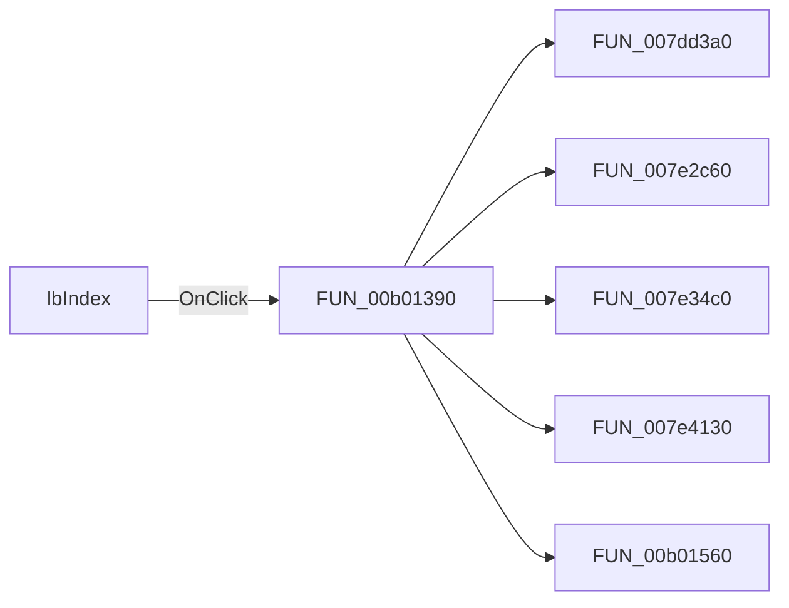

# lbIndex

> Analysis status: Pending individual source review.

## Control

| Property | Recovered value |
| --- | --- |
| Form | FormHelp |
| Component path | FormHelp.PCIndexSearch.tsIndex.lbIndex |
| Control class | TListBox |
| Caption | Not present in the recovered resource. |
| Hint | Not present in the recovered resource. |
| Text | Not present in the recovered resource. |
| Handler name | lbIndexClick |
| Handler address | 00b01390 |
| Graph node | `resource:dfm:FormHelp/FormHelp.PCIndexSearch.tsIndex.lbIndex` |
| Handler node | `function:00b01390` |
| Graph layer | UI |

## What happens when clicked

Pending individual analysis. An agent must read the recovered handler source and its relevant callees before it replaces this text.

## Click flow

## Handler evidence

- Source: [DecompiledSources/Tina16/functions/0000000000B01390__FUN_00b01390.c](../../../DecompiledSources/Tina16/functions/0000000000B01390__FUN_00b01390.c)
- Recovered role: Not present in the recovered resource.
- Current graph summary: Handles 1 Delphi UI event: FormHelp.PCIndexSearch.tsIndex.lbIndex.OnClick.
- Current graph behavior: Not present in the recovered resource.
- Current graph evidence: Not present in the recovered resource.
- Complexity: complex
- Distinct outgoing calls: 5

## Direct calls

- `function:007dd3a0` — FUN_007dd3a0
- `function:007e2c60` — FUN_007e2c60
- `function:007e34c0` — FUN_007e34c0
- `function:007e4130` — FUN_007e4130
- `function:00b01560` — FUN_00b01560

## Resource evidence

- Kind: Not present in the recovered resource.
- Modal result: Not present in the recovered resource.
- Checked state: Not present in the recovered resource.
- List items: Not present in the recovered resource.
- Image reference: Not present in the recovered resource.
- Extracted glyph: None.

## Nearby label candidates

Nearby labels are layout candidates only. They are not proof of behavior.

- No same-parent label candidate is available.

## Analysis limits

- Do not infer behavior from the control class, caption, hint, glyph, or nearby label alone.
- Do not replace the pending status until the handler source and relevant call path provide enough evidence.
