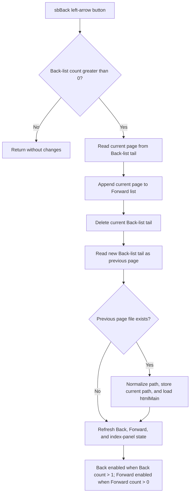

# sbBack

> Analysis status: Source-reviewed. The Back handler, shared page loader, history lists, enabled-state updater, and help-form lifecycle establish the behavior below.

## Control

| Property | Recovered value |
| --- | --- |
| Form | FormHelp |
| Component path | FormHelp.FlowPanel1.sbBack |
| Control class | TSpeedButton |
| Caption | Not present in the recovered resource. |
| Hint | Not present in the recovered resource. |
| Handler name | sbBackClick |
| Handler address | 00b016f0 |
| Graph node | `resource:dfm:FormHelp/FormHelp.FlowPanel1.sbBack` |
| Handler node | `function:00b016f0` |
| Graph layer | UI |

## What happens when clicked

FormHelp implements its own page history with two `TStringList`-like objects. The Back list is at form offset `+0x738`, and the Forward list is at `+0x740`. These lists are created when FormHelp is created and destroyed with the form. This is an internal file-based HTML history path; the recovered handler does not call the Windows HTML Help or CHM Back API.

When the Back list is not empty, `FUN_00b016f0` performs these operations in order:

1. It reads the last Back entry. This entry is the current page path.
2. It appends that current path to the Forward list.
3. It deletes the current path from the Back list.
4. It reads the new last Back entry, which is the previous page path.
5. It calls `FUN_00b01560` with that path and `addHistory = false`.

The shared navigator resolves a relative path against the help data's base directory, checks that the file exists, stores a slash-normalized current path at `FormHelp + 0x748`, and loads the target into `htmlMain`. Because Back passes `false`, the navigator does not append the target again to the Back list. It then refreshes navigation-button and index-panel state and makes the HTML viewer the form's active control.

The history contains page paths only. The Back handler does not save a scroll position, text selection, viewer zoom, form size, index selection, search value, or in-page anchor state. A Back action therefore reloads the prior page; it does not prove restoration of the prior page's exact viewport.

## Button state and history bounds

`FUN_00b01b00` enables `sbBack` only when the Back list contains more than one entry. One entry represents the current page and provides no previous page. It enables `sbForward` when the Forward list contains at least one entry.

- Back count `0`: the handler's `0 < count` guard makes the click a no-op.
- Back count `1`: normal UI use cannot click Back because the button is disabled. The handler itself checks only for a positive count. A direct or programmatic call with one entry would delete that entry and then request index `-1`; the recovered code has no second guard.
- Back count `2` or more: the normal history transfer and page load run. After the first valid Back action, Forward is enabled because it contains the page that was left. Back remains enabled only if at least two entries remain.

The Forward sibling performs the inverse transfer. Home clears Forward and uses the shared navigator with history insertion enabled. Tree, index, link, and search paths also feed the shared navigator or update the same lists. Their direct control articles own those routes.

## Missing pages and errors

The Back handler mutates the two history lists before it asks the shared navigator to load the previous page.

- If the previous path does not resolve to an existing file, `FUN_00b01560` does not load it and does not show an error message. It still refreshes enabled state. The viewer and current-path field can stay on the old page while the current history entry has already moved to Forward.
- If loading throws after the current-path field is assigned, the field can identify the target while the viewer remains old or partially updated.
- List, path, file-load, viewer, and UI-state exceptions propagate. There is no local catch or rollback.
- The transfer is not transactional. A failure after the Forward append can leave the Back and Forward lists, current-path field, and displayed page out of sync.

## Persistence boundary

Back reads help files but writes no file, registry value, INI value, application setting, or CHM state. Its history and current-page path exist only in the live FormHelp object. Closing and destroying the form frees both history lists, so the recovered code does not preserve Back or Forward history for a later help window.

## Click flow

## Handler evidence

- [FUN_00b016f0](../../../DecompiledSources/Tina16/functions/0000000000B016F0__FUN_00b016f0.c) reads and mutates the two history lists, selects the remaining Back-list tail, and calls the navigator without history insertion.
- [FUN_00b01560](../../../DecompiledSources/Tina16/functions/0000000000B01560__FUN_00b01560.c) resolves and validates the path, loads `htmlMain`, optionally appends a nonduplicate Back entry, refreshes navigation state, and activates the viewer.
- [FUN_00b01b00](../../../DecompiledSources/Tina16/functions/0000000000B01B00__FUN_00b01b00.c) enables Back for a count greater than one and Forward for a count greater than zero. It also synchronizes the index-panel controls with the loaded help data.
- [FUN_00b017f0](../../../DecompiledSources/Tina16/functions/0000000000B017F0__FUN_00b017f0.c) is the inverse Forward transfer and confirms the roles of the two lists.
- [FUN_00b00d40](../../../DecompiledSources/Tina16/functions/0000000000B00D40__FUN_00b00d40.c) creates the Back and Forward lists.
- [FUN_00b00d80](../../../DecompiledSources/Tina16/functions/0000000000B00D80__FUN_00b00d80.c) destroys both lists with the form.

## Resource and glyph evidence

- The recovered DFM binds `sbBack.OnClick` to `sbBackClick` at `00b016f0`.
- The control has no recovered caption, hint, action, image-list index, or built-in modal result.
- The [extracted 24 by 24 PNG](../../../glyph/0176_FormHelp_FormHelp_FlowPanel1_sbBack_Glyph_Data.png) comes from a 1,786-byte embedded BMP and shows a leftward curved arrow. It supports the Back meaning, while the handler and shared lists prove the implementation.

## Analysis limits and ownership

- `FUN_00b016f0`, shared navigator `FUN_00b01560`, and shared navigation-state updater `FUN_00b01b00` are annotated with this control.
- Forward, Home, index-panel, contents-tree, index-list, search, and link handlers are evidence only here and remain with their direct control owners.
- The recovered code proves local HTML-file loading. It does not expose the source package's CHM extraction or deployment process, if one exists.
- The underlying HTML viewer can have internal load behavior that is not recovered in this call tree. This article does not invent caching, network access, encoding, or renderer error handling.
