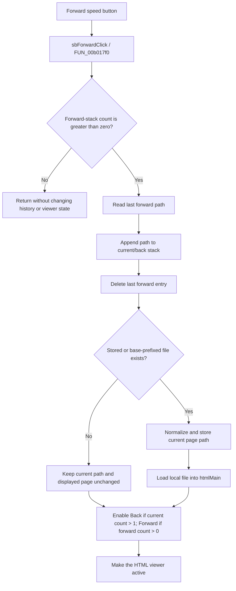

# Move forward in FormHelp history

> Analysis status: Source-reviewed. The Forward handler, internal history lists, shared local-HTML navigator, button-state updater, and FormHelp lifetime handlers establish the behavior below.

## Control

| Property | Recovered value |
| --- | --- |
| Form | FormHelp |
| Component path | FormHelp.FlowPanel1.sbForward |
| Control class | TSpeedButton |
| Caption | Not present in the recovered resource. |
| Hint | Not present in the recovered resource. |
| Text | Not present in the recovered resource. |
| Handler name | sbForwardClick |
| Handler address | 00b017f0 |
| Graph node | `resource:dfm:FormHelp/FormHelp.FlowPanel1.sbForward` |
| Handler node | `function:00b017f0` |
| Graph layer | UI |

## What happens when clicked

`FUN_00b017f0` moves one entry forward through FormHelp's own history lists. It does not call a WebBrowser, WinHelp, or CHM history command.

The form owns two Delphi string lists:

- form field `+0x738` is the current and back-history stack;
- form field `+0x740` is the forward-history stack.

The most recent entry is the last string in each list. A valid Forward click performs these changes in order:

1. reads the last path from the forward stack;
2. appends that path to the current/back stack;
3. deletes the last entry from the forward stack;
4. reads the newly appended last entry from the current/back stack; and
5. calls the shared FormHelp navigator with its add-to-history flag clear.

This is a last-in, first-out operation. Repeated clicks visit successively older entries in the forward stack until it becomes empty.

## Local help-page navigation

The shared navigator first tests the selected path. If it is not an existing file, it prefixes the help system's recovered base directory and tests the combined path.

For a path that exists, it:

- normalizes `/` separators to `\` and stores the result as the current page path at form `+0x748`;
- loads the file into `FormHelp.htmlMain`, a `THtmlViewer`; and
- keeps the add-to-history flag clear because the Forward handler already changed the two stacks.

After the load attempt, the navigator recalculates the navigation controls and makes the HTML viewer the form's active control. It does not reload the help contents tree, index, or search data.

The history therefore belongs to the custom FormHelp window around a local HTML viewer. It is not the viewer's private browser history and is not an external CHM engine history.

## Button enabled state

The shared state updater sets:

- **Back** enabled only when the current/back stack contains more than one entry; and
- **Forward** enabled only when the forward stack contains at least one entry.

After one successful history move, Forward remains enabled when another entry is available. Consuming the final forward entry disables it. Back is enabled only when the resulting current/back stack contains more than one entry, which is the normal state after a forward move from an already displayed page.

When the forward stack is already empty, `FUN_00b017f0` returns without reading a path, changing a list, loading the viewer, moving focus, or recalculating the buttons. Normal UI state already disables Forward in this case. A programmatic call with an empty stack is therefore also a no-op.

## Missing pages and failures

The history stacks change before the selected file is validated or loaded.

If neither the stored path nor the base-directory-prefixed path exists, the shared navigator does not change current-path field `+0x748` and does not load `htmlMain`. It still updates the button states and active control. The entry has already moved from the forward stack to the current/back stack, so a missing file consumes one forward-history step while the displayed page stays unchanged. No message is shown on this route.

The handler has no local exception handler or rollback:

- If the append succeeds and the forward-list delete fails, the path can exist in both stacks.
- If both list changes succeed but path resolution or the viewer load raises, the stacks remain changed.
- The shared navigator writes the normalized current path before it asks `THtmlViewer` to load the file. A load exception can therefore leave the path field ahead of the visible page.
- An exception before the state updater runs can leave button enabled states stale.

## Persistence boundary

`FormCreate` constructs both history lists. `FormDestroy` frees them. `FormClose` selects `caFree`, so closing the help form destroys its in-memory history during the normal close lifecycle.

Forward performs no INI, registry, file, project, or settings write. The stack changes are not undo state and are not persisted for a later FormHelp instance or application session.

## Click flow

## Source evidence

- [FUN_00b017f0](../../../DecompiledSources/Tina16/functions/0000000000B017F0__FUN_00b017f0.c) guards on the forward-list count, transfers its last entry to the current/back list, deletes it from the forward list, and calls the shared navigator without adding another history entry.
- [FUN_00b01560](../../../DecompiledSources/Tina16/functions/0000000000B01560__FUN_00b01560.c) resolves the local page path, stores the normalized current path, loads `htmlMain`, invokes the button-state updater, and selects the viewer as the active control.
- [FUN_00b01b00](../../../DecompiledSources/Tina16/functions/0000000000B01B00__FUN_00b01b00.c) sets Back enabled for current/back count greater than one and Forward enabled for forward count greater than zero.
- [FUN_00b016f0](../../../DecompiledSources/Tina16/functions/0000000000B016F0__FUN_00b016f0.c), the paired Back handler, moves the current entry to the forward stack and loads the preceding current/back entry.
- [FUN_00b00d40](../../../DecompiledSources/Tina16/functions/0000000000B00D40__FUN_00b00d40.c) constructs both history lists during `FormCreate`.
- [FUN_00b00d80](../../../DecompiledSources/Tina16/functions/0000000000B00D80__FUN_00b00d80.c) frees both lists during `FormDestroy`.
- [FUN_00b00d00](../../../DecompiledSources/Tina16/functions/0000000000B00D00__FUN_00b00d00.c) selects close action `2`, the recovered `caFree` value, and releases the help-data object during normal form closure.

## Resource and glyph evidence

- The recovered DFM binds `FormHelp.FlowPanel1.sbForward.OnClick` to `sbForwardClick` at `00b017f0`.
- The control has no recovered caption, hint, action, built-in modal result, or image-list reference.
- The extracted [24-by-24 Forward glyph](../../../glyph/0177_FormHelp_FormHelp_FlowPanel1_sbForward_Glyph_Data.png) is a right-pointing curved arrow. It corroborates the forward direction; the two-list transfer and local-page load prove the behavior.
- The paired Back and Home controls use matching 24-by-24 toolbar glyphs. Their resource placement alone is not used as behavioral proof.

## Analysis limits and ownership

- This Bead annotates only the Forward handler `FUN_00b017f0`.
- Bead `.546`, the Back control, owns the shared local-page navigator `FUN_00b01560` and navigation-state updater `FUN_00b01b00`. This article cites them without redefining their graph annotations.
- Adjacent FormHelp controls own their command-specific handlers. The VCL string-list, control-state, active-control, file-test, and HTML-viewer functions remain evidence only.
- The original Delphi names for history fields `+0x738` and `+0x740` are not recovered. Their stack roles are established by the paired Back and Forward transfers and the button-state counts.
