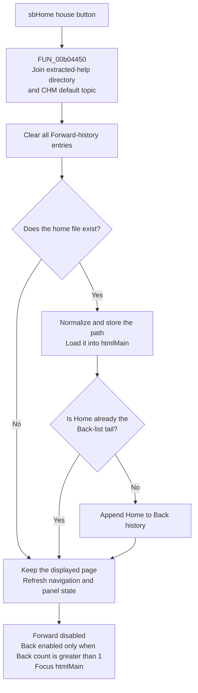

# sbHome

> Analysis status: Source-reviewed. The CHM default-topic resolver, shared page navigator, history lists, and navigation-state updater establish the behavior below.

## Control

| Property | Recovered value |
| --- | --- |
| Form | FormHelp |
| Component path | FormHelp.FlowPanel1.sbHome |
| Control class | TSpeedButton |
| Caption | Not present in the recovered resource. |
| Hint | Not present in the recovered resource. |
| Text | Not present in the recovered resource. |
| Handler name | sbHomeClick |
| Handler address | 00b018f0 |
| Graph node | `resource:dfm:FormHelp/FormHelp.FlowPanel1.sbHome` |
| Handler node | `function:00b018f0` |
| Graph layer | UI |

## What happens when clicked

`sbHomeClick` navigates the main FormHelp HTML viewer to the help package's default topic. It does not use a fixed `index.html` name.

The handler asks `FUN_00b04450` to concatenate two strings from the loaded help-data object:

- Offset `+0x20` is the extracted help base directory.
- Offset `+0x28` is the default topic read from the CHM `#SYSTEM` stream.

The help-data loader [FUN_00b02f00](../../../DecompiledSources/Tina16/functions/0000000000B02F00__FUN_00b02f00.c) extracts the CHM data under `DesignSoft\Help\`, reads `#SYSTEM`, and stores its default-topic string at offset `+0x28`. The exact topic name is therefore package data and is not a static string in this click handler.

After it builds the target, Home clears the complete Forward-history list at form offset `+0x740`. It then passes the target to the shared navigator with history insertion enabled.

The navigator checks the file path, normalizes forward slashes to backslashes, stores the current path at form offset `+0x748`, and loads it into `htmlMain`. It appends the home path to the Back/current-history list at `+0x738` unless that path is already the last entry. It then refreshes navigation and index-panel state and makes the main HTML viewer the active control.

## History and button state

Home does not reset the Back list. It adds a new history entry only when the home path differs from the current tail. This gives these state changes:

- The Forward list is always cleared before path validation. The Forward button is then disabled.
- If Home leaves a different valid page, the home path is appended. Back becomes enabled when the Back list now has more than one entry.
- If the current history tail is already the home path, no duplicate entry is added. The existing Back history remains available.
- The Home button itself has no recovered checked-state change.

The state updater also synchronizes the contents and index controls, side-panel availability, and the show-hide button with the loaded help data. Home does not select a Contents, Index, or Search tab, change an index selection, rebuild those data structures, or show or hide the side panel directly.

## Click flow

## Handler evidence

- [FUN_00b018f0](../../../DecompiledSources/Tina16/functions/0000000000B018F0__FUN_00b018f0.c) builds the home target, clears the list at `+0x740`, and calls the shared navigator with history insertion enabled.
- [FUN_00b04450](../../../DecompiledSources/Tina16/functions/0000000000B04450__FUN_00b04450.c) concatenates help-data strings `+0x20` and `+0x28` without an added separator.
- [FUN_00b01560](../../../DecompiledSources/Tina16/functions/0000000000B01560__FUN_00b01560.c) validates and normalizes the path, loads `htmlMain`, avoids a duplicate Back-list tail, refreshes UI state, and activates the viewer.
- [FUN_00b01b00](../../../DecompiledSources/Tina16/functions/0000000000B01B00__FUN_00b01b00.c) enables Back only when its list count is greater than one and enables Forward only when its list is nonempty. It also synchronizes the index-panel controls.
- [FUN_00b00d40](../../../DecompiledSources/Tina16/functions/0000000000B00D40__FUN_00b00d40.c) creates the two history lists with the form. [FUN_00b00d80](../../../DecompiledSources/Tina16/functions/0000000000B00D80__FUN_00b00d80.c) destroys them.
- [FUN_00b00ef0](../../../DecompiledSources/Tina16/functions/0000000000B00EF0__FUN_00b00ef0.c) calls this same Home handler when FormHelp is shown. The fallback routes at [FUN_00b019d0](../../../DecompiledSources/Tina16/functions/0000000000B019D0__FUN_00b019d0.c) and [FUN_00b01a30](../../../DecompiledSources/Tina16/functions/0000000000B01A30__FUN_00b01a30.c) also call Home when the corresponding help index data is unavailable.
- Complexity: complex.
- Distinct outgoing calls: 3.

## Missing topics and failure boundaries

The shared navigator first tests the full path. If it does not exist, it tries to prefix the help base directory and tests again. The Home target already includes that base directory, but it still follows this common path.

- If neither path exists, no page is loaded and no new Back entry is added. The old viewer content and current-path field remain, but Forward history has already been cleared.
- The navigator shows no missing-file message. It still refreshes button and panel state and makes `htmlMain` active.
- The target path is stored before the viewer load. If the viewer load raises an exception, the current-path field can identify Home while the displayed page is old or partially loaded.
- The handler has no local catch, retry, result check, or rollback. String, list, file, viewer, and UI exceptions can propagate.

## Index, contents, and persistence boundaries

Home uses the package default topic only. It does not resolve a Contents-tree node, Index-list item, Search result, context ID, anchor, or external URL. It also does not preserve or restore scroll position, selection, or viewer zoom.

The click writes no help file, application setting, registry value, or project data. The current page and both history lists belong to the live FormHelp instance. Form destruction frees those lists, so this recovered path does not persist Home navigation or history across help-window lifetimes.

## Direct calls

- `function:00414480` - Clears the temporary home-path UnicodeString.
- `function:00b01560` - Loads the resolved page, maintains Back history, refreshes control state, and activates `htmlMain`.
- `function:00b04450` - Builds the extracted CHM default-topic path.

## Resource and glyph evidence

- The recovered DFM binds `sbHome.OnClick` to `sbHomeClick` at `00b018f0`.
- The control has no recovered caption, hint, action, image-list index, modal result, or nearby label.
- The [extracted 24 by 24 PNG](../../../glyph/0175_FormHelp_FormHelp_FlowPanel1_sbHome_Glyph_Data.png) comes from a 1,786-byte embedded BMP and shows a house. It supports the Home meaning. The handler and help-data path prove the target and implementation.

## Analysis limits and ownership

- This control owns `FUN_00b018f0` and the unique default-topic path builder `FUN_00b04450`.
- The Back control owns shared navigator `FUN_00b01560` and shared state updater `FUN_00b01b00`; they are cited here as evidence and are not duplicated in this annotation fragment.
- The CHM `#SYSTEM` value supplies the topic. The recovered binary does not expose the package-specific topic string used at run time.
- The underlying HTML viewer can have internal parsing and rendering behavior outside this recovered call tree. This article does not infer caching, encoding, script execution, or network access.
