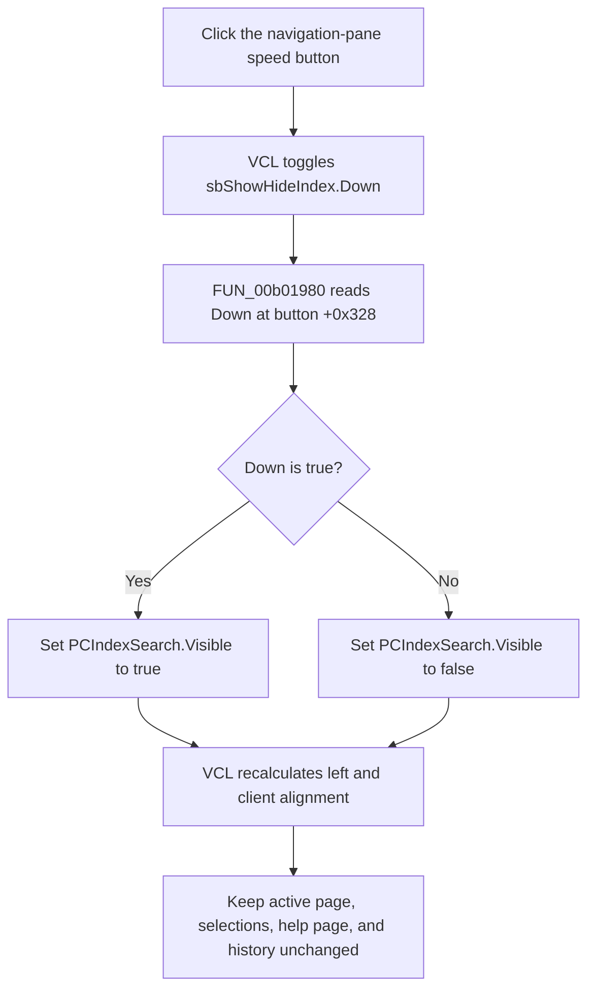

# Show or hide the help navigation pane

> Analysis status: Complete. The recovered speed-button state, direct VCL visibility call, navigation-page resource, shared state reconciler, aligned layout, and glyph support this explanation.

## Control

| Property | Recovered value |
| --- | --- |
| Form | FormHelp |
| Component path | FormHelp.FlowPanel1.sbShowHideIndex |
| Control class | TSpeedButton |
| Caption | Not present in the recovered resource. |
| Hint | Not present in the recovered resource. |
| Group index | 1 |
| Allow all up | true |
| Handler name | sbShowHideIndexClick |
| Handler address | 00b01980 |
| Graph node | `resource:dfm:FormHelp/FormHelp.FlowPanel1.sbShowHideIndex` |
| Handler node | `function:00b01980` |
| Graph layer | UI |

## What happens when clicked

`sbShowHideIndex` is a grouped `TSpeedButton` with `AllowAllUp = true`. VCL changes its `Down` state as part of the click before it calls `FUN_00b01980`. The handler reads that state from button offset `+0x328` and passes the same Boolean to the VCL visibility setter for FormHelp field `+0x6b0`.

Resource structure and the shared FormHelp reconciler identify field `+0x6b0` as `PCIndexSearch`, the left-aligned navigation `TPageControl`. Thus:

- when the button is down, the navigation pane is visible;
- when the button is up, the navigation pane is hidden; and
- when pane visibility already equals the requested state, the VCL setter returns without another visibility notification or layout change.

The control name says “Index,” but the pane contains all three recovered navigation pages: **Contents**, **Index**, and **Search**.

## Layout and splitter behavior

`PCIndexSearch` is aligned to the left and has a recovered width of `200`. `htmlMain` is aligned to the remaining client area. Changing pane visibility sends the normal VCL visibility-change notification and triggers aligned-control layout:

- hiding the pane releases its 200-pixel layout area, so the main HTML viewer can expand;
- showing it restores the left navigation area, and the main viewer uses the remaining width.

`Splitter1` is a separate sibling component at the pane boundary. `FUN_00b01980` does not change the splitter's `Visible`, `Enabled`, position, or size. Any splitter movement caused by VCL alignment is layout behavior, not a splitter state write by this handler.

The click does not resize the form itself and does not write a new pane width. The prior `PCIndexSearch` width remains on the component and is used again when it becomes visible.

## Page, selection, and history state

The handler changes only `PCIndexSearch.Visible`. It does not change:

- the active Contents, Index, or Search page;
- the selected contents-tree node or index-list item;
- Search text or results;
- the current HTML help document; or
- the Back and Forward history lists.

These objects remain allocated while the pane is hidden. Showing the pane therefore exposes the previous active page and selections. The main help page and its scroll state are not reloaded by this click.

## Button, glyph, and availability state

The handler does not replace the glyph, change `Enabled`, or write `Down` itself. The VCL speed-button click changes `Down`; the handler consumes it. The extracted 24 by 24 bitmap shows a small window with a left navigation list, which is consistent with pane visibility, but the handler and resource tree provide the behavioral proof.

Shared helper `FUN_00b01b00` maintains broader FormHelp state after help-document or navigation changes. It:

- hides `PCIndexSearch` when neither Contents nor Index data is available;
- hides the show/hide button in that unavailable state;
- otherwise shows the button;
- synchronizes the button's `Down` state to the pane's actual `Visible` state; and
- updates the separate Back and Forward button enabled states from their history counts.

`FUN_00b01980` does not call this reconciler and does not update Back or Forward. It only applies the already toggled `Down` state to pane visibility.

## Persistence and errors

- Pane visibility lasts in the current `FormHelp` component instance until another action changes or reconciles it. The handler does not write a registry, INI, settings record, help file, or other cross-session store.
- There is no application confirmation, validation, or error message.
- The handler has no explicit null or availability guard. Normal resource construction supplies both components, and a hidden unavailable button cannot be clicked through the UI. A programmatic call with invalid fields would still reach the VCL setter.
- The VCL setter performs no work when the requested value already matches `Visible`. Otherwise, exceptions from visibility notifications or layout propagate because the handler has no local exception handler or rollback.
- The speed-button state changes before the handler calls the visibility setter. If that setter fails, the button and pane can temporarily disagree until `FUN_00b01b00` or another update synchronizes them.

## Toggle flow

## Source evidence

- Show/hide click wrapper: [FUN_00b01980](../../../DecompiledSources/Tina16/functions/0000000000B01980__FUN_00b01980.c)
- Generic VCL visibility setter: [FUN_0064dbe0](../../../DecompiledSources/Tina16/functions/000000000064DBE0__FUN_0064dbe0.c)
- Shared FormHelp pane/button/history reconciler: [FUN_00b01b00](../../../DecompiledSources/Tina16/functions/0000000000B01B00__FUN_00b01b00.c)
- Generic speed-button Down setter used for reconciliation: [FUN_0082a6c0](../../../DecompiledSources/Tina16/functions/000000000082A6C0__FUN_0082a6c0.c)
- Help navigation and history consumer: [FUN_00b01560](../../../DecompiledSources/Tina16/functions/0000000000B01560__FUN_00b01560.c)
- Extracted glyph: [`0174_FormHelp_FormHelp_FlowPanel1_sbShowHideIndex_Glyph_Data.png`](../../../glyph/0174_FormHelp_FormHelp_FlowPanel1_sbShowHideIndex_Glyph_Data.png)

## Resource evidence

- `PCIndexSearch` is a left-aligned `TPageControl`, width `200`, with **Contents**, **Index**, and **Search** pages.
- The Contents page owns `tvContents`; the Index page owns `lbIndex`; the Search page owns `eSearch` and `HtmlViewer3`.
- `htmlMain` is aligned to the client area beside the navigation pane.
- `Splitter1` is a separate sibling at recovered left coordinate `200`.
- `sbShowHideIndex` has `GroupIndex = 1`, `AllowAllUp = true`, no caption or hint, and one embedded 24 by 24 bitmap glyph.
- The glyph is a static image. No alternate down or disabled glyph is present in the recovered resource.
- Nearby label candidate: None.

## Analysis limits and annotation ownership

- `TIARA-diz.6.7.546` canonically owns shared FormHelp navigation dispatcher `FUN_00b01560` and state reconciler `FUN_00b01b00`. This article cites them without redefining them.
- Generic VCL helpers `FUN_0064dbe0` and `FUN_0082a6c0` remain evidence-only here.
- This article annotates only the unique show/hide handler `FUN_00b01980`.
- The original Delphi field names for form offsets `+0x6b0` and `+0x6d8` are not recovered. Their `PCIndexSearch` and `sbShowHideIndex` identities follow from the DFM component tree, the handler's property offsets, and the shared reconciler's two-way visibility/Down synchronization.
