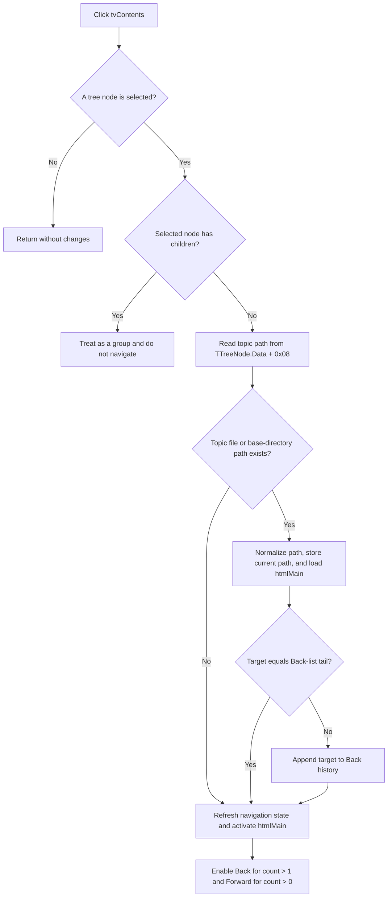

# Open a leaf help topic from the Contents tree

> Analysis status: Source-reviewed. The contents-tree builder, selected-node guard, topic record, shared page navigator, history state, and sibling Index path establish the behavior below.

## Control

| Property | Recovered value |
| --- | --- |
| Form | FormHelp |
| Component path | FormHelp.PCIndexSearch.tsContents.tvContents |
| Control class | TTreeView |
| Parent page | Contents |
| Align | alClient |
| ReadOnly | true |
| Handler name | tvContentsClick |
| Handler address | 00b01aa0 |
| Graph node | `resource:dfm:FormHelp/FormHelp.PCIndexSearch.tsContents.tvContents` |
| Handler node | `function:00b01aa0` |
| Graph layer | UI |

## What happens when clicked

`TFormHelp.tvContentsClick` opens a help page only when the tree has a selected
leaf node. The recovered handler performs these operations:

1. It gets the current `TTreeNode` from `tvContents`.
2. It returns when no node is selected.
3. It tests whether the selected node has children and returns when it does.
4. For a leaf, it reads the help-record pointer from `TTreeNode.Data`, takes the
   topic path from record offset `+0x08`, and passes that path to the shared
   FormHelp navigator with history insertion enabled.

The handler does not derive the topic from the visible node caption. The form's
show path builds the tree recursively from help records and stores the complete
record pointer in each node's `Data` field. Record offset `+0x10` supplies child
records. This data flow proves which value is used for navigation.

## Leaf and group behavior

- **No selected node:** The handler returns. It does not load a page, update
  history, refresh navigation buttons, or move focus.
- **Selected group node:** A node whose native TreeView child count is positive
  is not a topic command. The handler returns without loading its record's
  path. Native tree selection or expansion behavior is outside this OnClick
  handler.
- **Selected leaf node:** The handler sends `Data + 0x08` to the shared
  navigator. It does not separately test for an empty path or a null `Data`
  pointer.

Because this is `OnClick`, clicking an already selected leaf runs the handler
again. A valid page can be reloaded, but the navigator does not add a second
Back entry when the target equals the Back-list tail.

## Topic resolution and page load

The `.546`-owned shared navigator first tests the supplied topic as a file path.
If it is not found, it prefixes the help-data base directory at help-record
container offset `+0x20` and tests the combined path. For an existing file it:

- replaces `/` with `\` and stores the result as the current help path at form
  offset `+0x748`;
- loads that file into `htmlMain`;
- appends the path to the Back list when it differs from the current tail;
- refreshes FormHelp navigation and index-panel state; and
- makes `htmlMain` the active control.

The selected tree node is not explicitly cleared or changed, but keyboard focus
moves to the HTML viewer after the navigator completes.

## History and button state

The Back list at form offset `+0x738` includes the current page as its final
entry. A successful tree navigation adds the target unless it is already that
entry. The Forward list at `+0x740` is not cleared or changed by this handler or
the shared navigator.

After every navigator call, including a missing-file path, the shared state
updater enables Back only when the Back list has more than one entry. It enables
Forward when the Forward list is not empty. A valid first leaf navigation can
therefore enable Back only when another page already precedes it. Existing
Forward history remains available after a new contents-tree selection because
the recovered path has no Forward-list clear call.

## Relationship to Index and Search

Contents, Index, and Search are pages of the same `PCIndexSearch` control. The
Index selection handler also feeds a record topic to the same navigator with
history insertion enabled. This gives all routes the same displayed page,
current path, and Back/Forward lists.

The contents-tree click does not change the PageControl page, Index list
selection, Search edit text, or search results. The shared state updater changes
control availability and side-panel state from the loaded help-data capability
flags; it does not select a corresponding Index or Search entry. The recovered
code therefore proves shared navigation state, not selection synchronization
between the three tabs.

## Click flow

## No-op, error, and partial-state paths

- A missing topic file, before and after base-directory resolution, produces no
  message and no page or history change. The navigator still refreshes UI state
  and activates `htmlMain`.
- The handler assumes that a selected leaf has a valid help-record pointer. A
  malformed or externally inserted leaf with null `Data` can fail before the
  navigator is called.
- The current-path field is assigned before the HTML viewer load. A viewer-load
  exception can leave the stored path changed while the old page remains
  visible or the new page is only partly loaded.
- The page is loaded before history insertion. An allocation or list exception
  during insertion can leave the new page visible without the matching Back
  entry.
- The HTML loader has an internal busy-state guard. If that guard rejects the
  load, the shared navigator receives no failure result and can still add the
  target to history and update the current-path field while the old page stays
  visible.
- Tree access, record access, file probing, path allocation, HTML loading,
  history, focus, and state-refresh exceptions propagate. There is no local
  catch, transaction, confirmation, or rollback.

## Persistence boundary

This click reads a local help file. It does not write a help file, project,
registry value, INI value, or application setting. The Back and Forward lists,
current path, tree selection, and displayed page are live FormHelp state. The
form destruction path frees both history lists. No recovered path persists the
contents selection or history for a later help window.

## Evidence

- [Contents click handler `FUN_00b01aa0`](../../../DecompiledSources/Tina16/functions/0000000000B01AA0__FUN_00b01aa0.c) gets the selected node, rejects nodes with children, reads `Data + 0x08`, and requests navigation with history insertion.
- [Tree selected-node getter `FUN_006e2530`](../../../DecompiledSources/Tina16/functions/00000000006E2530__FUN_006e2530.c) returns the current `TTreeNode` or null.
- [Tree-node child test `FUN_006dd2b0`](../../../DecompiledSources/Tina16/functions/00000000006DD2B0__FUN_006dd2b0.c) asks the native TreeView for the node's child count and returns true when it is positive.
- [Form show handler `FUN_00b00ef0`](../../../DecompiledSources/Tina16/functions/0000000000B00EF0__FUN_00b00ef0.c) creates root nodes from help records and starts recursive child construction.
- [Recursive tree builder `FUN_00b00de0`](../../../DecompiledSources/Tina16/functions/0000000000B00DE0__FUN_00b00de0.c) adds child records and recurses through record offset `+0x10`.
- [Tree-node data setter `FUN_006dc990`](../../../DecompiledSources/Tina16/functions/00000000006DC990__FUN_006dc990.c) writes each supplied record pointer to node offset `+0x18`, the VCL `Data` field read by the click handler.
- [Shared navigator `FUN_00b01560`](../../../DecompiledSources/Tina16/functions/0000000000B01560__FUN_00b01560.c) resolves the path, loads `htmlMain`, optionally appends nonduplicate history, refreshes state, and changes the active control. Bead `.546` owns its canonical annotation.
- [Shared state updater `FUN_00b01b00`](../../../DecompiledSources/Tina16/functions/0000000000B01B00__FUN_00b01b00.c) applies the Back and Forward count rules and help-data capability state. Bead `.546` owns its canonical annotation.
- [Index click handler `FUN_00b01390`](../../../DecompiledSources/Tina16/functions/0000000000B01390__FUN_00b01390.c) confirms that Index topics use the same navigator and history flag.
- [Form lifecycle handlers](../../../DecompiledSources/Tina16/functions/0000000000B00D40__FUN_00b00d40.c) create the two history lists, while [`FUN_00b00d80`](../../../DecompiledSources/Tina16/functions/0000000000B00D80__FUN_00b00d80.c) frees them.
- [Recovered component tree](../../../DecompiledSources/Tina16/resources/dfm/ui-evidence.json) identifies the read-only client-aligned tree, its Contents page, and the `tvContentsClick` binding.

## Resource evidence and analysis limits

- The tree has no recovered caption, hint, text, list items, action, image-list
  reference, or embedded glyph. Its parent tab is captioned **Contents**.
- There is no same-parent label candidate. The component tree and source data
  flow, not a nearby label, establish the function.
- This article owns only unique handler `FUN_00b01aa0`. Shared navigator
  `FUN_00b01560` and state updater `FUN_00b01b00` are cited and omitted as
  coordinated with `.546`. Generic VCL tree and file helpers remain evidence
  only.
- The original Delphi type and field names of the help record are not
  recovered. Offsets and their use are reported without invented names.
