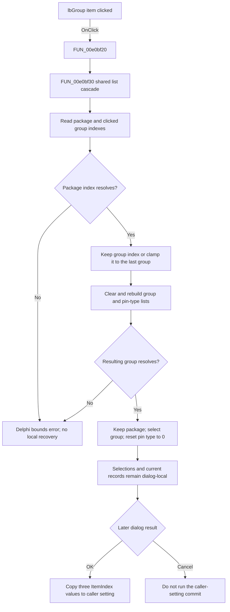

# lbGroup

> Analysis status: Complete. The recovered click handler, shared list cascade, form initialization, OK handler, registry consumer, and resource tree support this explanation.

## Control

| Property | Recovered value |
| --- | --- |
| Form | FPGAPinSettings |
| Form caption | FPGA Pin Setting |
| Parent group | `rgGroup`, caption `Group Setting` |
| Component path | FPGAPinSettings.rgGroup.lbGroup |
| Control class | TListBox |
| Caption | Not present in the recovered resource. |
| Hint | Not present in the recovered resource. |
| Items | Not stored in the DFM; they are added at run time. |
| Handler name | lbGroupClick |
| Handler address | 00e0bf20 |
| Graph node | `resource:dfm:FPGAPinSettings/FPGAPinSettings.rgGroup.lbGroup` |
| Handler node | `function:00e0bf20` |
| Graph layer | UI |

The control has no recovered glyph or image reference. Its location under `Group Setting`, the sibling package and pin-type lists, and the handler data flow identify its purpose.

## What happens when clicked

`FUN_00e0bf20` calls the shared FPGAPinSettings list cascade `FUN_00e0bf30`. The package list click uses the same cascade, but this article describes the state at entry from `lbGroup`.

The cascade reads two current indexes:

1. `lbPackage.ItemIndex`, which identifies the selected package in the loaded package registry.
2. `lbGroup.ItemIndex`, which identifies the group that the user clicked.

It resolves the selected package and stores that record as the form's current package reference. It then calculates the resulting group index as the smaller of the old group index and the last group index in that package. For a normal click on an existing group, this keeps the clicked index. If a list rebuild has made that index too large, it selects the package's last group instead.

The helper then performs a complete dependent-list rebuild:

- It clears `lbGroup` and `lbPinType`.
- It adds every group name from the selected package back to `lbGroup`, in registry order.
- It resolves the group at the preserved or clamped index and stores that record as the form's current group reference.
- It adds every pin-type name from the selected group to `lbPinType`, in registry order.
- It restores the unchanged package index, applies the resulting group index, and sets `lbPinType.ItemIndex` to `0`.

The package list itself is not cleared or repopulated by this click. Only its selection index is restored. The selected pin type is not preserved: every group click resets it to the first entry. A repeated click on the same group runs the same clear, repopulate, and reset sequence because there is no same-index shortcut.

## Staged state and caller impact

The dialog receives a pointer to a three-index setting from its caller. `FormCreate` copies the package, group, and pin-type indexes into form-local initial fields. `FormShow` loads the package data and builds the lists from those saved indexes.

The group click does not write the caller's three-index setting. It changes the list selections and the form-local current-package and current-group references only. `FUN_00e0c0f0`, the `OK` handler, later reads the three visible `ItemIndex` values and copies them to the caller-owned setting. The `Cancel` button has no application click handler, so it does not run this commit code. Thus, canceling after a group click leaves the caller's original indexes unchanged.

`FUN_00e0c170` independently consumes the same package/group/pin-type index hierarchy to resolve a pin-type name. This confirms that the three indexes, rather than the displayed strings or the form-local record pointers, are the caller-visible result.

The click does not change the global package registry, write a package file, update a device, or persist preferences. Any later model or hardware effect belongs to the consumer of the committed three-index setting and is not present in this handler path.

## Validation, no-op, and errors

- A user click on an existing list item supplies a valid group index and completes the rebuild. There is no branch that reports success.
- There is no empty-package, empty-group, `ItemIndex = -1`, or missing-registry guard in `FUN_00e0bf30`.
- The indexed registry accessor checks its unsigned index against the list count and calls the Delphi bounds-error path when the index is outside the list. The click handler does not catch that exception or replace it with a control-specific message.
- A package with no groups produces a last-group index of `-1`, which is then used for a registry lookup. An invalid package or group selection can fail in the same lookup path.
- The helper does not check whether a selected group has pin types before it sets the pin-type index to `0`. The recovered path contains no fallback label, disabled-state change, or warning for an empty pin-type list.
- List clear, string allocation, and item-add failures also have no local recovery. Delphi/VCL exception handling owns those errors.
- There is no close, modal-result, or persistence call in the group-click path. The dialog stays open after a successful selection.

## Click flow

## Source evidence

- Group click wrapper: [FUN_00e0bf20](../../../DecompiledSources/Tina16/functions/0000000000E0BF20__FUN_00e0bf20.c)
- Shared package/group/pin-type cascade: [FUN_00e0bf30](../../../DecompiledSources/Tina16/functions/0000000000E0BF30__FUN_00e0bf30.c)
- Package list wrapper that uses the same cascade: [FUN_00e0bf10](../../../DecompiledSources/Tina16/functions/0000000000E0BF10__FUN_00e0bf10.c)
- Form setup and initial list population: [FUN_00e0bb50](../../../DecompiledSources/Tina16/functions/0000000000E0BB50__FUN_00e0bb50.c) and [FUN_00e0bba0](../../../DecompiledSources/Tina16/functions/0000000000E0BBA0__FUN_00e0bba0.c)
- OK commit: [FUN_00e0c0f0](../../../DecompiledSources/Tina16/functions/0000000000E0C0F0__FUN_00e0c0f0.c)
- Three-index pin-type name consumer: [FUN_00e0c170](../../../DecompiledSources/Tina16/functions/0000000000E0C170__FUN_00e0c170.c)
- Bounds-checked registry access: [FUN_004aeac0](../../../DecompiledSources/Tina16/functions/00000000004AEAC0__FUN_004aeac0.c)

## Analysis limits and ownership

- The recovered source establishes the package, group, and pin-type hierarchy through list population and the independent name resolver. It does not recover domain-specific meanings for the individual group or pin-type strings.
- The DFM supplies no static items. The exact available names and counts depend on the package registry loaded when the form is shown.
- `FUN_00e0bf30` is shared by the package and group list click handlers. The `lbPackage` control analysis owns its canonical annotation. This article cites that helper and annotates only the unique `lbGroup` wrapper.
