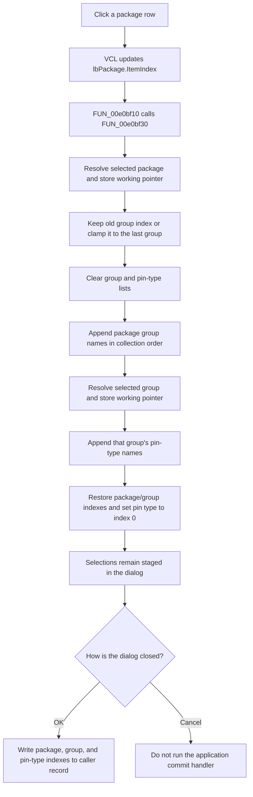

# Select an FPGA package and refresh its dependent lists

> Analysis status: Complete. The recovered package-click wrapper, shared dependent-list rebuild, form initialization, OK handler, and downstream index resolver support this explanation.

## Control

| Property | Recovered value |
| --- | --- |
| Form | FPGAPinSettings |
| Component path | FPGAPinSettings.rgPackage.lbPackage |
| Control class | TListBox |
| Parent caption | Device Setting |
| Caption | Not present in the recovered resource. |
| Hint | Not present in the recovered resource. |
| Handler name | lbPackageClick |
| Handler address | 00e0bf10 |
| Graph node | `resource:dfm:FPGAPinSettings/FPGAPinSettings.rgPackage.lbPackage` |
| Handler node | `function:00e0bf10` |
| Graph layer | UI |

## What happens when clicked

The VCL list box changes `lbPackage.ItemIndex` before it calls `FUN_00e0bf10`. The recovered wrapper then calls `FUN_00e0bf30`, the shared package/group cascade.

The cascade reads the selected package index and uses it to resolve an object from the process-wide FPGA package collection. It stores this selected-package pointer in the form's working field at `+0x728`. It does not copy the package selection to the caller's result record at this point.

The cascade then rebuilds the two dependent lists:

1. It reads the old `lbGroup.ItemIndex`.
2. It calculates the last valid group index for the new package.
3. It keeps the old numeric group index when it fits. If it is too large, it selects the new package's last group. It matches by index, not by group name.
4. It clears `lbPinType` and `lbGroup`.
5. It appends every group name from the selected package to `lbGroup.Items` in source collection order.
6. It resolves the retained or clamped group and stores that working pointer at form field `+0x730`.
7. It appends every pin-type name from that group to `lbPinType.Items`, also in source collection order.
8. It restores the selected package index, applies the chosen group index, and sets `lbPinType.ItemIndex` to `0`.

The pin-type selection therefore always moves to the first entry after a package click. It does not preserve the old pin type by index or name. Clicking the already selected package is not a no-op: the same lists are cleared and rebuilt, and the pin type returns to index `0`.

## Initial selections and staged state

`FPGAPinSettings.FormCreate` obtains a caller-owned three-integer record and copies its package, group, and pin-type indexes into private form fields. `FormShow` loads the package catalog when necessary, fills the three list boxes, and applies those initial indexes. These opening values are separate from the package-click default described above.

A package click changes list-box selections and the two working object pointers only. `FUN_00e0c0f0`, the **OK** handler, later reads the three current list-box indexes and writes them to the caller-owned record. The built-in `bkCancel` button has no application OnClick handler, so Cancel does not run that commit path.

`FUN_00e0c170` shows how the committed record is used later. It validates the stored package, group, and pin-type indexes against the same nested collections and returns the selected pin-type object's name. The package click itself does not call this resolver, save a file, or update another model.

## Validation, empty data, and errors

- `FormShow` is responsible for loading and validating the external package catalog. If loading fails, it displays the localized `HDLStrings.Msg_Vhdl_PackDataErr` error and closes the form. The package-click handler has no separate load or retry path.
- The click cascade has no guard for `lbPackage.ItemIndex = -1`, a package with no groups, a retained group index of `-1`, or a selected group with no pin types. The checked collection accessor handles an invalid package or group index through the Delphi range-error path; this is not an intentional no-op.
- The list clearing happens before the selected group is resolved. If group resolution or a later item allocation fails, the form can contain cleared or partly rebuilt lists. There is no snapshot or rollback.
- Setting pin-type index `0` on an empty rebuilt list is delegated to the VCL list box. The recovered application code does not supply a fallback selection or error message.
- There is no local exception handler. Collection range failures, string allocation failures, and list-box operations propagate through the Delphi runtime.

## Package selection flow

## Source evidence

- Package click wrapper: [FUN_00e0bf10](../../../DecompiledSources/Tina16/functions/0000000000E0BF10__FUN_00e0bf10.c)
- Shared package/group list cascade: [FUN_00e0bf30](../../../DecompiledSources/Tina16/functions/0000000000E0BF30__FUN_00e0bf30.c)
- Form initialization and catalog population: [FUN_00e0bb50](../../../DecompiledSources/Tina16/functions/0000000000E0BB50__FUN_00e0bb50.c) and [FUN_00e0bba0](../../../DecompiledSources/Tina16/functions/0000000000E0BBA0__FUN_00e0bba0.c)
- Checked nested-collection access: [FUN_004aeac0](../../../DecompiledSources/Tina16/functions/00000000004AEAC0__FUN_004aeac0.c)
- OK commit: [FUN_00e0c0f0](../../../DecompiledSources/Tina16/functions/0000000000E0C0F0__FUN_00e0c0f0.c)
- Committed pin-type name resolver: [FUN_00e0c170](../../../DecompiledSources/Tina16/functions/0000000000E0C170__FUN_00e0c170.c)

## Resource evidence

- Form caption: **FPGA Pin Setting**.
- Parent group caption: **Device Setting**.
- The dependent containers are captioned **Group Setting** and **Pin Type Setting**.
- No package, group, or pin-type strings are serialized in the DFM. `FormShow` and the click cascade populate them from the loaded package objects.
- Hint: Not present in the recovered resource.
- Extracted glyph: None.
- Nearby label candidate: None.

## Analysis limits

- The recovered code proves that each displayed string comes from field `+8` of the relevant package, group, or pin-type object. The original Delphi class and field names are not recovered.
- `FUN_00e0bf30` is shared by package and group clicks. This package article owns its canonical annotation because a package change drives the complete group and pin-type cascade. The group article cites it without redefining it.
- The click path does not sort, deduplicate, or compare names. Any catalog-specific ordering and uniqueness rules are outside this handler.
