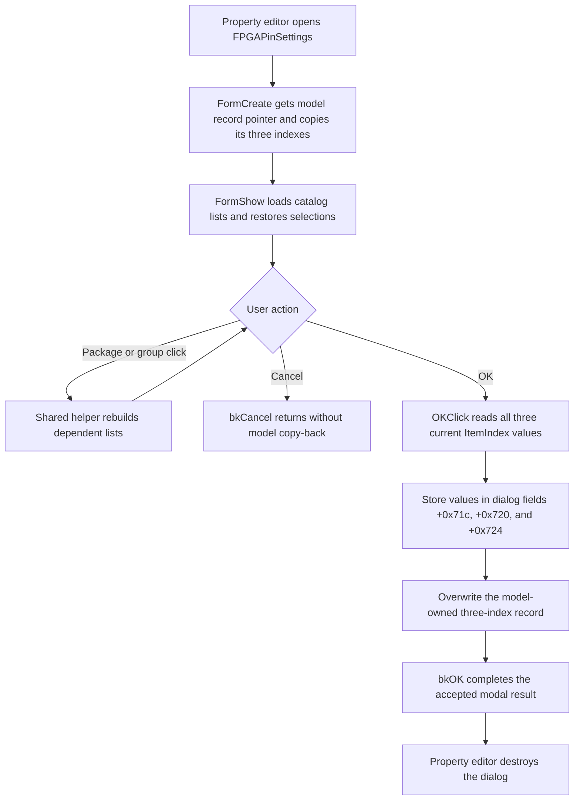

# OK

## Control

| Property | Recovered value |
| --- | --- |
| Form | FPGAPinSettings |
| Component path | FPGAPinSettings.OK |
| Control class | TBitBtn |
| Caption | Supplied by the built-in `bkOK` button kind. No explicit caption is stored in the form resource. |
| Hint | Not present in the recovered resource. |
| Handler name | OKClick |
| Handler address | 00e0c0f0 |
| Graph node | `resource:dfm:FPGAPinSettings/FPGAPinSettings.OK` |
| Handler node | `function:00e0c0f0` |
| Graph layer | UI |

## What happens when clicked

`OKClick` commits the three current list selections to the FPGA pin-setting record that belongs to the edited model item. It reads `ItemIndex` from `lbPackage`, `lbGroup`, and `lbPinType`, in that order. It first stores the three results in dialog fields at offsets `+0x71c`, `+0x720`, and `+0x724`. It then copies these 32-bit values to the model-owned record at `+0x708` as one adjacent device/package, group, and pin-type triplet.

The dialog constructor receives the model object and the edited item index. `FormCreate` asks that model for the address of its 12-byte setting record. It saves this address at `+0x708` and copies the original three indexes to dialog fields. `FormShow` uses those saved values to select entries after it loads the device/package, group, and pin-type lists. Thus, the initial selections are a view of the existing model value. A later list selection remains dialog state until this OK handler writes the current indexes to the model record.

The package and group controls use a shared list rebuild path. A package or group click rebuilds the dependent group and pin-type lists and resets the pin-type selection to zero. `OKClick` does not rebuild a list. It commits the state that those controls have already produced. Shared helper ownership is documented with [lbPackage](lbpackage-8f2d2c2dd5.md) and [lbGroup](lbgroup-9c77725b80.md).

## Validation and commit boundary

The OK handler has no branch and no local validation. It does not reject `ItemIndex = -1`, test catalog bounds, confirm that the package/group/pin combination is valid, or test the record pointer before it writes. If a list returns `-1`, that signed 32-bit value is copied to the record. The catalog and list setup normally constrain the choices, but this is not an OK-side guard.

All three list getters run before the first model-record store. Therefore, an exception from a getter leaves the model record unchanged. The three record stores then run in sequence and have no transaction or rollback. A fault during these stores can leave a partial triplet. The handler has no local exception message or recovery path.

The resource declares this button as `bkOK`. The shared property-editor lifecycle creates the dialog, runs it modally, destroys it, and returns its modal result. On normal completion, the built-in OK action supplies the accepted modal result. The recovered form has no `OnCloseQuery` handler, and `OKClick` does not set `ModalResult` or implement a close veto itself.

The `bkCancel` button has no application `OnClick` handler. Cancel does not run this copy-back, and the shared modal caller does not copy data after `ShowModal` returns. The selected triplet therefore stays unchanged when the user cancels. One independent side effect can occur before either button is used: `FormShow` can load and cache `fpga_pinout.txt`, or show the localized package-data error if that load fails.

## Model, hardware, and persistence effects

The immediate output is only the changed three-index record in the model. Other recovered code reads that record to resolve the selected pin name and to format an FPGA-pin setting. The broader configuration serializer later emits the setting with type `fpgapins`, name `Pin settings`, its formatted value, and the attribute index. `OKClick` itself does not save a file or request serialization.

No hardware, driver, DLL, synthesis, bitstream, or programming call is present in the handler, the dialog setup, or the modal caller. The recovered evidence therefore proves a model-metadata update, not immediate FPGA hardware propagation.

## Click flow

## Handler evidence

- [OK handler](../../../DecompiledSources/Tina16/functions/0000000000E0C0F0__FUN_00e0c0f0.c): reads the three list `ItemIndex` properties and copies the values to the record referenced by `+0x708`.
- [Dialog constructor](../../../DecompiledSources/Tina16/functions/0000000000E0BA80__FUN_00e0ba80.c): stores the model object and edited item index at `+0x6f8` and `+0x700`.
- [FormCreate handler](../../../DecompiledSources/Tina16/functions/0000000000E0BB50__FUN_00e0bb50.c): obtains the model-owned record pointer and copies the original triplet to dialog fields.
- [FormShow handler](../../../DecompiledSources/Tina16/functions/0000000000E0BBA0__FUN_00e0bba0.c): loads the catalog, populates all three lists, restores the saved selections, and reports catalog-load failure.
- [Package-list handler](../../../DecompiledSources/Tina16/functions/0000000000E0BF10__FUN_00e0bf10.c) and [group-list handler](../../../DecompiledSources/Tina16/functions/0000000000E0BF20__FUN_00e0bf20.c): route list clicks to the dependent-list rebuild.
- [Shared list rebuild](../../../DecompiledSources/Tina16/functions/0000000000E0BF30__FUN_00e0bf30.c): rebuilds group and pin-type entries and applies their current or reset indexes.
- [Modal property-editor lifecycle](../../../DecompiledSources/Tina16/functions/0000000000B088A0__FUN_00b088a0.c): calls `ShowModal`, destroys the dialog, and returns the result without a later copy-back.
- [Pin-name resolver](../../../DecompiledSources/Tina16/functions/0000000000E0C170__FUN_00e0c170.c): validates the stored indexes against the catalog and resolves the selected pin name.
- [Setting formatter](../../../DecompiledSources/Tina16/functions/0000000001253190__FUN_01253190.c) and [configuration serializer](../../../DecompiledSources/Tina16/functions/0000000001253910__FUN_01253910.c): consume the stored triplet during later configuration serialization.

## Resource evidence

- The form caption is `FPGA Pin Setting`.
- The three list groups are captioned `Device Setting`, `Group Setting`, and `Pin Type Setting`.
- The OK button kind is `bkOK`; the sibling Cancel button kind is `bkCancel`.
- No explicit OK caption, hint, modal-result property, image reference, or extracted glyph is present.

## Limits

- Recovered names do not establish whether the first index is called a device index or a package index in the original Delphi model. The UI says `Device Setting`, while the control is named `lbPackage`; this article uses device/package for that field.
- The recovered code proves later configuration serialization, but it does not prove the final file path or when the user starts that save.
- No immediate hardware update is present in the traced path.
