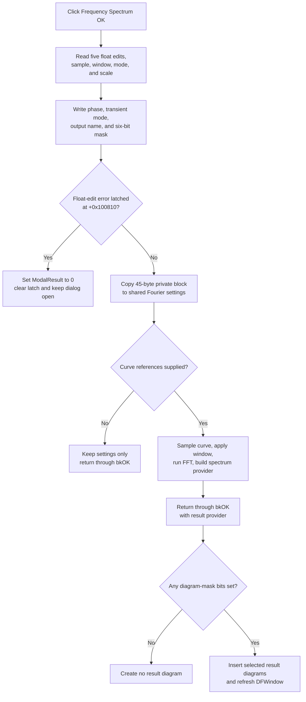

# Validate and accept Frequency Spectrum settings

## Control

| Property | Recovered value |
| --- | --- |
| Form | FrequencySpectrumDlg |
| Component path | FrequencySpectrumDlg.OKBtn |
| Control class | TBitBtn |
| Caption | Not present in the recovered resource. |
| Hint | Not present in the recovered resource. |
| Kind | bkOK |
| Handler name | OKBtnClick |
| Handler address | 0114cc80 |
| Graph node | `resource:dfm:FrequencySpectrumDlg/FrequencySpectrumDlg.OKBtn` |
| Handler node | `function:0114cc80` |
| Graph layer | UI |

## What happens when clicked

`FUN_0114cc80` reads all Frequency Spectrum controls, stages the numeric and transform options, rebuilds the six-bit result mask, and records the output selection. It then checks the dialog's float-edit error latch at form offset `+0x100810`.

- With no latched edit error, it copies the 45-byte private settings block to the shared Fourier settings. If the form has a supplied curve, it also calculates the spectrum before the dialog closes.
- With a latched edit error, it sets `ModalResult` to zero, clears the latch, skips the private-settings copy and spectrum calculation, and leaves the dialog open.

The button's recovered `bkOK` kind supplies the normal OK modal result. The handler does not write result `1` itself. Its explicit zero write is the validation veto that prevents the built-in OK action from closing the form.

## Values collected from the form

The handler reads these recovered controls:

| Control or group | Accepted representation |
| --- | --- |
| Sampling start and end time | Two floating-point values in the private settings block. |
| Minimum and maximum frequency | Two floating-point values in the private settings block. |
| Reference voltage | One floating-point value in the private settings block. |
| Number of samples | Combo index plus `7`, which gives exponent `7` through `16` for `128` through `65536` samples. |
| Window function | Uniform, Hanning, Flattop, Blackman, Hamming, or Bartlet index. |
| Mode | Spectral density or Spectrum index. |
| Scale | Linear, Linear-dB, or Logarithmic index. |
| Phase correction | Checked state stored in shared Fourier state. |
| Transient initial condition | Radio index encoded as `(index + 1) mod 3` in shared Fourier state. |
| Output | Combo index `0` stores `<EVERYCURVE>`; another index stores that item's text. |
| Diagrams | Six check boxes rebuilt as bits `0` through `5`. |

The diagram-mask bits follow the recovered control order:

- bit `0`: Complex Amplitude
- bit `1`: Phase
- bit `2`: Real part
- bit `3`: Imaginary part
- bit `4`: Energy spectrum
- bit `5`: Amplitude

No handler branch requires at least one result bit. A valid selected-curve OK can calculate a spectrum while the later result builder creates no diagram because all six bits are clear.

## Two construction modes

The constructor sets byte `+0x100811` only when both supplied curve references are null.

### Selected-curve mode

`FUN_0114e6b0` supplies a selected curve and its provider. The form initialization fixes the Output combo to that curve, disables the Output combo, and disables the transient-initial-condition control. Byte `+0x100811` remains zero.

After an error-free settings copy, OK calls `FUN_0114d810`. The worker samples the selected curve at `2^exponent` evenly spaced times, applies the selected window, runs the radix-2 FFT, applies the recovered phase-correction path, and builds the requested frequency-bin provider at form offset `+0x7c0`.

When the modal call returns result `1`, `FUN_0114e6b0` passes that provider and the six-bit mask to the result-diagram builder. The builder inserts one in-memory result diagram for each selected bit and refreshes the DFWindow layout. These diagram changes make the DF document modified, but this path does not save that document to disk.

### Settings-only mode

`FUN_01349310` creates the same dialog with null curve references. The constructor sets `+0x100811` to one. Form initialization fills the Output combo with available entries and restores the saved output selection.

An error-free OK still copies the accepted settings to shared Fourier state, but it does not call the FFT worker and does not create a spectrum provider. The caller uses the accepted shared settings in its wider analysis setup. This OK path changes settings only.

## Validation and retry behavior

The OK handler does not implement the float rules inline. Each `TFloatEdit` uses the recovered value getter and its validation callbacks.

- The shared range checker requires a nonnegative sampling start, an end after the start, and a sampling interval within the available bounds.
- For the frequency fields, it also requires a nonnegative minimum, a maximum after the minimum, and a maximum within the FFT limit for the sample count and time interval. A value only slightly above that limit is reduced to the exact limit.
- A sample-count change and valid start or end exit recalculate the available frequency range.
- A float-edit error displays the first error message and sets latch `+0x100810`. A second error while the latch is set does not show another message.

On the error branch, OK clears `ModalResult`, clears the latch, and returns. The user can correct the values and click OK again, or click the built-in Cancel button. The handler does not close the dialog or calculate a partial spectrum on this branch.

## Click flow

## Early shared-state writes

The handler writes four groups of shared fields before it checks the error latch:

- phase-correction state;
- encoded transient-initial-condition state;
- output selection text or `<EVERYCURVE>`;
- the six diagram-mask bits.

Therefore, the error veto is not a full rollback. It prevents the 45-byte private settings block from being copied and prevents the FFT, but the early shared fields already contain the current control choices. If the user clicks Cancel after this failed OK, no recovered Cancel handler restores those fields.

The normal Cancel path does not run `FUN_0114cc80`, copy the private block, or calculate a spectrum. However, standalone start-time and end-time validation callbacks can update their shared working bounds before Cancel. Cancel is therefore not a general transaction rollback for every field that the dialog touches.

## State, persistence, and failures

- Accepted settings remain in process-wide Fourier state and initialize later Frequency Spectrum dialogs. The OK handler does not write a file, registry value, or configuration file.
- In selected-curve mode, the transform starts after the shared settings copy. If sampling, allocation, FFT, or provider construction fails, the accepted settings can remain committed even though no complete result exists.
- The handler contains no command-level rollback for the shared settings, early shared fields, generated provider, or later result diagrams.
- The result-diagram insertion happens after the modal dialog accepts. A later failure can leave only some requested diagrams inserted.
- If the float-edit getter or another callee raises before the latch branch completes, the recovered body does not restore fields that it already wrote.
- After a failed OK, a corrected OK rereads every control and can complete normally. The latch is cleared at the end of each click.
- A repeated accepted use can replace the saved settings and create another set of named result diagrams. No title or file path changes in this handler.

## Evidence

- [OK handler `FUN_0114cc80`](../../../DecompiledSources/Tina16/functions/000000000114CC80__FUN_0114cc80.c) proves the control reads, private and shared field writes, result-mask mapping, error gate, settings copy, selected-curve test, and FFT call.
- [Form initialization `FUN_0114c7f0`](../../../DecompiledSources/Tina16/functions/000000000114C7F0__FUN_0114c7f0.c) copies shared settings to the private block, restores every control, and configures the Output and transient controls for the supplied-curve or settings-only mode.
- [Dialog constructor `FUN_0114c680`](../../../DecompiledSources/Tina16/functions/000000000114C680__FUN_0114c680.c) stores the supplied curve references and sets byte `+0x100811` only when both are null.
- [Float-edit error adapter `FUN_0114d210`](../../../DecompiledSources/Tina16/functions/000000000114D210__FUN_0114d210.c) routes the control's error text to the dialog error-latch helper.
- [First-error latch helper `FUN_01b1cf30`](../../../DecompiledSources/Tina16/functions/0000000001B1CF30__FUN_01b1cf30.c) shows the message and sets the latch only when it was previously clear.
- [Shared interval and frequency checker `FUN_0113f590`](../../../DecompiledSources/Tina16/functions/000000000113F590__FUN_0113f590.c) proves the recovered time, ordering, frequency, tolerance, and FFT-limit conditions.
- [Frequency-range refresh `FUN_0114d180`](../../../DecompiledSources/Tina16/functions/000000000114D180__FUN_0114d180.c) recalculates minimum and maximum frequency from the sample exponent and sampling duration.
- [Selected-curve modal coordinator `FUN_0114e6b0`](../../../DecompiledSources/Tina16/functions/000000000114E6B0__FUN_0114e6b0.c) supplies the curve, accepts only modal result `1`, publishes accepted spectrum results, and releases the dialog.
- [FFT worker `FUN_0114d810`](../../../DecompiledSources/Tina16/functions/000000000114D810__FUN_0114d810.c) implements selected-curve sampling, windowing, FFT, correction, and provider construction.
- [Settings-only caller `FUN_01349310`](../../../DecompiledSources/Tina16/functions/0000000001349310__FUN_01349310.c) creates the dialog without curve references and distinguishes Cancel result `2` from acceptance.
- [Recovered Delphi resource evidence](../../../DecompiledSources/Tina16/resources/dfm/ui-evidence.json) binds `OKBtn.OnClick` to `OKBtnClick`, identifies the button as `bkOK`, and supplies the input, choice, and diagram captions. The button has no recovered caption, hint, glyph, or image reference.

## Annotation ownership

`TIARA-diz.6.7.296` canonically owns `FUN_0114cc80`, the dialog lifecycle, and the selected-curve FFT path. This control's fragment repeats the complete canonical `FUN_0114cc80` object without changing any field. It cites and omits `FUN_0114e6b0`, `FUN_0114c7f0`, `FUN_0114d810`, and `FUN_0114d430`.

## Analysis limits

- The original Delphi names for the private block, shared Fourier fields, and bytes `+0x100810` and `+0x100811` are not recovered.
- The source shows the early shared writes and the later private-block gate. It does not prove that another outer dialog owner restores them after Cancel.
- The exact localized float-edit error strings are resolved at runtime and are not present as direct text on the OK button.
- The nearby Reference voltage, Scale, and Window function labels describe form inputs. Their screen distance from OK does not establish button behavior; the handler data flow does.
