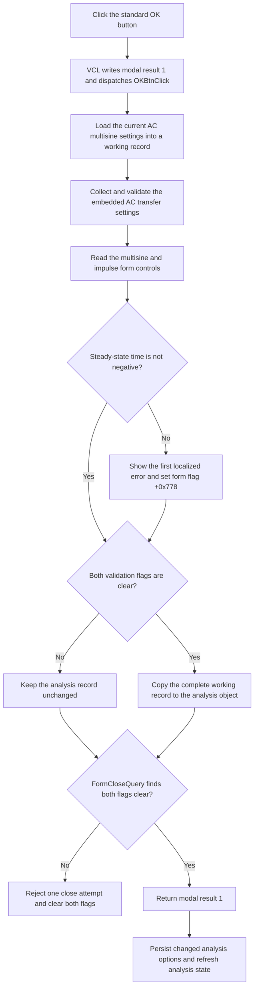

# Accept the AC multisine analysis settings

> Analysis status: Complete. The recovered DFM, OK handler, settings-record copy, AC transfer validator, close guard, and modal caller support this explanation.

## Control

| Property | Recovered value |
| --- | --- |
| Form | frmACMultiSine |
| Form caption | AC Multisine Analysis |
| Component path | frmACMultiSine.OKBtn |
| Control class | TBitBtn |
| Caption | Supplied by `Kind = bkOK`; no custom caption is present. |
| Hint | Not present in the recovered resource. |
| Handler name | OKBtnClick |
| Handler address | 00f5f6e0 |
| Graph node | `resource:dfm:frmACMultiSine/frmACMultiSine.OKBtn` |
| Handler node | `function:00f5f6e0` |
| Graph layer | UI |

`OKBtn` uses the standard VCL `bkOK` kind. This kind supplies the OK caption, stock glyph, default-button state, and modal result `1`. The DFM has no custom caption, hint, image, or extracted glyph for this button.

## What happens when clicked

The inherited VCL button path writes modal result `1` to the form and then dispatches `OKBtnClick`. The handler ignores `Sender` and performs these operations:

1. It initializes a managed working record from the current analysis object at offset `+0xe98`. If the form has no analysis object, it uses the global default record instead.
2. It asks the embedded AC transfer frame to collect the start frequency, end frequency, point count, sweep type, diagram flags, and the Show Loop Gain Output Only state.
3. It reads the selected source text, source amplitude, cycle count, steady-state time, impulse width, transient-initial-condition row, input-signal row, and Boolean options from the form controls into the same record.
4. It reports a localized validation error when the steady-state time is below zero.
5. Only when the AC transfer frame error flag and the form error flag are both clear, it copies the complete working record back to the current analysis object or global default record.
6. It finalizes the managed string fields in the working record and returns.

The proven settings-record layout starts at analysis-object offset `+0xe98`. Its recovered fields include start and end frequency at `+0xe98` and `+0xea0`, amplitude at `+0xea8`, steady-state time at `+0xeb0`, impulse width at `+0xeb8`, point count at `+0xec0`, cycle count at `+0xec2`, AC sweep type at `+0xec6`, source text at `+0xec8`, and input-signal row at `+0xed5`. The original Delphi record and field names are not recovered.

## Validation and close behavior

The AC transfer collector requires `0 < start frequency < end frequency <= 1e50`. An invalid range shows the first pending localized message and sets the embedded frame error flag at `+0x540`. A negative steady-state time uses the form-specific error wrapper and sets the form error flag at `+0x778`.

The float and integer edit getters parse their current text and apply the limits and optional callbacks configured on each control. Their `OnError` handlers also forward the edit message to the form-specific error wrapper. `OKBtnClick` has no local catch, retry, fallback, or partial record-copy branch.

`FormCloseQuery` permits closure only when both error flags are clear. It then clears both flags. Therefore, a reported validation error prevents the modal-result write from closing the form once, keeps the analysis record unchanged, and lets the user correct the inputs. Further error messages for the same flag are suppressed until this close query resets the flag.

## Accepted-result effects

The modal caller snapshots the current analysis record before it opens this dialog. When `ShowModal` returns result `1`, it compares the accepted record with the snapshot. The caller writes changed AC transfer values to the analysis options. It writes changed amplitude, steady-state time, and cycle count through the named `.OPTIONS` keys `MSAMPLITUDE`, `MSSTEADYTIME`, and `MSCYCLES`. It then recalculates the analysis time data and can reinitialize the HDL simulation when that simulation path is active.

This click does not directly run the analysis, save a file, or program hardware. A Cancel result skips the caller's accepted-result update path.

## Click flow

## Source evidence

- [OK handler `FUN_00f5f6e0`](../../../DecompiledSources/Tina16/functions/0000000000F5F6E0__FUN_00f5f6e0.c) proves the control reads, the negative steady-state-time test, the two error-flag test, and the conditional record copy.
- [AC transfer collector `FUN_00f07e10`](../../../DecompiledSources/Tina16/functions/0000000000F07E10__FUN_00f07e10.c) proves the frequency limits, AC transfer fields, diagram-flag collection, and Show Loop Gain Output Only write.
- [Form error wrapper `FUN_00f5f250`](../../../DecompiledSources/Tina16/functions/0000000000F5F250__FUN_00f5f250.c) forwards a message to [the shared first-error reporter](../../../DecompiledSources/Tina16/functions/0000000001B1CF30__FUN_01b1cf30.c) with form flag `+0x778`.
- [Close-query handler `FUN_00f5f2b0`](../../../DecompiledSources/Tina16/functions/0000000000F5F2B0__FUN_00f5f2b0.c) tests and resets the embedded frame and form error flags.
- [Form-show handler `FUN_00f5f3d0`](../../../DecompiledSources/Tina16/functions/0000000000F5F3D0__FUN_00f5f3d0.c) loads the same record fields into the controls and calls the input-mode state handler.
- [Float edit getter `FUN_00b90090`](../../../DecompiledSources/Tina16/functions/0000000000B90090__FUN_00b90090.c) and [integer edit getter `FUN_00f04d50`](../../../DecompiledSources/Tina16/functions/0000000000F04D50__FUN_00f04d50.c) prove text parsing, configured range checks, and value caching.
- [Float error handler `FUN_00f5fa20`](../../../DecompiledSources/Tina16/functions/0000000000F5FA20__FUN_00f5fa20.c) and [integer error handler `FUN_00f5fa40`](../../../DecompiledSources/Tina16/functions/0000000000F5FA40__FUN_00f5fa40.c) forward control messages to the form error wrapper.
- [Modal caller `FUN_01349310`](../../../DecompiledSources/Tina16/functions/0000000001349310__FUN_01349310.c) creates the form, snapshots and compares the record, writes changed analysis options, recalculates the analysis data, and can reinitialize the active HDL simulation.
- [Managed-record copy helper `FUN_00417c40`](../../../DecompiledSources/Tina16/functions/0000000000417C40__FUN_00417c40.c) proves the direction of the load and accepted record copies.
- [TBitBtn kind setter `FUN_0082bc30`](../../../DecompiledSources/Tina16/functions/000000000082BC30__FUN_0082bc30.c) maps `bkOK` to modal result `1`, the default state, caption, and stock glyph. [The inherited click path](../../../DecompiledSources/Tina16/functions/0000000000687F30__FUN_00687f30.c) writes that modal result before it dispatches `OnClick`.
- [Recovered Delphi resource evidence](../../../DecompiledSources/Tina16/resources/dfm/ui-evidence.json) supplies the form caption, component tree, control items, event bindings, and button kind.

## Analysis limits and ownership

- This Bead owns the OK handler, form-specific error wrapper, edit error forwarders, and close guard.
- The shared AC transfer collector, edit parsers, managed-record helper, VCL button path, and modal caller are evidence only.
- The original Delphi settings-record field names and the three Boolean field names are not recovered from the handler. This article states only their proven record offsets and control reads.
- The source does not recover the localized text for the negative steady-state-time message.
- The higher-level exception recovery after a direct edit-parser failure is not recovered.
