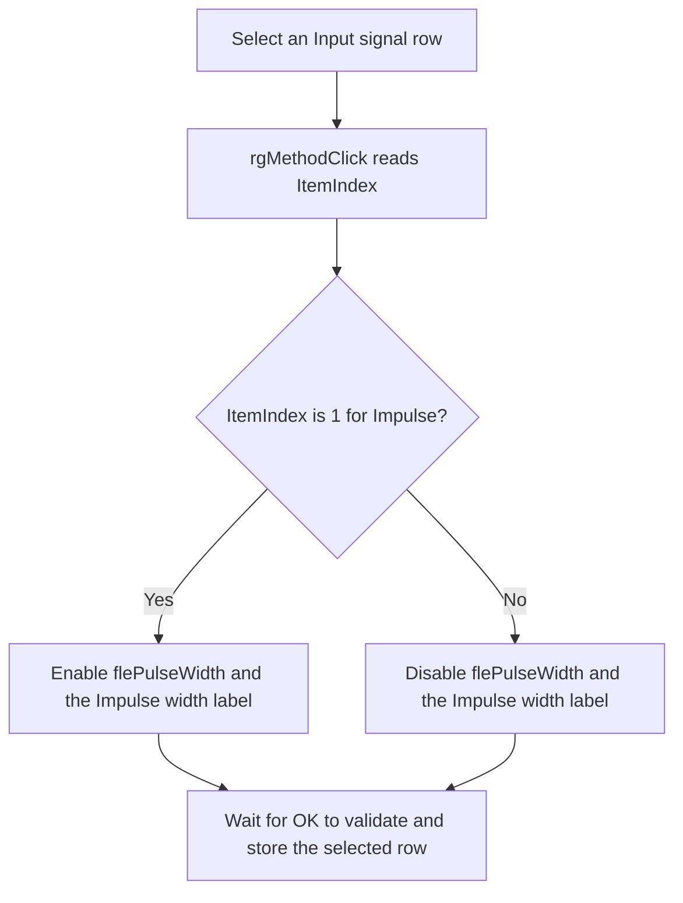

# Select the multisine or impulse input

> Analysis status: Complete. The recovered DFM, click handler, form-show path, and OK settings-record write support this explanation.

## Control

| Property | Recovered value |
| --- | --- |
| Form | frmACMultiSine |
| Form caption | AC Multisine Analysis |
| Component path | frmACMultiSine.Panel1.rgMethod |
| Control class | TRadioGroup |
| Caption | Input signal |
| Items | Multisine; Impulse |
| Hint | Not present in the recovered resource. |
| Handler name | rgMethodClick |
| Handler address | 00f5f9c0 |
| Graph node | `resource:dfm:frmACMultiSine/frmACMultiSine.Panel1.rgMethod` |
| Handler node | `function:00f5f9c0` |
| Graph layer | UI |

The resource has no action, image, glyph, or custom hint for this radio group.

## What happens when clicked

The radio group changes its selected item before it dispatches `rgMethodClick`. The handler ignores `Sender` and reads `rgMethod.ItemIndex` directly.

- Item `0`, **Multisine**, disables the `flePulseWidth` edit and its `Impulse width` label.
- Item `1`, **Impulse**, enables the `flePulseWidth` edit and its `Impulse width` label.
- Any other recovered index follows the disabled branch. The resource supplies only the two valid items.

The handler makes no direct function calls because both enabled-state operations are virtual control calls. It does not parse the impulse width, show a message, close the form, or change the analysis object. Repeated clicks on the same item are idempotent.

`FormShow` calls this same handler after it restores the selected input-signal row. This keeps the impulse-width controls synchronized when the dialog first appears.

## When the selection is stored

The later OK handler reads `rgMethod.ItemIndex` into byte `+0x3d` of its working settings record. This field maps to analysis-object offset `+0xed5`. Only when both validation flags are clear does OK copy the complete working record to the analysis object. A validation failure or Cancel therefore does not accept this selection through the recovered modal path.

## Click flow

## Source evidence

- [Click handler `FUN_00f5f9c0`](../../../DecompiledSources/Tina16/functions/0000000000F5F9C0__FUN_00f5f9c0.c) tests `rgMethod.ItemIndex` for exact value `1`, assigns the result to the impulse-width edit's enabled property, reads that property, and assigns it to the related label.
- [Form-show handler `FUN_00f5f3d0`](../../../DecompiledSources/Tina16/functions/0000000000F5F3D0__FUN_00f5f3d0.c) restores the saved input-mode row and then calls this handler to synchronize the controls.
- [OK handler `FUN_00f5f6e0`](../../../DecompiledSources/Tina16/functions/0000000000F5F6E0__FUN_00f5f6e0.c) reads the same radio-group item index into settings-record byte `+0x3d` and copies that record only when both validation flags are clear.
- [Recovered Delphi resource evidence](../../../DecompiledSources/Tina16/resources/dfm/ui-evidence.json) supplies the `Input signal` caption, ordered `Multisine` and `Impulse` items, `rgMethodClick` binding, `flePulseWidth` edit, and `Impulse width` label.

## Analysis limits and ownership

- This Bead owns only the input-signal click handler.
- The form-show and OK handlers are shared evidence. Their annotations belong to the OK control analysis.
- The direct source uses form-field offsets instead of recovered component names. The DFM component types, the paired enabled-state write, the form-show call, and the OK record mapping establish the edit and label identities.
