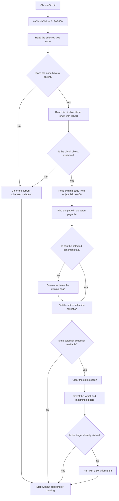

# tvCircuit

> Analysis status: Complete individual source review.

## Control

| Property | Recovered value |
| --- | --- |
| Form | frmComponentExplorer |
| Component path | frmComponentExplorer.pnlHome.tvCircuit |
| Control class | TTreeView |
| Read-only | true |
| Caption | Not present in the recovered resource. |
| Hint | Not present in the recovered resource. |
| Text | Not present in the recovered resource. |
| Handler name | tvCircuitClick |
| Handler address | 013ab400 |
| Graph node | `resource:dfm:frmComponentExplorer/frmComponentExplorer.pnlHome.tvCircuit` |
| Handler node | `function:013ab400` |
| Graph layer | UI |

## What happens when clicked

The click synchronizes the Component Explorer tree with the active schematic editor.

1. The handler reads the selected tree node.
2. If no node is selected, or if the selected node is a root node, the handler clears the current schematic selection. It does not change the active schematic page and does not pan the view.
3. For a child node, the handler reads the circuit-object pointer from tree-node field `+0x18`. If this pointer is null, the handler also clears the current schematic selection and stops.
4. For a valid circuit object, the handler gets its owning schematic page from object field `+0x68`. It finds this page in the main editor's open-page list and compares that index with the selected schematic tab.
5. If the page index and tab index are different, the handler calls the main schematic context function to open or activate the owning page. If the indexes are equal, it keeps the current page.
6. The handler then gets the active schematic selection collection. If the collection is available, it clears the old selection, selects the clicked object and objects with the same recovered identity, and calls the viewport helper for the clicked object.
7. The viewport helper pans with a 50-unit margin only when the target is outside the visible rectangle. It does not change the zoom scale.

The handler does not show an error message. If the active selection collection is not available after page activation, it does not select or reveal the target. The separate `OnDblClick` event uses a different handler and is not part of this `OnClick` path.

## Click flow

## Handler evidence

- Source: [DecompiledSources/Tina16/functions/00000000013AB400__FUN_013ab400.c](../../../DecompiledSources/Tina16/functions/00000000013AB400__FUN_013ab400.c)
- `FUN_006e2530` returns the selected `TTreeNode` from the tree view.
- `FUN_006dd390` walks from a tree node to its parent. The handler uses a null parent to identify the root or no-selection path.
- The form's tree construction stores circuit-object pointers in tree-node field `+0x18`. The click handler reads the same field.
- `FUN_017ff620` returns field `+0x68` from the selected circuit object. The parallel recovered navigation path at `FUN_014b7650` passes this value to the same page-index and page-activation functions.
- `FUN_006d5120` sends tab-control message `0x130B`, which is `TCM_GETCURSEL`, and therefore returns the selected schematic tab index.
- `FUN_01c8a290` searches the main editor's open-page records and returns the matching index or `-1`.
- `FUN_01c8ab30` opens or activates the requested schematic context when the handler detects a different page index.
- `FUN_01994230` visits the current selection collection and clears each selected object through `FUN_01994100`.
- `FUN_01993f30` applies the selected state to the target and to collection objects with the same recovered identity.
- `FUN_01c746c0` checks target bounds against the current viewport and pans only when necessary.

## Direct calls

- [FUN_006d5120](../../../DecompiledSources/Tina16/functions/00000000006D5120__FUN_006d5120.c) — Gets the selected schematic tab index.
- [FUN_006dd390](../../../DecompiledSources/Tina16/functions/00000000006DD390__FUN_006dd390.c) — Gets a tree node's parent.
- [FUN_006e2530](../../../DecompiledSources/Tina16/functions/00000000006E2530__FUN_006e2530.c) — Gets the selected tree node.
- [FUN_017ff620](../../../DecompiledSources/Tina16/functions/00000000017FF620__FUN_017ff620.c) — Gets the selected object's owning schematic page.
- [FUN_01993f30](../../../DecompiledSources/Tina16/functions/0000000001993F30__FUN_01993f30.c) — Applies selection state to the target and its identity matches.
- [FUN_01994230](../../../DecompiledSources/Tina16/functions/0000000001994230__FUN_01994230.c) — Clears the current schematic selection.
- [FUN_019a45d0](../../../DecompiledSources/Tina16/functions/00000000019A45D0__FUN_019a45d0.c) — Gets the active schematic selection collection.
- [FUN_01c746c0](../../../DecompiledSources/Tina16/functions/0000000001C746C0__FUN_01c746c0.c) — Pans until the selected object is visible.
- [FUN_01c8a290](../../../DecompiledSources/Tina16/functions/0000000001C8A290__FUN_01c8a290.c) — Finds an open schematic page index.
- [FUN_01c8ab30](../../../DecompiledSources/Tina16/functions/0000000001C8AB30__FUN_01c8ab30.c) — Opens or activates a schematic editor context.

## Resource evidence

- The form caption is `Component Explorer`.
- The tree is a read-only `TTreeView` aligned to fill `pnlHome` below the search panel.
- The recovered resource has no tree caption, hint, static items, image reference, or embedded glyph.
- No same-parent label candidate is available.
- The control also has separate collapse, compare, custom-draw, double-click, and expand event handlers. These events do not change the recovered `OnClick` call path.

## State and no-op behavior

- A root row or no selected row clears the current schematic selection.
- A child row with a null circuit-object pointer also clears the selection.
- A target on the active page does not cause a page switch.
- An object that is already visible does not cause a viewport change.
- A missing active selection collection stops selection and viewport work after any required page activation.
- No recovered branch reports an error to the user.

## Analysis limits

- The recovered sources do not supply Delphi names for the circuit-object and open-page record types.
- Field `+0x68` is identified as the owning schematic page from its use by the page lookup, activation, and parallel navigation paths. The original field name is not recovered.
- `FUN_01993f30` compares a recovered object identity before it selects related objects. The source does not recover the original identity-field name.
