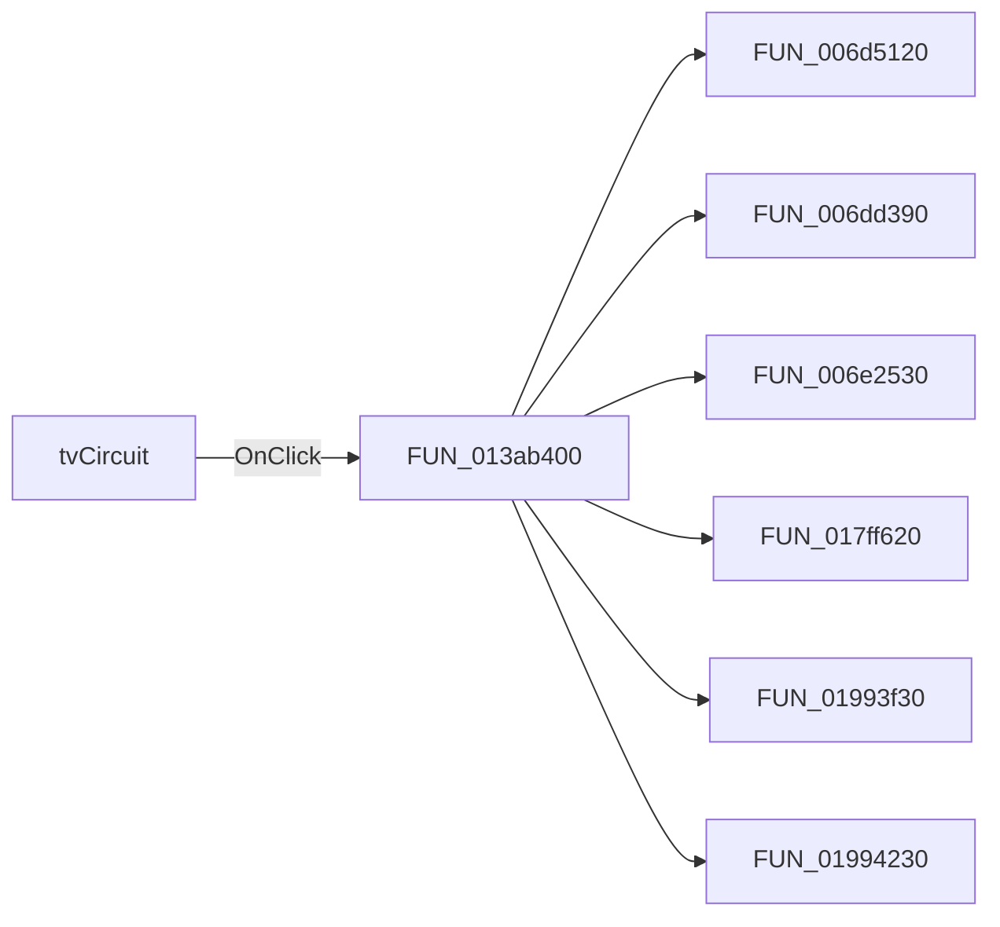

# tvCircuit

> Analysis status: Pending individual source review.

## Control

| Property | Recovered value |
| --- | --- |
| Form | frmComponentExplorer |
| Component path | frmComponentExplorer.pnlHome.tvCircuit |
| Control class | TTreeView |
| Caption | Not present in the recovered resource. |
| Hint | Not present in the recovered resource. |
| Text | Not present in the recovered resource. |
| Handler name | tvCircuitClick |
| Handler address | 013ab400 |
| Graph node | `resource:dfm:frmComponentExplorer/frmComponentExplorer.pnlHome.tvCircuit` |
| Handler node | `function:013ab400` |
| Graph layer | UI |

## What happens when clicked

Pending individual analysis. An agent must read the recovered handler source and its relevant callees before it replaces this text.

## Click flow

## Handler evidence

- Source: [DecompiledSources/Tina16/functions/00000000013AB400__FUN_013ab400.c](../../../DecompiledSources/Tina16/functions/00000000013AB400__FUN_013ab400.c)
- Recovered role: Not present in the recovered resource.
- Current graph summary: Handles 1 Delphi UI event: frmComponentExplorer.pnlHome.tvCircuit.OnClick.
- Current graph behavior: Not present in the recovered resource.
- Current graph evidence: Not present in the recovered resource.
- Complexity: complex
- Distinct outgoing calls: 10

## Direct calls

- `function:006d5120` — FUN_006d5120
- `function:006dd390` — FUN_006dd390
- `function:006e2530` — FUN_006e2530
- `function:017ff620` — FUN_017ff620
- `function:01993f30` — FUN_01993f30
- `function:01994230` — FUN_01994230
- `function:019a45d0` — FUN_019a45d0
- `function:01c746c0` — FUN_01c746c0
- `function:01c8a290` — FUN_01c8a290
- `function:01c8ab30` — FUN_01c8ab30

## Resource evidence

- Kind: Not present in the recovered resource.
- Modal result: Not present in the recovered resource.
- Checked state: Not present in the recovered resource.
- List items: Not present in the recovered resource.
- Image reference: Not present in the recovered resource.
- Extracted glyph: None.

## Nearby label candidates

Nearby labels are layout candidates only. They are not proof of behavior.

- No same-parent label candidate is available.

## Analysis limits

- Do not infer behavior from the control class, caption, hint, glyph, or nearby label alone.
- Do not replace the pending status until the handler source and relevant call path provide enough evidence.
