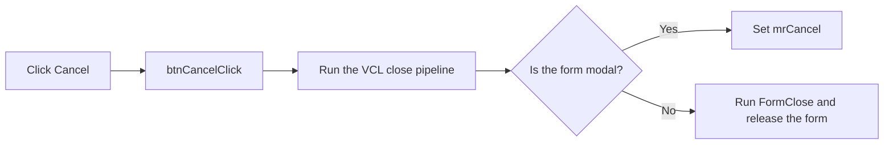

# btnCancel

> Analysis status: Reviewed from recovered source.

## Control

| Property | Recovered value |
| --- | --- |
| Form | frmComponentReport |
| Component path | frmComponentReport.pnlButtons.btnCancel |
| Control class | TBitBtn |
| Caption | Not present in the recovered resource. |
| Hint | Not present in the recovered resource. |
| Text | Not present in the recovered resource. |
| Handler name | btnCancelClick |
| Handler address | 01bb6500 |
| Graph node | `resource:dfm:frmComponentReport/frmComponentReport.pnlButtons.btnCancel` |
| Handler node | `function:01bb6500` |
| Graph layer | UI |

## What happens when clicked

The click handler requests that the Component Report form close. It does not read
the grid and it does not change a component.

The shared VCL close routine handles the result. For a modal form, it sets modal
result 2 (`mrCancel`). For a modeless form, it runs the close-query and close-action
pipeline. This form has no recovered `OnCloseQuery` handler. Its recovered
`FormClose` handler selects the release action, so a modeless close releases the
form. No error message or retry path is present in `btnCancelClick`.

## Click flow

## Handler evidence

- Source: [DecompiledSources/Tina16/functions/0000000001BB6500__FUN_01bb6500.c](../../../DecompiledSources/Tina16/functions/0000000001BB6500__FUN_01bb6500.c)
- Recovered role: Closes the Component Report without applying grid edits.
- Current graph summary: Handles 1 Delphi UI event: frmComponentReport.pnlButtons.btnCancel.OnClick.
- Current graph behavior: Calls the shared VCL form-close routine and returns.
- Current graph evidence: `FUN_01bb6500` contains only a call to `FUN_00805200`. The resource identifies this control as `bkCancel`; `FormClose` at 01BB5EA0 sets the close action to release.
- Complexity: simple
- Distinct outgoing calls: 1

## Direct calls

- `function:00805200` — Runs the VCL form close-query and close-action pipeline.

## Resource evidence

- Kind: bkCancel
- Modal result: Not present in the recovered resource.
- Checked state: Not present in the recovered resource.
- List items: Not present in the recovered resource.
- Image reference: Not present in the recovered resource.
- Extracted glyph: None.

## Nearby label candidates

Nearby labels are layout candidates only. They are not proof of behavior.

- No same-parent label candidate is available.

## Analysis limits

- The recovered source proves that the handler does not apply grid values. It does not prove how an exception from the VCL close pipeline would be presented.
