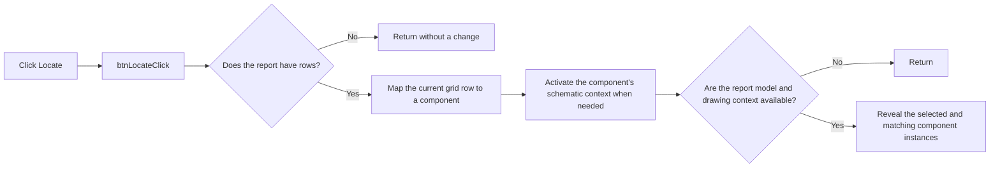

# &Locate

> Analysis status: Reviewed from recovered source.

## Control

| Property | Recovered value |
| --- | --- |
| Form | frmComponentReport |
| Component path | frmComponentReport.pnlButtons.btnLocate |
| Control class | TBitBtn |
| Caption | &Locate |
| Hint | Not present in the recovered resource. |
| Text | Not present in the recovered resource. |
| Handler name | btnLocateClick |
| Handler address | 01bb6680 |
| Graph node | `resource:dfm:frmComponentReport/frmComponentReport.pnlButtons.btnLocate` |
| Handler node | `function:01bb6680` |
| Graph layer | UI |

## What happens when clicked

The handler does nothing when the report list is empty. Otherwise, it maps the
current grid row to its component record and resolves the record's owning
schematic context. If that context is not active, it asks the main editor to
activate it.

When the report model and its drawing context exist, the handler prepares the
model, reveals the selected component, and scans the model for related component
records. The related-record helper compares component kind and name. When these
values match but the component number differs, it also reveals that record. This
lets one report row locate all matching component instances. The handler does not
edit component data, save the circuit, or close the report. It has no local error
or invalid-row recovery branch.

## Click flow

## Handler evidence

- Source: [DecompiledSources/Tina16/functions/0000000001BB6680__FUN_01bb6680.c](../../../DecompiledSources/Tina16/functions/0000000001BB6680__FUN_01bb6680.c)
- Recovered role: Activates the selected component context and reveals matching component instances.
- Current graph summary: Handles 1 Delphi UI event: frmComponentReport.pnlButtons.btnLocate.OnClick.
- Current graph behavior: Maps the current report row to a component, activates its editor context when needed, and reveals the selected and related matching components.
- Current graph evidence: `FUN_01bb6680` checks the list count at `+0x6E8`, gets the row selected by the grid at `+0x6D0`, resolves its owner with `FUN_017ff620`, compares the active context through `FUN_01c8a290`, and calls `FUN_01c8ab30` when it differs. It then calls `FUN_01993f30` for the selected record and uses `FUN_01bb6550` while scanning the report model at `+0x6F0`.
- Complexity: complex
- Distinct outgoing calls: 9

## Direct calls

- `function:006d5120` — FUN_006d5120
- `function:00b94e60` — FUN_00b94e60
- `function:017ff620` — FUN_017ff620
- `function:0198d430` — FUN_0198d430
- `function:01993f30` — FUN_01993f30
- `function:01994230` — FUN_01994230
- `function:01bb6550` — Reveals another component when its kind and name match the selected record but its component number differs.
- `function:01c8a290` — FUN_01c8a290
- `function:01c8ab30` — FUN_01c8ab30

## Resource evidence

- Kind: Not present in the recovered resource.
- Modal result: Not present in the recovered resource.
- Checked state: Not present in the recovered resource.
- List items: Not present in the recovered resource.
- Image reference: Not present in the recovered resource.
- Extracted glyph: None.

## Nearby label candidates

Nearby labels are layout candidates only. They are not proof of behavior.

- No same-parent label candidate is available.

## Analysis limits

- The recovered source does not expose a named invalid-row check. A row/list mismatch can therefore fail in a lower-level getter.
- The exact pan, zoom, or highlight style of the shared reveal routine is not established here.
