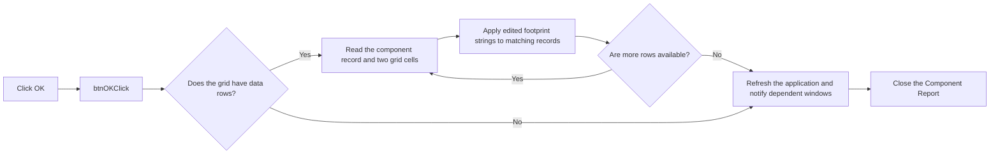

# btnOK

> Analysis status: Reviewed from recovered source.

## Control

| Property | Recovered value |
| --- | --- |
| Form | frmComponentReport |
| Component path | frmComponentReport.pnlButtons.btnOK |
| Control class | TBitBtn |
| Caption | Not present in the recovered resource. |
| Hint | Not present in the recovered resource. |
| Text | Not present in the recovered resource. |
| Handler name | btnOKClick |
| Handler address | 01bb61c0 |
| Graph node | `resource:dfm:frmComponentReport/frmComponentReport.pnlButtons.btnOK` |
| Handler node | `function:01bb61c0` |
| Graph layer | UI |

## What happens when clicked

The handler applies the edited footprint-name data from the report grid. For
each data row, it gets the associated component record and reads both grid
cells. It normalizes the component name strings, combines the edited values,
and sends them through `FUN_01bb77f0`. That helper scans the report model and
updates records that have the same component kind and name but a different
component number. The handler also writes the new strings to the row's direct
component record.

After all rows are processed, the handler requests an application refresh. If
the report model exists, it notifies dependent windows of the model change. It
then closes the form through the VCL close pipeline. When the grid has no data
rows, it skips the row-update loop but still refreshes and closes the form. No
explicit validation message, retry, save-to-file call, or rollback path appears
in the recovered handler.

## Click flow

## Handler evidence

- Source: [DecompiledSources/Tina16/functions/0000000001BB61C0__FUN_01bb61c0.c](../../../DecompiledSources/Tina16/functions/0000000001BB61C0__FUN_01bb61c0.c)
- Recovered role: Applies edited footprint-name data, refreshes the application, and closes the Component Report.
- Current graph summary: Handles 1 Delphi UI event: frmComponentReport.pnlButtons.btnOK.OnClick.
- Current graph behavior: Reads each report row, updates the direct and matching component records, refreshes dependent UI state, and closes the form.
- Current graph evidence: `FUN_01bb61c0` reads rows from grid field `+0x6D0` and component records from list field `+0x6E8`, passes the two row strings to `FUN_01bb77f0`, writes strings to the direct record, calls the application refresh path and `FUN_0199e310`, then calls `FUN_00805200`.
- Complexity: complex
- Distinct outgoing calls: 14

## Direct calls

- `function:00414480` — Delphi UnicodeString clear and finalization helper
- `function:00414560` — Delphi UnicodeString array finalization helper
- `function:00416ad0` — FUN_00416ad0
- `function:00416ba0` — FUN_00416ba0
- `function:00416db0` — FUN_00416db0
- `function:00416dc0` — FUN_00416dc0
- `function:004170c0` — FUN_004170c0
- `function:004b5390` — Delphi string-list value getter
- `function:0064e770` — FUN_0064e770
- `function:00805200` — FUN_00805200
- `function:00848870` — FUN_00848870
- `function:0084e320` — FUN_0084e320
- `function:0199e310` — FUN_0199e310
- `function:01bb77f0` — Scans the report model and propagates the two edited strings to matching component records.

## Resource evidence

- Kind: bkOK
- Modal result: Not present in the recovered resource.
- Checked state: Not present in the recovered resource.
- List items: Not present in the recovered resource.
- Image reference: Not present in the recovered resource.
- Extracted glyph: None.

## Nearby label candidates

Nearby labels are layout candidates only. They are not proof of behavior.

- No same-parent label candidate is available.

## Analysis limits

- The form caption identifies these values as footprint-name data, but the recovered field names for the two grid columns are not available.
- The handler has no explicit validation or local rollback block. The recovered source does not prove how a lower-level string or grid exception appears to the user.
