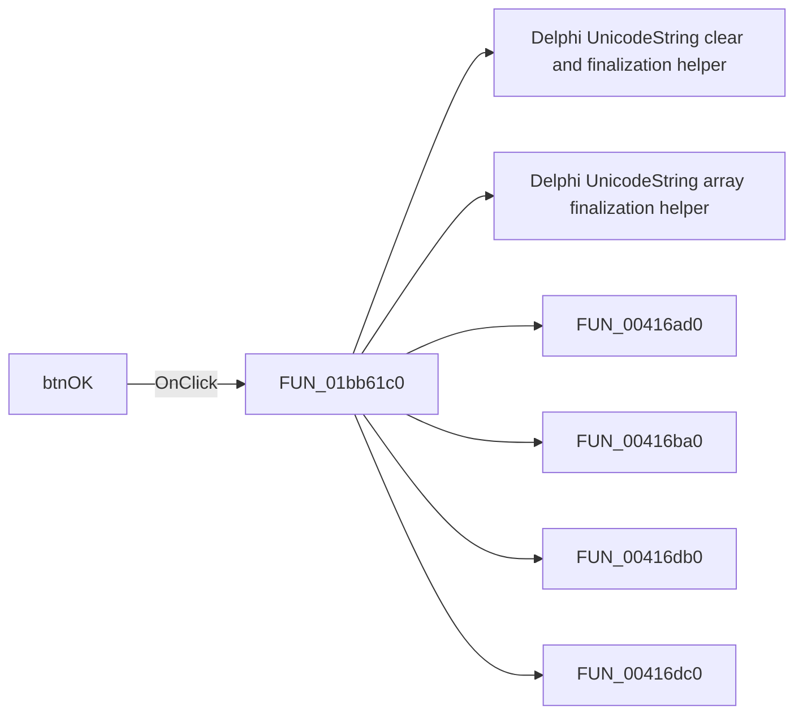

# btnOK

> Analysis status: Pending individual source review.

## Control

| Property | Recovered value |
| --- | --- |
| Form | frmComponentReport |
| Component path | frmComponentReport.pnlButtons.btnOK |
| Control class | TBitBtn |
| Caption | Not present in the recovered resource. |
| Hint | Not present in the recovered resource. |
| Text | Not present in the recovered resource. |
| Handler name | btnOKClick |
| Handler address | 01bb61c0 |
| Graph node | `resource:dfm:frmComponentReport/frmComponentReport.pnlButtons.btnOK` |
| Handler node | `function:01bb61c0` |
| Graph layer | UI |

## What happens when clicked

Pending individual analysis. An agent must read the recovered handler source and its relevant callees before it replaces this text.

## Click flow

## Handler evidence

- Source: [DecompiledSources/Tina16/functions/0000000001BB61C0__FUN_01bb61c0.c](../../../DecompiledSources/Tina16/functions/0000000001BB61C0__FUN_01bb61c0.c)
- Recovered role: Not present in the recovered resource.
- Current graph summary: Handles 1 Delphi UI event: frmComponentReport.pnlButtons.btnOK.OnClick.
- Current graph behavior: Not present in the recovered resource.
- Current graph evidence: Not present in the recovered resource.
- Complexity: complex
- Distinct outgoing calls: 14

## Direct calls

- `function:00414480` — Delphi UnicodeString clear and finalization helper
- `function:00414560` — Delphi UnicodeString array finalization helper
- `function:00416ad0` — FUN_00416ad0
- `function:00416ba0` — FUN_00416ba0
- `function:00416db0` — FUN_00416db0
- `function:00416dc0` — FUN_00416dc0
- `function:004170c0` — FUN_004170c0
- `function:004b5390` — Delphi string-list value getter
- `function:0064e770` — FUN_0064e770
- `function:00805200` — FUN_00805200
- `function:00848870` — FUN_00848870
- `function:0084e320` — FUN_0084e320
- `function:0199e310` — FUN_0199e310
- `function:01bb77f0` — FUN_01bb77f0

## Resource evidence

- Kind: bkOK
- Modal result: Not present in the recovered resource.
- Checked state: Not present in the recovered resource.
- List items: Not present in the recovered resource.
- Image reference: Not present in the recovered resource.
- Extracted glyph: None.

## Nearby label candidates

Nearby labels are layout candidates only. They are not proof of behavior.

- No same-parent label candidate is available.

## Analysis limits

- Do not infer behavior from the control class, caption, hint, glyph, or nearby label alone.
- Do not replace the pending status until the handler source and relevant call path provide enough evidence.
