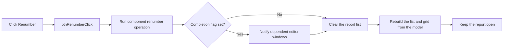

# &Renumber

> Analysis status: Reviewed from recovered source.

## Control

| Property | Recovered value |
| --- | --- |
| Form | frmComponentReport |
| Component path | frmComponentReport.pnlButtons.btnRenumber |
| Control class | TBitBtn |
| Caption | &Renumber |
| Hint | Not present in the recovered resource. |
| Text | Not present in the recovered resource. |
| Handler name | btnRenumberClick |
| Handler address | 01bb6510 |
| Graph node | `resource:dfm:frmComponentReport/frmComponentReport.pnlButtons.btnRenumber` |
| Handler node | `function:01bb6510` |
| Graph layer | UI |

## What happens when clicked

The click handler runs the shared component-renumber operation for the report
model. That operation traverses eligible components, prepares renumber records,
and runs the renumber interaction. If the operation sets its completion flag, it
notifies dependent editor windows that the model changed.

When the renumber operation returns, the handler always clears the report's
backing string list and rebuilds the list and the two-column grid from the same
model. This rebuild also occurs when the renumber interaction does not set its
completion flag. The handler ignores the Boolean result from the rebuild helper.
Therefore, a stopped duplicate-name resolution can leave a partially rebuilt
report. The handler does not close the form and has no local error handler.

## Click flow

## Handler evidence

- Source: [DecompiledSources/Tina16/functions/0000000001BB6510__FUN_01bb6510.c](../../../DecompiledSources/Tina16/functions/0000000001BB6510__FUN_01bb6510.c)
- Recovered role: Renumbers report components and rebuilds the report grid.
- Current graph summary: Handles 1 Delphi UI event: frmComponentReport.pnlButtons.btnRenumber.OnClick.
- Current graph behavior: Calls the shared renumber workflow, clears the report list, and rebuilds the report from its model.
- Current graph evidence: `FUN_01bb6510` passes form field `+0x6F0` to `FUN_019acdc0`, clears the list at `+0x6E8` through virtual slot `+0x90`, and calls `FUN_01bb5f00` with the same model.
- Complexity: moderate
- Distinct outgoing calls: 2

## Direct calls

- `function:019acdc0` — Traverses eligible components, runs the shared renumber interaction, and sends a model-change notification when its completion flag is set.
- `function:01bb5f00` — Rebuilds the Component Report list and grid from a component model.

## Resource evidence

- Kind: Not present in the recovered resource.
- Modal result: Not present in the recovered resource.
- Checked state: Not present in the recovered resource.
- List items: Not present in the recovered resource.
- Image reference: Not present in the recovered resource.
- Extracted glyph: None.

## Nearby label candidates

Nearby labels are layout candidates only. They are not proof of behavior.

- No same-parent label candidate is available.

## Analysis limits

- The recovered source does not identify the numbering order or the exact values assigned by the shared renumber interaction.
- The handler does not inspect the rebuild result, and it has no local rollback path.
