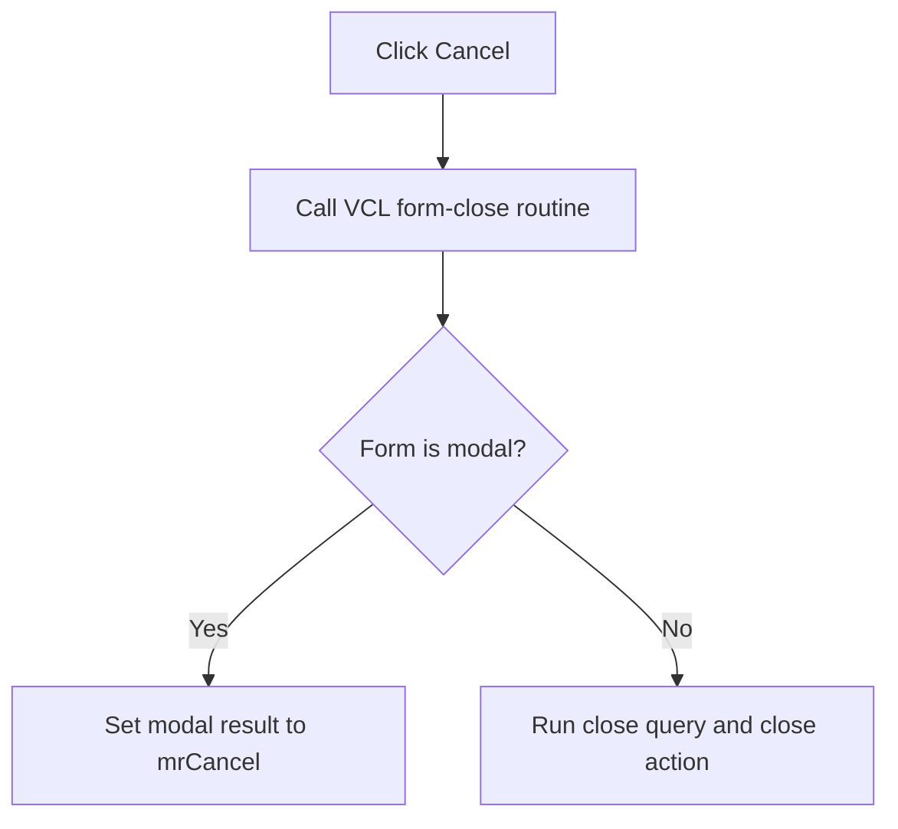

# bCancel

> Analysis status: Complete. The command uses the common VCL close action.

## Control

| Property | Recovered value |
| --- | --- |
| Form | frmDesignTool |
| Component path | frmDesignTool.ButtonPanel.bCancel |
| Control class | TBitBtn |
| Caption | Not present in the recovered resource. |
| Hint | Not present in the recovered resource. |
| Text | Not present in the recovered resource. |
| Handler name | bCancelClick |
| Handler address | 014987f0 |
| Graph node | `resource:dfm:frmDesignTool/frmDesignTool.ButtonPanel.bCancel` |
| Handler node | `function:014987f0` |
| Graph layer | UI |

## What happens when clicked

The handler calls the common VCL form-close routine. For a modal form, that routine sets `mrCancel` (`2`). For a modeless form, it runs the normal close-query and close-action path. The recovered `bkCancel` button kind agrees with this behavior.

## Click flow

## Handler evidence

- Source: [DecompiledSources/Tina16/functions/00000000014987F0__FUN_014987f0.c](../../../DecompiledSources/Tina16/functions/00000000014987F0__FUN_014987f0.c)
- Recovered role: Not present in the recovered resource.
- Current graph summary: Handles 1 Delphi UI event: frmDesignTool.ButtonPanel.bCancel.OnClick.
- Current graph behavior: Not present in the recovered resource.
- Current graph evidence: Not present in the recovered resource.
- Complexity: simple
- Distinct outgoing calls: 1

## Direct calls

- `function:00805200` — FUN_00805200

## Resource evidence

- Kind: bkCancel
- Modal result: Not present in the recovered resource.
- Checked state: Not present in the recovered resource.
- List items: Not present in the recovered resource.
- Image reference: Not present in the recovered resource.
- Extracted glyph: None.

## Nearby label candidates

Nearby labels are layout candidates only. They are not proof of behavior.

- No same-parent label candidate is available.

## Analysis limits

- Do not infer behavior from the control class, caption, hint, glyph, or nearby label alone.
- The modeless close result depends on the form's virtual close-query and close-action methods.
