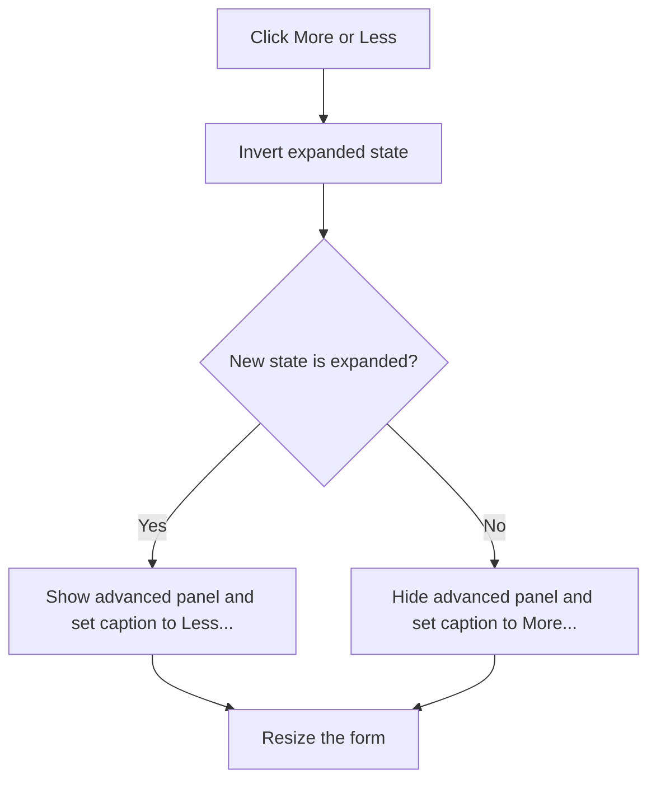

# Less...

> Analysis status: Complete. The button toggles the advanced Design Tool panel.

## Control

| Property | Recovered value |
| --- | --- |
| Form | frmDesignTool |
| Component path | frmDesignTool.SimplePanel.bMore |
| Control class | TBitBtn |
| Caption | Less... |
| Hint | Not present in the recovered resource. |
| Text | Not present in the recovered resource. |
| Handler name | bMoreClick |
| Handler address | 014988e0 |
| Graph node | `resource:dfm:frmDesignTool/frmDesignTool.SimplePanel.bMore` |
| Handler node | `function:014988e0` |
| Graph layer | UI |

## What happens when clicked

The handler inverts the saved expanded-state byte and passes it to `FUN_01498900`. That helper shows or hides the advanced panel, changes the form height, and changes the button caption between the localized **More...** and **Less...** text. Repeated clicks alternate the two states.

## Click flow

## Handler evidence

- Source: [DecompiledSources/Tina16/functions/00000000014988E0__FUN_014988e0.c](../../../DecompiledSources/Tina16/functions/00000000014988E0__FUN_014988e0.c)
- Recovered role: Not present in the recovered resource.
- Current graph summary: Handles 1 Delphi UI event: frmDesignTool.SimplePanel.bMore.OnClick.
- Current graph behavior: Not present in the recovered resource.
- Current graph evidence: Not present in the recovered resource.
- Complexity: simple
- Distinct outgoing calls: 1

## Direct calls

- `function:01498900` — FUN_01498900

## Resource evidence

- Kind: Not present in the recovered resource.
- Modal result: Not present in the recovered resource.
- Checked state: Not present in the recovered resource.
- List items: Not present in the recovered resource.
- Image reference: Not present in the recovered resource.
- Extracted glyph: None.

## Nearby label candidates

Nearby labels are layout candidates only. They are not proof of behavior.

- Rank 1: Input Parameters: at distance 766.
- Rank 2: Title at distance 824.

## Analysis limits

- Do not infer behavior from the control class, caption, hint, glyph, or nearby label alone.
- The bootstrap captured **Less...**; the handler also assigns **More...**.
