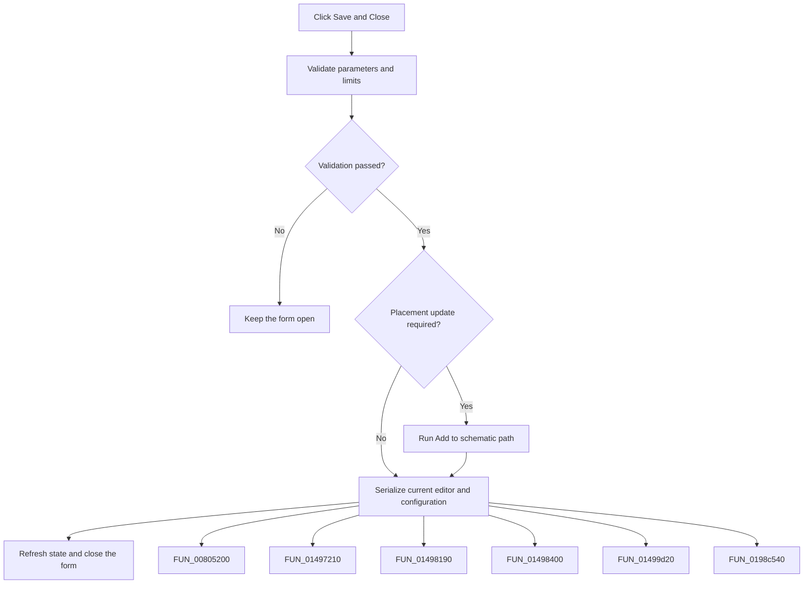

# Save && Close

> Analysis status: Complete. The command validates, saves the current design-tool data, and closes the form on success.

## Control

| Property | Recovered value |
| --- | --- |
| Form | frmDesignTool |
| Component path | frmDesignTool.ButtonPanel.bSave |
| Control class | TButton |
| Caption | Save && Close |
| Hint | Not present in the recovered resource. |
| Text | Not present in the recovered resource. |
| Handler name | bSaveClick |
| Handler address | 01498370 |
| Graph node | `resource:dfm:frmDesignTool/frmDesignTool.ButtonPanel.bSave` |
| Handler node | `function:01498370` |
| Graph layer | UI |

## What happens when clicked

The handler validates the parameter table and, when required, updates calculated min/max values. If the active schematic state requires placement, it calls the same handler as **Add to schematic**. It then serializes the current editor and configuration to the active design-tool object, refreshes form state, and closes the form. A validation failure stops before save and close.

## Click flow

## Handler evidence

- Source: [DecompiledSources/Tina16/functions/0000000001498370__FUN_01498370.c](../../../DecompiledSources/Tina16/functions/0000000001498370__FUN_01498370.c)
- Recovered role: Not present in the recovered resource.
- Current graph summary: Handles 1 Delphi UI event: frmDesignTool.ButtonPanel.bSave.OnClick.
- Current graph behavior: Not present in the recovered resource.
- Current graph evidence: Not present in the recovered resource.
- Complexity: complex
- Distinct outgoing calls: 6

## Direct calls

- `function:00805200` — FUN_00805200
- `function:01497210` — FUN_01497210
- `function:01498190` — FUN_01498190
- `function:01498400` — Handles 1 Delphi UI event: frmDesignTool.ButtonPanel.btnPlace.OnClick.
- `function:01499d20` — FUN_01499d20
- `function:0198c540` — FUN_0198c540

## Resource evidence

- Kind: Not present in the recovered resource.
- Modal result: Not present in the recovered resource.
- Checked state: Not present in the recovered resource.
- List items: Not present in the recovered resource.
- Image reference: Not present in the recovered resource.
- Extracted glyph: None.

## Nearby label candidates

Nearby labels are layout candidates only. They are not proof of behavior.

- No same-parent label candidate is available.

## Analysis limits

- Do not infer behavior from the control class, caption, hint, glyph, or nearby label alone.
- The predicate that selects the placement update is recovered only as a shared application-state query.
