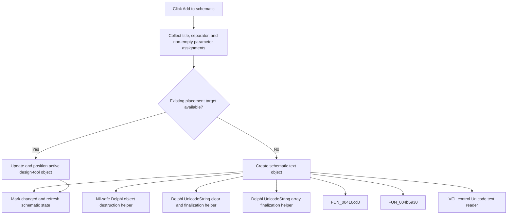

# Add to schematic

> Analysis status: Complete. The command builds design-tool text and adds or updates it in the active schematic.

## Control

| Property | Recovered value |
| --- | --- |
| Form | frmDesignTool |
| Component path | frmDesignTool.ButtonPanel.btnPlace |
| Control class | TButton |
| Caption | Add to schematic |
| Hint | Not present in the recovered resource. |
| Text | Not present in the recovered resource. |
| Handler name | btnPlaceClick |
| Handler address | 01498400 |
| Graph node | `resource:dfm:frmDesignTool/frmDesignTool.ButtonPanel.btnPlace` |
| Handler node | `function:01498400` |
| Graph layer | UI |

## What happens when clicked

The handler reads the title and starts a text list with the title plus a blank separator. For each non-empty parameter row, it adds assignment text in the form `name := value` and includes recovered min/max text when present. It then either creates a schematic text object or updates the active design-tool object, applies the current title font, positions the object, marks the model changed, and refreshes the editor.

## Click flow

## Handler evidence

- Source: [DecompiledSources/Tina16/functions/0000000001498400__FUN_01498400.c](../../../DecompiledSources/Tina16/functions/0000000001498400__FUN_01498400.c)
- Recovered role: Not present in the recovered resource.
- Current graph summary: Handles 1 Delphi UI event: frmDesignTool.ButtonPanel.btnPlace.OnClick.
- Current graph behavior: Not present in the recovered resource.
- Current graph evidence: Not present in the recovered resource.
- Complexity: complex
- Distinct outgoing calls: 13

## Direct calls

- `function:00410f20` — Nil-safe Delphi object destruction helper
- `function:00414480` — Delphi UnicodeString clear and finalization helper
- `function:00414560` — Delphi UnicodeString array finalization helper
- `function:00416cd0` — FUN_00416cd0
- `function:004b6930` — FUN_004b6930
- `function:0064dd90` — VCL control Unicode text reader
- `function:0084e320` — FUN_0084e320
- `function:00b94e60` — FUN_00b94e60
- `function:014937c0` — FUN_014937c0
- `function:0149ec30` — FUN_0149ec30
- `function:0198c540` — FUN_0198c540
- `function:0199e310` — FUN_0199e310
- `function:01c9c910` — FUN_01c9c910

## Resource evidence

- Kind: Not present in the recovered resource.
- Modal result: Not present in the recovered resource.
- Checked state: Not present in the recovered resource.
- List items: Not present in the recovered resource.
- Image reference: Not present in the recovered resource.
- Extracted glyph: None.

## Nearby label candidates

Nearby labels are layout candidates only. They are not proof of behavior.

- No same-parent label candidate is available.

## Analysis limits

- Do not infer behavior from the control class, caption, hint, glyph, or nearby label alone.
- The exact user-visible Undo label of the created schematic action is not proven.
