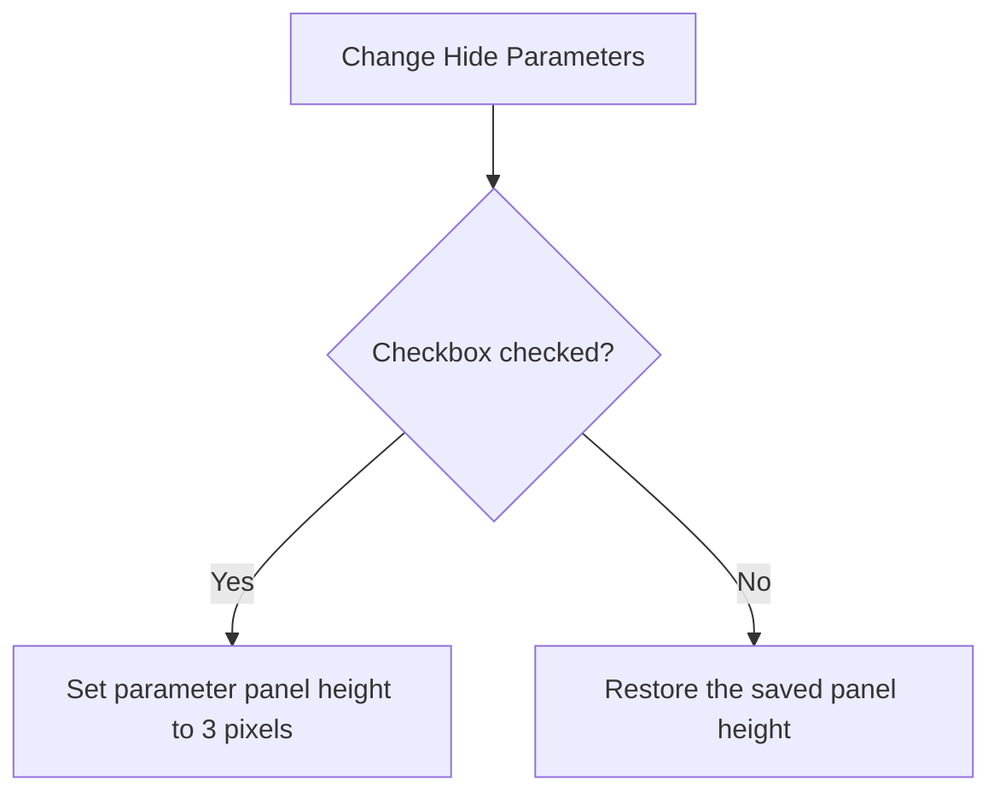

# Hide Parameters

> Analysis status: Complete. The checkbox collapses or restores the parameter panel height.

## Control

| Property | Recovered value |
| --- | --- |
| Form | frmDesignTool |
| Component path | frmDesignTool.AdvancedPanel.gbInterpreter.pnPanelInterpreter.pnToolPanel.cbHideParams |
| Control class | TCheckBox |
| Caption | Hide Parameters |
| Hint | Not present in the recovered resource. |
| Text | Not present in the recovered resource. |
| Handler name | cbHideParamsClick |
| Handler address | 014987a0 |
| Graph node | `resource:dfm:frmDesignTool/frmDesignTool.AdvancedPanel.gbInterpreter.pnPanelInterpreter.pnToolPanel.cbHideParams` |
| Handler node | `function:014987a0` |
| Graph layer | UI |

## What happens when clicked

The handler reads the checkbox state. When the box is checked, it sets the parameter panel height to 3 pixels. When the box is clear, it restores the height saved during form initialization at form offset `+0x918`. The handler does not change parameter values.

## Click flow

## Handler evidence

- Source: [DecompiledSources/Tina16/functions/00000000014987A0__FUN_014987a0.c](../../../DecompiledSources/Tina16/functions/00000000014987A0__FUN_014987a0.c)
- Recovered role: Not present in the recovered resource.
- Current graph summary: Handles 1 Delphi UI event: frmDesignTool.AdvancedPanel.gbInterpreter.pnPanelInterpreter.pnToolPanel.cbHideParams.OnClick.
- Current graph behavior: Not present in the recovered resource.
- Current graph evidence: Not present in the recovered resource.
- Complexity: simple
- Distinct outgoing calls: 1

## Direct calls

- `function:0064cc50` — FUN_0064cc50

## Resource evidence

- Kind: Not present in the recovered resource.
- Modal result: Not present in the recovered resource.
- Checked state: Not present in the recovered resource.
- List items: Not present in the recovered resource.
- Image reference: Not present in the recovered resource.
- Extracted glyph: None.

## Nearby label candidates

Nearby labels are layout candidates only. They are not proof of behavior.

- No same-parent label candidate is available.

## Analysis limits

- Do not infer behavior from the control class, caption, hint, glyph, or nearby label alone.
- The recovered source proves a height change. It does not prove that the panel is made invisible.
