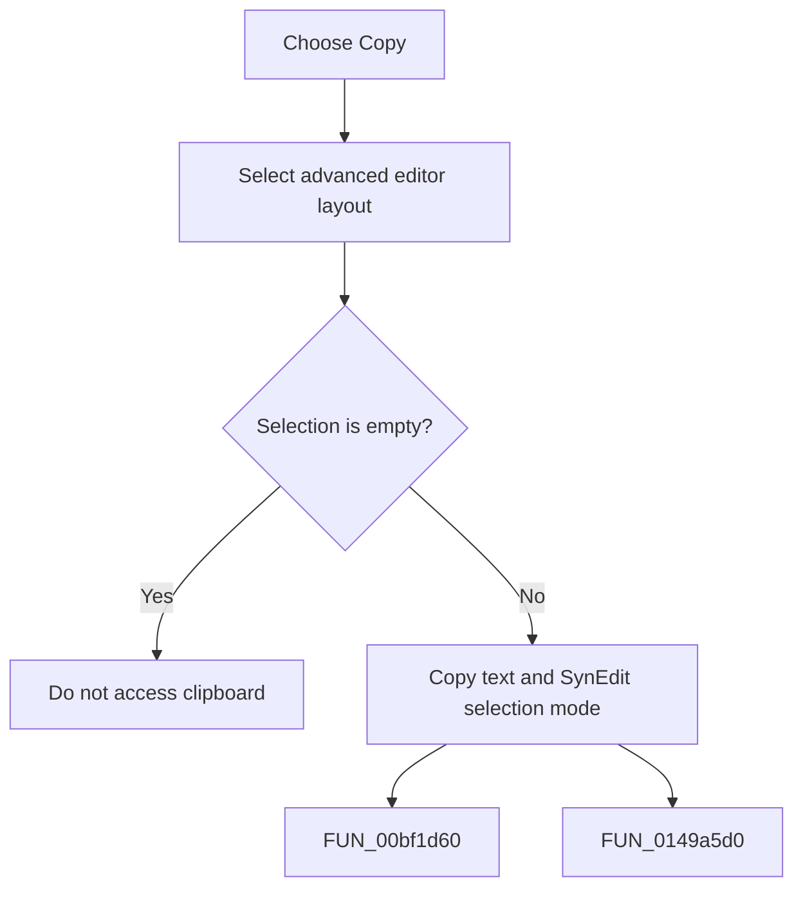

# Copy

> Analysis status: Complete. The command expands the editor area and copies its current selection.

## Control

| Property | Recovered value |
| --- | --- |
| Form | frmDesignTool |
| Component path | frmDesignTool.mnMainMenu.mnEdit.miCopy |
| Control class | TMenuItem |
| Caption | Copy |
| Hint | Not present in the recovered resource. |
| Text | Not present in the recovered resource. |
| Handler name | miCopyClick |
| Handler address | 01498fe0 |
| Graph node | `resource:dfm:frmDesignTool/frmDesignTool.mnMainMenu.mnEdit.miCopy` |
| Handler node | `function:01498fe0` |
| Graph layer | UI |

## What happens when clicked

The handler first selects the advanced editor layout. It then copies the main editor selection to the standard clipboard and adds SynEdit selection-mode data. An empty selection is a clipboard no-op.

## Click flow

## Handler evidence

- Source: [DecompiledSources/Tina16/functions/0000000001498FE0__FUN_01498fe0.c](../../../DecompiledSources/Tina16/functions/0000000001498FE0__FUN_01498fe0.c)
- Recovered role: Not present in the recovered resource.
- Current graph summary: Handles 1 Delphi UI event: frmDesignTool.mnMainMenu.mnEdit.miCopy.OnClick.
- Current graph behavior: Not present in the recovered resource.
- Current graph evidence: Not present in the recovered resource.
- Complexity: moderate
- Distinct outgoing calls: 2

## Direct calls

- `function:00bf1d60` — FUN_00bf1d60
- `function:0149a5d0` — FUN_0149a5d0

## Resource evidence

- Kind: Not present in the recovered resource.
- Modal result: Not present in the recovered resource.
- Checked state: Not present in the recovered resource.
- List items: Not present in the recovered resource.
- Image reference: Not present in the recovered resource.
- Extracted glyph: None.

## Nearby label candidates

Nearby labels are layout candidates only. They are not proof of behavior.

- No same-parent label candidate is available.

## Analysis limits

- Do not infer behavior from the control class, caption, hint, glyph, or nearby label alone.
- Clipboard failures are handled inside the shared SynEdit command; this handler has no rollback.
