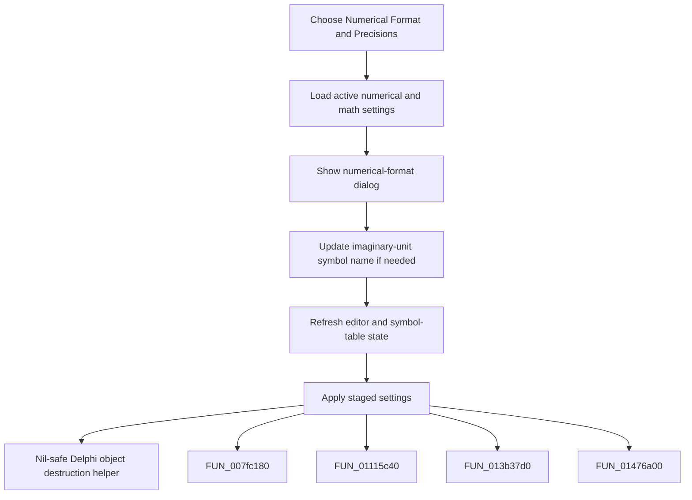

# Numerical Format && Precisions

> Analysis status: Complete. The command edits numerical-format settings and refreshes the interpreter symbol state.

## Control

| Property | Recovered value |
| --- | --- |
| Form | frmDesignTool |
| Component path | frmDesignTool.mnMainMenu.mnSettings.miNumericalFormat |
| Control class | TMenuItem |
| Caption | Numerical Format && Precisions |
| Hint | Not present in the recovered resource. |
| Text | Not present in the recovered resource. |
| Handler name | miNumericalFormatClick |
| Handler address | 014994a0 |
| Graph node | `resource:dfm:frmDesignTool/frmDesignTool.mnMainMenu.mnSettings.miNumericalFormat` |
| Handler node | `function:014994a0` |
| Graph layer | UI |

## What happens when clicked

The handler creates the numerical-format dialog, copies the active interpreter's packed numerical and math settings into it, and shows it modally. After the dialog returns, it updates the recovered imaginary-unit symbol name when needed, refreshes the active editor and symbol-table state, and applies the staged settings. The dialog owns the acceptance rules; this handler does not inspect the modal result directly.

## Click flow

## Handler evidence

- Source: [DecompiledSources/Tina16/functions/00000000014994A0__FUN_014994a0.c](../../../DecompiledSources/Tina16/functions/00000000014994A0__FUN_014994a0.c)
- Recovered role: Not present in the recovered resource.
- Current graph summary: Handles 1 Delphi UI event: frmDesignTool.mnMainMenu.mnSettings.miNumericalFormat.OnClick.
- Current graph behavior: Not present in the recovered resource.
- Current graph evidence: Not present in the recovered resource.
- Complexity: complex
- Distinct outgoing calls: 5

## Direct calls

- `function:00410f20` — Nil-safe Delphi object destruction helper
- `function:007fc180` — FUN_007fc180
- `function:01115c40` — FUN_01115c40
- `function:013b37d0` — FUN_013b37d0
- `function:01476a00` — FUN_01476a00

## Resource evidence

- Kind: Not present in the recovered resource.
- Modal result: Not present in the recovered resource.
- Checked state: Not present in the recovered resource.
- List items: Not present in the recovered resource.
- Image reference: Not present in the recovered resource.
- Extracted glyph: None.

## Nearby label candidates

Nearby labels are layout candidates only. They are not proof of behavior.

- No same-parent label candidate is available.

## Analysis limits

- Do not infer behavior from the control class, caption, hint, glyph, or nearby label alone.
- The click handler does not expose the dialog's internal OK and Cancel branches.
