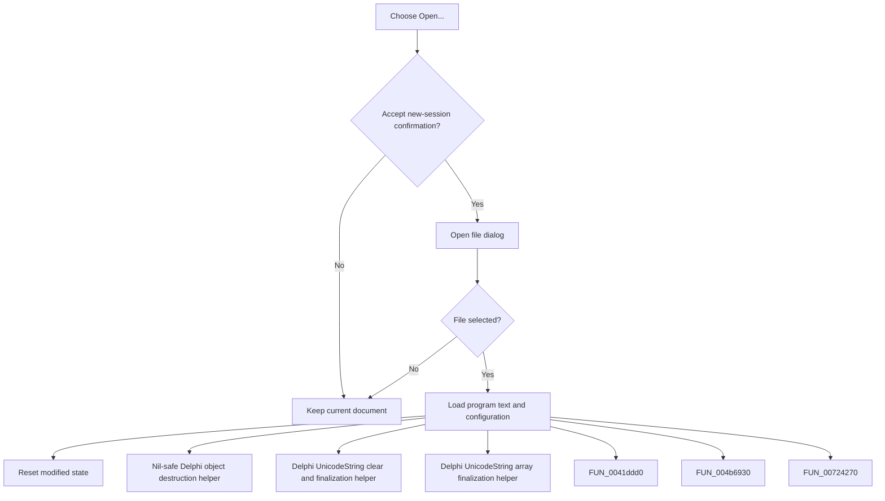

# Open...

> Analysis status: Complete. The command confirms replacement, opens a design-tool file, and loads its text and settings.

## Control

| Property | Recovered value |
| --- | --- |
| Form | frmDesignTool |
| Component path | frmDesignTool.mnMainMenu.mnFile.miOpen |
| Control class | TMenuItem |
| Caption | Open... |
| Hint | Not present in the recovered resource. |
| Text | Not present in the recovered resource. |
| Handler name | miOpenClick |
| Handler address | 01499150 |
| Graph node | `resource:dfm:frmDesignTool/frmDesignTool.mnMainMenu.mnFile.miOpen` |
| Handler node | `function:01499150` |
| Graph layer | UI |

## What happens when clicked

The handler selects the advanced editor layout and asks for new-session confirmation. If accepted, it opens the configured file dialog. File-dialog acceptance clears the main editor, reads the selected file, parses its configuration into the runtime settings, loads the remaining program text, and resets the editor's modified state. Declining either dialog leaves the current document unchanged.

## Click flow

## Handler evidence

- Source: [DecompiledSources/Tina16/functions/0000000001499150__FUN_01499150.c](../../../DecompiledSources/Tina16/functions/0000000001499150__FUN_01499150.c)
- Recovered role: Not present in the recovered resource.
- Current graph summary: Handles 1 Delphi UI event: frmDesignTool.mnMainMenu.mnFile.miOpen.OnClick.
- Current graph behavior: Not present in the recovered resource.
- Current graph evidence: Not present in the recovered resource.
- Complexity: complex
- Distinct outgoing calls: 12

## Direct calls

- `function:00410f20` — Nil-safe Delphi object destruction helper
- `function:00414480` — Delphi UnicodeString clear and finalization helper
- `function:00414560` — Delphi UnicodeString array finalization helper
- `function:0041ddd0` — FUN_0041ddd0
- `function:004b6930` — FUN_004b6930
- `function:00724270` — FUN_00724270
- `function:00b89270` — FUN_00b89270
- `function:00b8e650` — FUN_00b8e650
- `function:00c0dad0` — FUN_00c0dad0
- `function:010cd270` — FUN_010cd270
- `function:01493b00` — FUN_01493b00
- `function:0149a5d0` — FUN_0149a5d0

## Resource evidence

- Kind: Not present in the recovered resource.
- Modal result: Not present in the recovered resource.
- Checked state: Not present in the recovered resource.
- List items: Not present in the recovered resource.
- Image reference: Not present in the recovered resource.
- Extracted glyph: None.

## Nearby label candidates

Nearby labels are layout candidates only. They are not proof of behavior.

- No same-parent label candidate is available.

## Analysis limits

- Do not infer behavior from the control class, caption, hint, glyph, or nearby label alone.
- Parsing failures are handled by the shared file parser; this handler has no transaction rollback.
