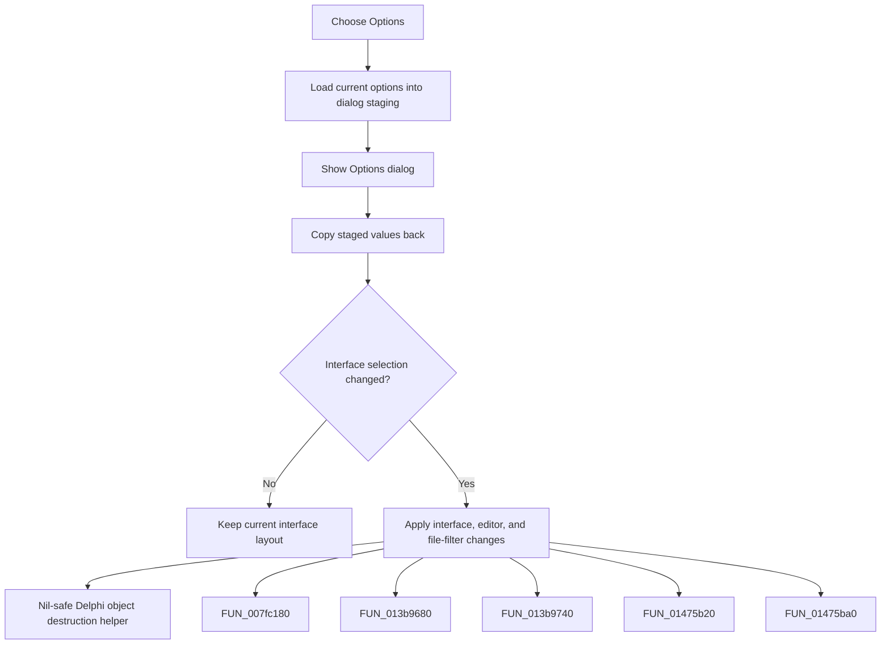

# Options

> Analysis status: Complete. The command edits Design Tool options and applies a changed interface selection.

## Control

| Property | Recovered value |
| --- | --- |
| Form | frmDesignTool |
| Component path | frmDesignTool.mnMainMenu.mnSettings.miOptions |
| Control class | TMenuItem |
| Caption | Options |
| Hint | Not present in the recovered resource. |
| Text | Not present in the recovered resource. |
| Handler name | miOptionsClick |
| Handler address | 01499560 |
| Graph node | `resource:dfm:frmDesignTool/frmDesignTool.mnMainMenu.mnSettings.miOptions` |
| Handler node | `function:01499560` |
| Graph layer | UI |

## What happens when clicked

The handler creates the Options dialog and seeds staged Ignore min/max, Keep cursor, and interface values from current state. It shows the dialog, then copies the staging values back. Cancel returns the original staged values because only the dialog's OK handler updates staging from live controls. If the returned interface differs from the initial value, `FUN_01499620` changes the editor page, file filters, model interface bit, and related controls; otherwise that refresh is skipped.

## Click flow

## Handler evidence

- Source: [DecompiledSources/Tina16/functions/0000000001499560__FUN_01499560.c](../../../DecompiledSources/Tina16/functions/0000000001499560__FUN_01499560.c)
- Recovered role: Not present in the recovered resource.
- Current graph summary: Handles 1 Delphi UI event: frmDesignTool.mnMainMenu.mnSettings.miOptions.OnClick.
- Current graph behavior: Not present in the recovered resource.
- Current graph evidence: Not present in the recovered resource.
- Complexity: complex
- Distinct outgoing calls: 7

## Direct calls

- `function:00410f20` — Nil-safe Delphi object destruction helper
- `function:007fc180` — FUN_007fc180
- `function:013b9680` — FUN_013b9680
- `function:013b9740` — FUN_013b9740
- `function:01475b20` — FUN_01475b20
- `function:01475ba0` — FUN_01475ba0
- `function:01499620` — FUN_01499620

## Resource evidence

- Kind: Not present in the recovered resource.
- Modal result: Not present in the recovered resource.
- Checked state: Not present in the recovered resource.
- List items: Not present in the recovered resource.
- Image reference: Not present in the recovered resource.
- Extracted glyph: None.

## Nearby label candidates

Nearby labels are layout candidates only. They are not proof of behavior.

- No same-parent label candidate is available.

## Analysis limits

- Do not infer behavior from the control class, caption, hint, glyph, or nearby label alone.
- Cancel copies unchanged staging values; the handler does not test the modal result.
