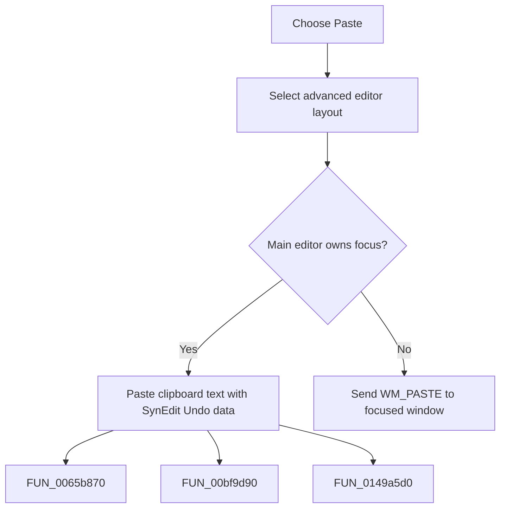

# Paste

> Analysis status: Complete. The command pastes into the main editor or forwards paste to the focused control.

## Control

| Property | Recovered value |
| --- | --- |
| Form | frmDesignTool |
| Component path | frmDesignTool.mnMainMenu.mnEdit.miPaste |
| Control class | TMenuItem |
| Caption | Paste |
| Hint | Not present in the recovered resource. |
| Text | Not present in the recovered resource. |
| Handler name | miPasteClick |
| Handler address | 01499010 |
| Graph node | `resource:dfm:frmDesignTool/frmDesignTool.mnMainMenu.mnEdit.miPaste` |
| Handler node | `function:01499010` |
| Graph layer | UI |

## What happens when clicked

The handler selects the advanced layout and compares the focused window with the Design Tool editor target. When the editor owns focus, it uses the SynEdit paste path, which accepts standard text and SynEdit block-mode clipboard data and records Undo information. Otherwise it sends `WM_PASTE` (`0x302`) to the current focused window. A read-only editor or unavailable text format is a no-op on the SynEdit path.

## Click flow

## Handler evidence

- Source: [DecompiledSources/Tina16/functions/0000000001499010__FUN_01499010.c](../../../DecompiledSources/Tina16/functions/0000000001499010__FUN_01499010.c)
- Recovered role: Not present in the recovered resource.
- Current graph summary: Handles 1 Delphi UI event: frmDesignTool.mnMainMenu.mnEdit.miPaste.OnClick.
- Current graph behavior: Not present in the recovered resource.
- Current graph evidence: Not present in the recovered resource.
- Complexity: complex
- Distinct outgoing calls: 3

## Direct calls

- `function:0065b870` — FUN_0065b870
- `function:00bf9d90` — FUN_00bf9d90
- `function:0149a5d0` — FUN_0149a5d0

## Resource evidence

- Kind: Not present in the recovered resource.
- Modal result: Not present in the recovered resource.
- Checked state: Not present in the recovered resource.
- List items: Not present in the recovered resource.
- Image reference: Not present in the recovered resource.
- Extracted glyph: None.

## Nearby label candidates

Nearby labels are layout candidates only. They are not proof of behavior.

- No same-parent label candidate is available.

## Analysis limits

- Do not infer behavior from the control class, caption, hint, glyph, or nearby label alone.
- The forwarded control decides whether it accepts `WM_PASTE`.
