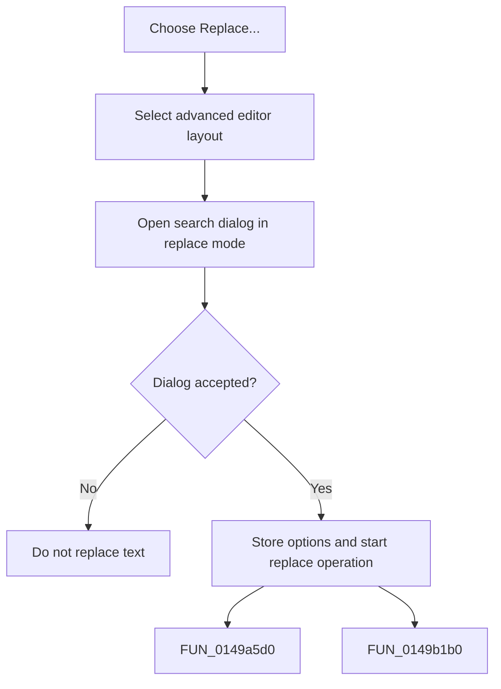

# Replace...

> Analysis status: Complete. The command opens the Replace dialog for the main editor.

## Control

| Property | Recovered value |
| --- | --- |
| Form | frmDesignTool |
| Component path | frmDesignTool.mnMainMenu.mnEdit.miReplace |
| Control class | TMenuItem |
| Caption | Replace... |
| Hint | Not present in the recovered resource. |
| Text | Not present in the recovered resource. |
| Handler name | miReplaceClick |
| Handler address | 01499100 |
| Graph node | `resource:dfm:frmDesignTool/frmDesignTool.mnMainMenu.mnEdit.miReplace` |
| Handler node | `function:01499100` |
| Graph layer | UI |

## What happens when clicked

The handler selects the advanced editor layout and opens the shared search dialog in replace mode. It seeds saved search, replace, direction, scope, and option values. If the user accepts, it stores the new settings and starts the shared search-or-replace operation when search text is available.

## Click flow

## Handler evidence

- Source: [DecompiledSources/Tina16/functions/0000000001499100__FUN_01499100.c](../../../DecompiledSources/Tina16/functions/0000000001499100__FUN_01499100.c)
- Recovered role: Not present in the recovered resource.
- Current graph summary: Handles 1 Delphi UI event: frmDesignTool.mnMainMenu.mnEdit.miReplace.OnClick.
- Current graph behavior: Not present in the recovered resource.
- Current graph evidence: Not present in the recovered resource.
- Complexity: moderate
- Distinct outgoing calls: 2

## Direct calls

- `function:0149a5d0` — FUN_0149a5d0
- `function:0149b1b0` — FUN_0149b1b0

## Resource evidence

- Kind: Not present in the recovered resource.
- Modal result: Not present in the recovered resource.
- Checked state: Not present in the recovered resource.
- List items: Not present in the recovered resource.
- Image reference: Not present in the recovered resource.
- Extracted glyph: None.

## Nearby label candidates

Nearby labels are layout candidates only. They are not proof of behavior.

- No same-parent label candidate is available.

## Analysis limits

- Do not infer behavior from the control class, caption, hint, glyph, or nearby label alone.
- The shared SynEdit search path controls prompts and individual replacement decisions.
