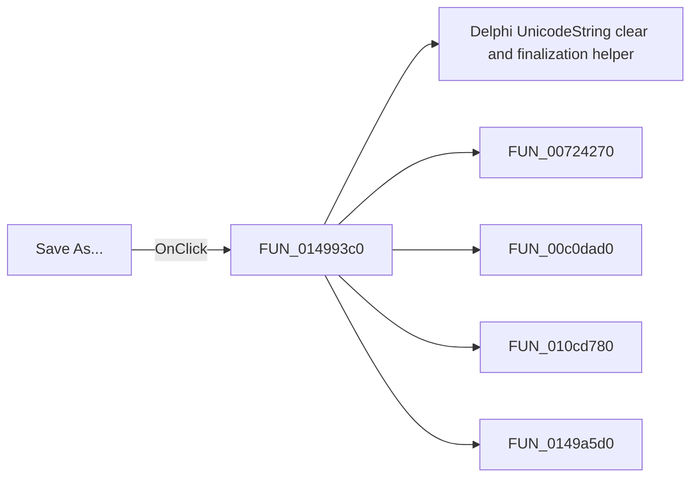

# Save As...

> Analysis status: Pending individual source review.

## Control

| Property | Recovered value |
| --- | --- |
| Form | frmDesignTool |
| Component path | frmDesignTool.mnMainMenu.mnFile.miSaveAs |
| Control class | TMenuItem |
| Caption | Save As... |
| Hint | Not present in the recovered resource. |
| Text | Not present in the recovered resource. |
| Handler name | miSaveAsClick |
| Handler address | 014993c0 |
| Graph node | `resource:dfm:frmDesignTool/frmDesignTool.mnMainMenu.mnFile.miSaveAs` |
| Handler node | `function:014993c0` |
| Graph layer | UI |

## What happens when clicked

Pending individual analysis. An agent must read the recovered handler source and its relevant callees before it replaces this text.

## Click flow

## Handler evidence

- Source: [DecompiledSources/Tina16/functions/00000000014993C0__FUN_014993c0.c](../../../DecompiledSources/Tina16/functions/00000000014993C0__FUN_014993c0.c)
- Recovered role: Not present in the recovered resource.
- Current graph summary: Handles 1 Delphi UI event: frmDesignTool.mnMainMenu.mnFile.miSaveAs.OnClick.
- Current graph behavior: Not present in the recovered resource.
- Current graph evidence: Not present in the recovered resource.
- Complexity: complex
- Distinct outgoing calls: 5

## Direct calls

- `function:00414480` — Delphi UnicodeString clear and finalization helper
- `function:00724270` — FUN_00724270
- `function:00c0dad0` — FUN_00c0dad0
- `function:010cd780` — FUN_010cd780
- `function:0149a5d0` — FUN_0149a5d0

## Resource evidence

- Kind: Not present in the recovered resource.
- Modal result: Not present in the recovered resource.
- Checked state: Not present in the recovered resource.
- List items: Not present in the recovered resource.
- Image reference: Not present in the recovered resource.
- Extracted glyph: None.

## Nearby label candidates

Nearby labels are layout candidates only. They are not proof of behavior.

- No same-parent label candidate is available.

## Analysis limits

- Do not infer behavior from the control class, caption, hint, glyph, or nearby label alone.
- Do not replace the pending status until the handler source and relevant call path provide enough evidence.
