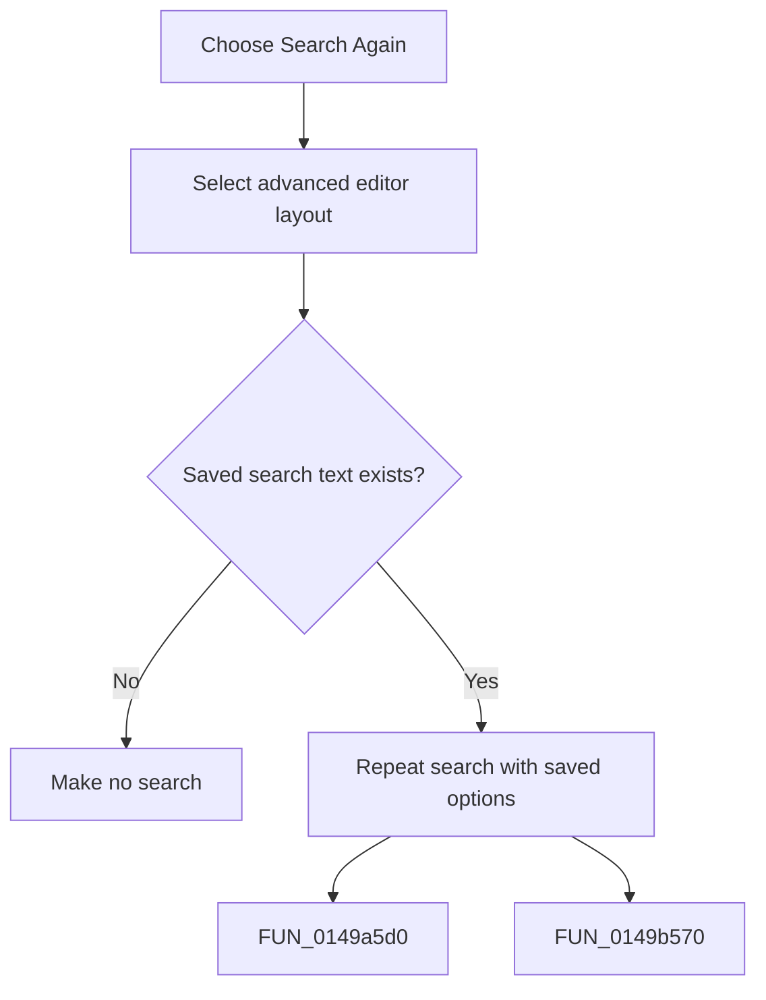

# Search Again

> Analysis status: Complete. The command repeats the saved search without opening the search dialog.

## Control

| Property | Recovered value |
| --- | --- |
| Form | frmDesignTool |
| Component path | frmDesignTool.mnMainMenu.mnEdit.miSearchAgain |
| Control class | TMenuItem |
| Caption | Search Again |
| Hint | Not present in the recovered resource. |
| Text | Not present in the recovered resource. |
| Handler name | miSearchAgainClick |
| Handler address | 01499120 |
| Graph node | `resource:dfm:frmDesignTool/frmDesignTool.mnMainMenu.mnEdit.miSearchAgain` |
| Handler node | `function:01499120` |
| Graph layer | UI |

## What happens when clicked

The handler selects the advanced editor layout and calls the shared search routine with the saved search text and saved options. If there is no saved search text, the shared call is a no-op. When no match is found, the helper reports that condition and restores the editor selection or caret state according to the saved direction.

## Click flow

## Handler evidence

- Source: [DecompiledSources/Tina16/functions/0000000001499120__FUN_01499120.c](../../../DecompiledSources/Tina16/functions/0000000001499120__FUN_01499120.c)
- Recovered role: Not present in the recovered resource.
- Current graph summary: Handles 1 Delphi UI event: frmDesignTool.mnMainMenu.mnEdit.miSearchAgain.OnClick.
- Current graph behavior: Not present in the recovered resource.
- Current graph evidence: Not present in the recovered resource.
- Complexity: moderate
- Distinct outgoing calls: 2

## Direct calls

- `function:0149a5d0` — FUN_0149a5d0
- `function:0149b570` — FUN_0149b570

## Resource evidence

- Kind: Not present in the recovered resource.
- Modal result: Not present in the recovered resource.
- Checked state: Not present in the recovered resource.
- List items: Not present in the recovered resource.
- Image reference: Not present in the recovered resource.
- Extracted glyph: None.

## Nearby label candidates

Nearby labels are layout candidates only. They are not proof of behavior.

- No same-parent label candidate is available.

## Analysis limits

- Do not infer behavior from the control class, caption, hint, glyph, or nearby label alone.
- This handler does not open a dialog or change the saved search options.
