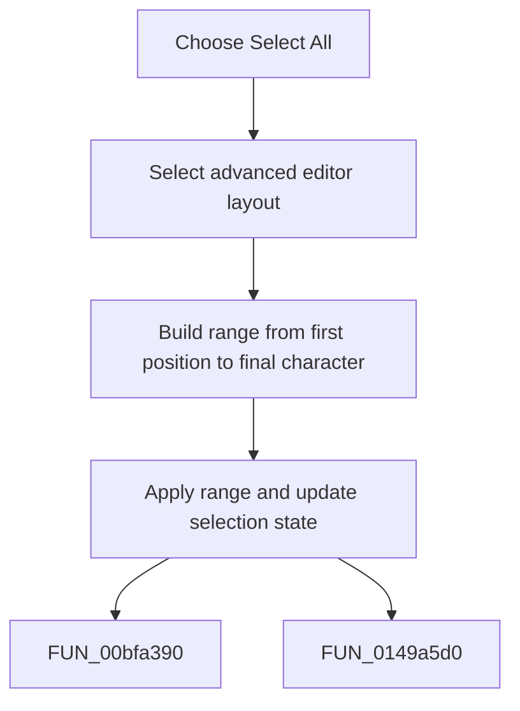

# Select All

> Analysis status: Complete. The command expands the editor area and selects all main-editor text.

## Control

| Property | Recovered value |
| --- | --- |
| Form | frmDesignTool |
| Component path | frmDesignTool.mnMainMenu.mnEdit.miSelectAll |
| Control class | TMenuItem |
| Caption | Select All |
| Hint | Not present in the recovered resource. |
| Text | Not present in the recovered resource. |
| Handler name | miSelectAllClick |
| Handler address | 014990a0 |
| Graph node | `resource:dfm:frmDesignTool/frmDesignTool.mnMainMenu.mnEdit.miSelectAll` |
| Handler node | `function:014990a0` |
| Graph layer | UI |

## What happens when clicked

The handler selects the advanced editor layout, then builds a selection from line 1, column 1 through the last character of the final line. It applies both endpoints to the main editor and requests a selection-state update. It does not use the clipboard.

## Click flow

## Handler evidence

- Source: [DecompiledSources/Tina16/functions/00000000014990A0__FUN_014990a0.c](../../../DecompiledSources/Tina16/functions/00000000014990A0__FUN_014990a0.c)
- Recovered role: Not present in the recovered resource.
- Current graph summary: Handles 1 Delphi UI event: frmDesignTool.mnMainMenu.mnEdit.miSelectAll.OnClick.
- Current graph behavior: Not present in the recovered resource.
- Current graph evidence: Not present in the recovered resource.
- Complexity: moderate
- Distinct outgoing calls: 2

## Direct calls

- `function:00bfa390` — FUN_00bfa390
- `function:0149a5d0` — FUN_0149a5d0

## Resource evidence

- Kind: Not present in the recovered resource.
- Modal result: Not present in the recovered resource.
- Checked state: Not present in the recovered resource.
- List items: Not present in the recovered resource.
- Image reference: Not present in the recovered resource.
- Extracted glyph: None.

## Nearby label candidates

Nearby labels are layout candidates only. They are not proof of behavior.

- No same-parent label candidate is available.

## Analysis limits

- Do not infer behavior from the control class, caption, hint, glyph, or nearby label alone.
- An empty editor still receives the helper's full-range selection update.
