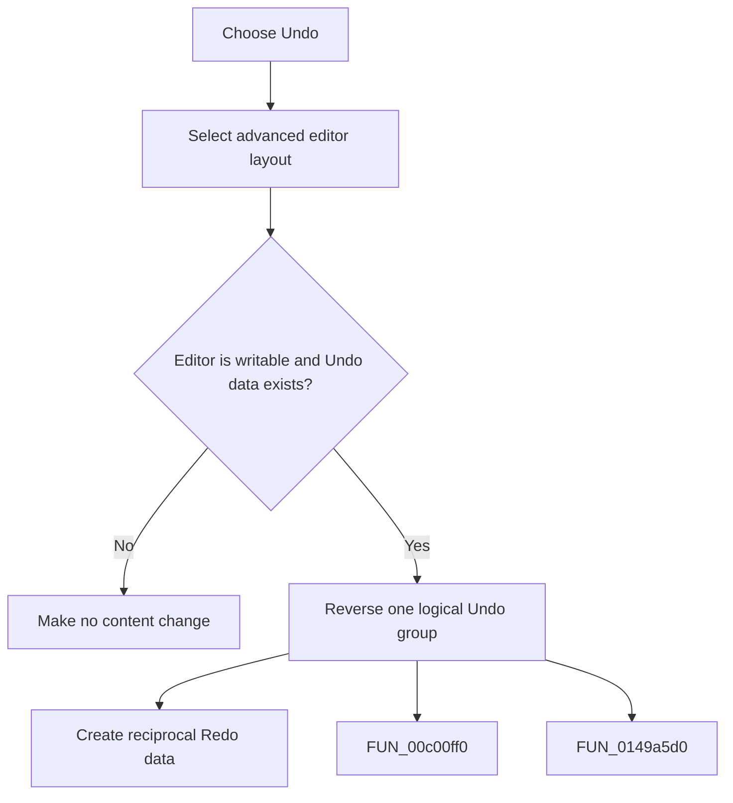

# Undo

> Analysis status: Complete. The command expands the editor area and reverses one logical SynEdit Undo group.

## Control

| Property | Recovered value |
| --- | --- |
| Form | frmDesignTool |
| Component path | frmDesignTool.mnMainMenu.mnEdit.miUndo |
| Control class | TMenuItem |
| Caption | Undo |
| Hint | Not present in the recovered resource. |
| Text | Not present in the recovered resource. |
| Handler name | miUndoClick |
| Handler address | 01498d70 |
| Graph node | `resource:dfm:frmDesignTool/frmDesignTool.mnMainMenu.mnEdit.miUndo` |
| Handler node | `function:01498d70` |
| Graph layer | UI |

## What happens when clicked

The handler selects the advanced editor layout and calls the SynEdit Undo routine. That routine returns immediately for a read-only editor. Otherwise it reverses one logical group, restores recorded text, caret, selection, and selection mode as applicable, and creates reciprocal Redo data. An empty Undo stack is a content no-op.

## Click flow

## Handler evidence

- Source: [DecompiledSources/Tina16/functions/0000000001498D70__FUN_01498d70.c](../../../DecompiledSources/Tina16/functions/0000000001498D70__FUN_01498d70.c)
- Recovered role: Not present in the recovered resource.
- Current graph summary: Handles 1 Delphi UI event: frmDesignTool.mnMainMenu.mnEdit.miUndo.OnClick.
- Current graph behavior: Not present in the recovered resource.
- Current graph evidence: Not present in the recovered resource.
- Complexity: moderate
- Distinct outgoing calls: 2

## Direct calls

- `function:00c00ff0` — FUN_00c00ff0
- `function:0149a5d0` — FUN_0149a5d0

## Resource evidence

- Kind: Not present in the recovered resource.
- Modal result: Not present in the recovered resource.
- Checked state: Not present in the recovered resource.
- List items: Not present in the recovered resource.
- Image reference: Not present in the recovered resource.
- Extracted glyph: None.

## Nearby label candidates

Nearby labels are layout candidates only. They are not proof of behavior.

- No same-parent label candidate is available.

## Analysis limits

- Do not infer behavior from the control class, caption, hint, glyph, or nearby label alone.
- Group boundaries and same-reason merging are decided by the shared SynEdit Undo routine.
