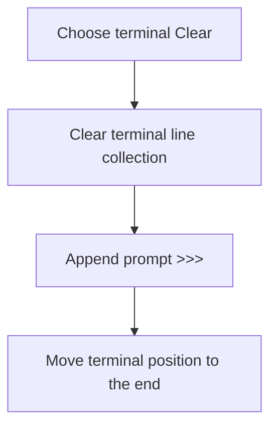

# Clear

> Analysis status: Complete. The command clears terminal lines and inserts a fresh prompt.

## Control

| Property | Recovered value |
| --- | --- |
| Form | frmDesignTool |
| Component path | frmDesignTool.pmTerminal.mnClearTerminal |
| Control class | TMenuItem |
| Caption | Clear |
| Hint | Not present in the recovered resource. |
| Text | Not present in the recovered resource. |
| Handler name | mnClearTerminalClick |
| Handler address | 01498da0 |
| Graph node | `resource:dfm:frmDesignTool/frmDesignTool.pmTerminal.mnClearTerminal` |
| Handler node | `function:01498da0` |
| Graph layer | UI |

## What happens when clicked

The handler clears the terminal editor's line collection, appends the recovered prompt text `>>>  `, and moves the terminal position to the end through `FUN_0149b8c0`. It does not ask for confirmation and does not change the main program editor.

## Click flow

## Handler evidence

- Source: [DecompiledSources/Tina16/functions/0000000001498DA0__FUN_01498da0.c](../../../DecompiledSources/Tina16/functions/0000000001498DA0__FUN_01498da0.c)
- Recovered role: Not present in the recovered resource.
- Current graph summary: Handles 1 Delphi UI event: frmDesignTool.pmTerminal.mnClearTerminal.OnClick.
- Current graph behavior: Not present in the recovered resource.
- Current graph evidence: Not present in the recovered resource.
- Complexity: simple
- Distinct outgoing calls: 1

## Direct calls

- `function:0149b8c0` — FUN_0149b8c0

## Resource evidence

- Kind: Not present in the recovered resource.
- Modal result: Not present in the recovered resource.
- Checked state: Not present in the recovered resource.
- List items: Not present in the recovered resource.
- Image reference: Not present in the recovered resource.
- Extracted glyph: None.

## Nearby label candidates

Nearby labels are layout candidates only. They are not proof of behavior.

- No same-parent label candidate is available.

## Analysis limits

- Do not infer behavior from the control class, caption, hint, glyph, or nearby label alone.
- The command does not preserve previous terminal text in an application-level buffer.
