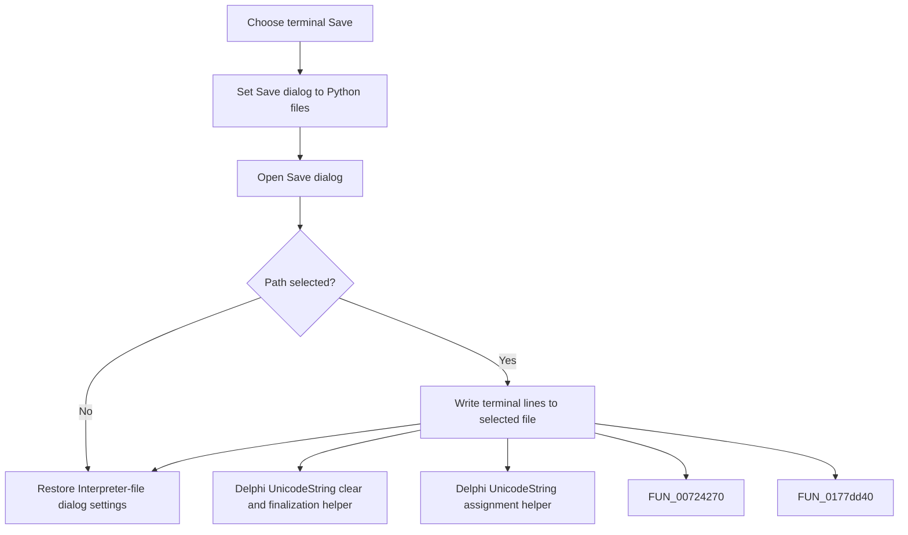

# Save

> Analysis status: Complete. The command saves terminal lines to a selected Python file.

## Control

| Property | Recovered value |
| --- | --- |
| Form | frmDesignTool |
| Component path | frmDesignTool.pmTerminal.mnSaveTerminal |
| Control class | TMenuItem |
| Caption | Save |
| Hint | Not present in the recovered resource. |
| Text | Not present in the recovered resource. |
| Handler name | mnSaveTerminalClick |
| Handler address | 01498e10 |
| Graph node | `resource:dfm:frmDesignTool/frmDesignTool.pmTerminal.mnSaveTerminal` |
| Handler node | `function:01498e10` |
| Graph layer | UI |

## What happens when clicked

The handler temporarily configures the shared Save dialog with default extension `py` and filter `Python file|*.py`. If the user selects a path, it writes the terminal editor's line collection to that file. It then restores the dialog's Interpreter-file extension and filter on both acceptance and Cancel. Cancel writes no terminal file.

## Click flow

## Handler evidence

- Source: [DecompiledSources/Tina16/functions/0000000001498E10__FUN_01498e10.c](../../../DecompiledSources/Tina16/functions/0000000001498E10__FUN_01498e10.c)
- Recovered role: Not present in the recovered resource.
- Current graph summary: Handles 1 Delphi UI event: frmDesignTool.pmTerminal.mnSaveTerminal.OnClick.
- Current graph behavior: Not present in the recovered resource.
- Current graph evidence: Not present in the recovered resource.
- Complexity: complex
- Distinct outgoing calls: 4

## Direct calls

- `function:00414480` — Delphi UnicodeString clear and finalization helper
- `function:00414ad0` — Delphi UnicodeString assignment helper
- `function:00724270` — FUN_00724270
- `function:0177dd40` — FUN_0177dd40

## Resource evidence

- Kind: Not present in the recovered resource.
- Modal result: Not present in the recovered resource.
- Checked state: Not present in the recovered resource.
- List items: Not present in the recovered resource.
- Image reference: Not present in the recovered resource.
- Extracted glyph: None.

## Nearby label candidates

Nearby labels are layout candidates only. They are not proof of behavior.

- No same-parent label candidate is available.

## Analysis limits

- Do not infer behavior from the control class, caption, hint, glyph, or nearby label alone.
- The handler does not add or remove a `.py` suffix itself; dialog behavior controls that detail.
