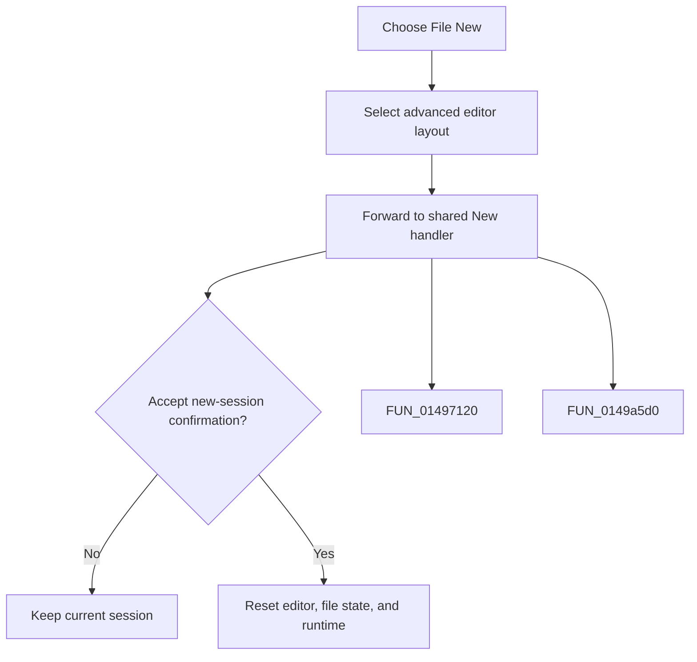

# New

> Analysis status: Complete. This menu item expands the editor and forwards to the same new-session handler as the toolbar button.

## Control

| Property | Recovered value |
| --- | --- |
| Form | frmDesignTool |
| Component path | frmDesignTool.mnMainMenu.mnFile.New1 |
| Control class | TMenuItem |
| Caption | New |
| Hint | Not present in the recovered resource. |
| Text | Not present in the recovered resource. |
| Handler name | New1Click |
| Handler address | 01498b90 |
| Graph node | `resource:dfm:frmDesignTool/frmDesignTool.mnMainMenu.mnFile.New1` |
| Handler node | `function:01498b90` |
| Graph layer | UI |

## What happens when clicked

The handler selects the advanced editor layout, then calls the toolbar New handler. That shared handler asks for confirmation. Acceptance clears the editor and file state, replaces the runtime while preserving settings, and refreshes the form. Decline keeps the current session.

## Click flow

## Handler evidence

- Source: [DecompiledSources/Tina16/functions/0000000001498B90__FUN_01498b90.c](../../../DecompiledSources/Tina16/functions/0000000001498B90__FUN_01498b90.c)
- Recovered role: Not present in the recovered resource.
- Current graph summary: Handles 1 Delphi UI event: frmDesignTool.mnMainMenu.mnFile.New1.OnClick.
- Current graph behavior: Not present in the recovered resource.
- Current graph evidence: Not present in the recovered resource.
- Complexity: moderate
- Distinct outgoing calls: 2

## Direct calls

- `function:01497120` — Handles 1 Delphi UI event: frmDesignTool.AdvancedPanel.gbInterpreter.pnPanelInterpreter.pnToolPanel.sbFileNew.OnClick.
- `function:0149a5d0` — FUN_0149a5d0

## Resource evidence

- Kind: Not present in the recovered resource.
- Modal result: Not present in the recovered resource.
- Checked state: Not present in the recovered resource.
- List items: Not present in the recovered resource.
- Image reference: Not present in the recovered resource.
- Extracted glyph: None.

## Nearby label candidates

Nearby labels are layout candidates only. They are not proof of behavior.

- No same-parent label candidate is available.

## Analysis limits

- Do not infer behavior from the control class, caption, hint, glyph, or nearby label alone.
- The forwarding menu handler has no independent reset behavior.
